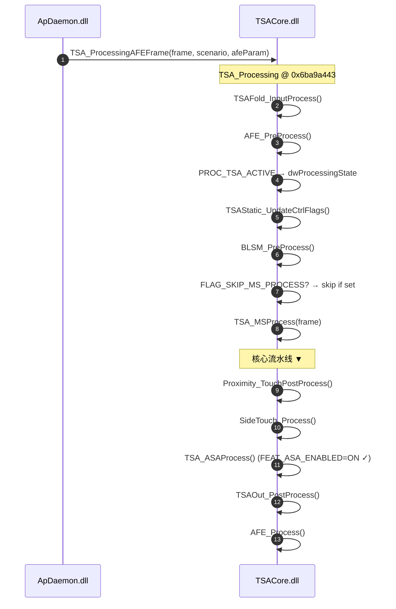

# 手指触摸算法流图 — TSA_MSProcess 全流水线

> 最后更新：2026-05-22  
> 基于 TSACore.dll 反编译分析（Gaokun Himax CSOT 参数单元）

---

## 1. 调用链



---

## 2. TSA_MSProcess 总体流图

```mermaid
flowchart TD
    ENTRY["TSA_MSProcess(param_1 = raw frame buffer)"] --> SET_FLAG["dwProcessingState |= PROC_MS_ACTIVE"]
    SET_FLAG --> SWITCH["DataSwitch_ToGrid()"]
    SWITCH --> GET_FRAME["AFE_GetFrame()"]
    GET_FRAME --> COPY_RAW["SS_CopyRaw(frame+0x18, cols+rows)"]

    COPY_RAW --> NULL_CHECK{"param_1 == NULL ||\n(prmtDynamic[0x24] && !SS_IsRawValid)?"}

    NULL_CHECK -->|"YES: bad data"| EARLY_OUT["TSA_MSReset if HW reset\nelse SS_Process + Ending"]

    NULL_CHECK -->|"NO: normal"| PRE_CLEAN["TSAIDE_CleanPointXY()\nHardwareAnalyzer_Reset()"]

    PRE_CLEAN --> HW_CHECK1{"TSAStatic_IsHWReset?"}

    HW_CHECK1 -->|YES| MS_RESET1["TSA_MSReset()"]
    HW_CHECK1 -->|NO| PROX_CHECK{"TSA_IsToBypassCurrentFrame?"}
    PROX_CHECK -->|NO| PROX["Proximity_Process()"]

    PROX --> TOUCH_CLEAN["Touch_Clean()"]
    MS_RESET1 --> TOUCH_CLEAN

    TOUCH_CLEAN --> BUF_COPY["Copy g_tsaBufDif → g_tsaBufPreDif\nCopy g_tsaBufRaw → g_tsaBufPreRaw"]
    BUF_COPY --> SAVE_UNNORM["g_pUnnormalizedRawBuf = param_1"]
    SAVE_UNNORM --> RAW_CHECK["TSA_RawCheckProcess()"]

    RAW_CHECK --> BRANCH1{"dwSystemFlags &\nFLAG_USE_DIF_BUF_PATH?"}

    BRANCH1 -->|"=0: RAW path"| RAW_PATH["memcpy raw→g_tsaBufRaw\nTPSensor_ProcessRaw()"]
    BRANCH1 -->|"≠0: DIF path"| DIF_PATH["memcpy raw→g_tsaBufDif\n(跳过 TPSensor_ProcessRaw)"]

    RAW_PATH --> RAW_PROC["Rawdata_Process()"]
    DIF_PATH --> RAW_PROC
    RAW_PROC --> HW_PROC["HardwareAnalyzer_Process()"]

    HW_PROC --> BYPASS_CHECK{"TSA_IsToBypassCurrentFrame?"}

    BYPASS_CHECK -->|"YES: bypass"| BYPASS_PATH["KeepPrevTouch + Ending"]
    BYPASS_CHECK -->|"NO: continue"| SIG_LAYER["▼ 信号处理层"]

    SIG_LAYER --> SIG_DETAIL["TSAPrmt_PreProcess → SS_Process\n→ memcpy g_tsaBufRaw→g_tsaBufPreCMFRaw"]

    SIG_DETAIL --> BRANCH2{"dwSystemFlags &\nFLAG_USE_DIF_BUF_PATH?"}
    BRANCH2 -->|"=0: normal"| NORM_SIG["BLIIR_CalcDiffCommon\nTSAPrpt_GetDifPreCMFPrpt\nBLSM_UpdateForRawUnstable\nRawdata_CMF if bCmfEnabled=1\nBLSM_Process → CMF_Process\nGridIIR_Process"]
    BRANCH2 -->|"≠0: skip"| SKIP_SIG["Skip BLSM+CMF+IIR"]

    NORM_SIG --> POST_SIG["HardwareAnalyzer_ProcessDif()\nTPSensor_Process()\nTSA_GetPrpt()\nSelf_Process()\nToeSynaBl_GetSidePrpt()\nSS_CheckDirtyByMutual()"]
    SKIP_SIG --> POST_SIG

    POST_SIG --> CHARGER_CHECK["▼ 充电噪声检测"]
    CHARGER_CHECK --> CHARGER_DETAIL["TSA_MSRawDirectionDectect()\nException_CheckChargerNoiseInRxLines()\n检查: prevTouches→touchCount != 0x100 && IsChargerNoise?"]

    CHARGER_DETAIL --> CHARGER_BRANCH{"充电噪声 ||\nTSA_IsToBypass?"}
    CHARGER_BRANCH -->|"YES"| KEEP_PREV["Touch_KeepPrevTouch…\nSideTouch_KeepPrevTouch…\n→ Ending"]

    CHARGER_BRANCH -->|"NO"| PEAK_LAYER["▼ 峰值检测层"]
    PEAK_LAYER --> PEAK_DETAIL["SS_ChargerNoiseFilterProcess()\nTSAPrmt_Process()\nSignalDisparity_Process()\nPeak_Process()"]

    PEAK_DETAIL --> SWITCH_BUF{"SS/SD SwitchBuffer?"}
    SWITCH_BUF -->|"YES"| REPEAK["Peak_Process() re-run"]
    SWITCH_BUF -->|"NO"| PEAK_FILTER["TSA_MSPeakFilter()"]
    REPEAK --> PEAK_FILTER

    PEAK_FILTER --> GRIP_REGION["Exception_CheckPanelSD()\ndwGripFlags |= 0x400\nGripFilter_RegionProcess()"]

    GRIP_REGION --> TRACK_LAYER["▼ 触摸跟踪层"]
    TRACK_LAYER --> TRACK_DETAIL["TSABuffer_PrevFrameProcess()\nTZ_Process()\ndwGripFlags &= ~0x400\nTSA_MSTouchPreFilter()\nCTD_ECProcess()\nIDT_Process(0)"]

    TRACK_DETAIL --> ID_ASSIGN["Touch_AssignPreIdxBasedOnID()\nPrevTouch_AssignCurIdxBasedOnID()"]

    ID_ASSIGN --> TS_TE["TS_Process() (Touch State)\nTE_Process() (Touch Events)"]
    TS_TE --> TSABUF_PRE["TSABuffer_PreProcess()"]

    TSABUF_PRE --> POST_LAYER["▼ 后处理层"]
    POST_LAYER --> POST_DETAIL["ER_Process()\nTouchAction_Process()\nTSA_MSTouchPostFilter()\nTS_PostProcess()\nTouchAction_PostProcess()\nException_Process()\nGesture_Process()\nGripFilter_Process()\nTouchMode_Process()"]

    POST_DETAIL --> REPORT_LAYER["▼ 上报与收尾"]
    REPORT_LAYER --> REPORT_DETAIL["TSAIDE_LogPreFltGridRpt()\nAntiTouch_Process()\nTouch_ProcessBetaGrip()\nTouchReport_Process()\nTouch_ProcessExtInfo()\nHardwareAnalyzer_PostProcess()\nHandGesture_Process()\nBigData_RecordProcess()\nBigData_StatProcess()\nPrevTouch_PostProcess()\nPrevPeak_Process()\nTSABuffer_PostProcess()"]

    REPORT_DETAIL --> ENDING["TSA_MSProcessEnding()\n(dwProcessingState &= ~PROC_MS_ACTIVE)"]
```



---

## 3. 核心流水线阶段分解

### 3.1 入口与数据通路分叉

```
阶段 0: ENTRY (TSA_MSProcess +0x00)
├── 日志 (>logLevel 3): "TSA_MSProcess"
├── dwProcessingState |= PROC_MS_ACTIVE (0x4)
├── DataSwitch_ToGrid()           — 数据通道切换到网格模式
├── AFE_GetFrame()               — 获取 AFE 帧头
├── SS_CopyRaw(frame+0x18, cols+rows) — 复制原始数据到 SS 缓冲区
└── 三种分支:
    ├─ [A] param_1==NULL 或 g_tsaPrmtDynamic[0x24]!=0且raw无效 → 提前退出
    ├─ [B] HW Reset                                          → TSA_MSReset
    └─ [C] 正常处理                                          → 继续流水线
```

**阶段 1: 预处理 (NORMAL PATH)**

| 序号 | 函数 | 功能 |
|:---:|------|------|
| 1 | `TSAIDE_CleanPointXY()` | 清理 IDE 调试点坐标 |
| 2 | `HardwareAnalyzer_Reset()` | 硬件分析器状态复位 |
| 3 | `Proximity_Process()` | 接近传感器处理（非 bypass 时） |
| 4 | `Touch_Clean()` | 触摸数据清理 |
| 5 | `memcpy_s(g_tsaBufPreDif ← g_tsaBufDif)` | 保存上帧差分数据 |
| 6 | `memcpy_s(g_tsaBufPreRaw ← g_tsaBufRaw)` | 保存上帧原始数据 |
| 7 | `g_pUnnormalizedRawBuf = param_1` | 记录未归一化的原始帧指针 |
| 8 | `TSA_RawCheckProcess()` | 原始数据冻结检测 |

**FLAG_USE_DIF_BUF_PATH (0x10000) 分叉：**

```
dwSystemFlags & 0x10000 ?
├─ =0: memcpy_s(param_1 → g_tsaBufRaw, 0x2648) + TPSensor_ProcessRaw()
└─ ≠0: memcpy_s(param_1 → g_tsaBufDif, 0x2648)
      (跳过 TPSensor_ProcessRaw，后续 BLSM/CMF/IIR 也跳过)
```

**阶段 1.5: 原始数据后处理**

| 序号 | 函数 | 功能 |
|:---:|------|------|
| 9 | `Rawdata_Process()` | 原始数据归一化处理 |
| 10 | `HardwareAnalyzer_Process()` | 硬件异常分析 |

---

### 3.2 信号处理层 (SIGNAL PROCESSING)

**Bypass 关卡**：`TSA_IsToBypassCurrentFrame()` 为真时跳过整个信号处理层。

```
TSAPrmt_PreProcess()        — 动态参数预更新
SS_Process()                — 基线更新 / CMF / Dif 计算
memcpy (g_tsaBufRaw → g_tsaBufPreCMFRaw)
```

**仅在 FLAG_USE_DIF_BUF_PATH=0 时执行：**

| 序号 | 函数 | 功能 |
|:---:|------|------|
| 11 | `BLIIR_CalcDiffCommon(g_tsaBufDif, g_tsaBufRaw, g_tsaBufBl)` | 差分基线 IIR 计算 |
| 12 | `TSAPrpt_GetDifPreCMFPrpt()` | 差分属性提取 |
| 13 | `BLSM_UpdateForRawUnstable()` | 原始不稳定基线更新 |
| 14 | `Rawdata_CMF()` *(if bCmfEnabled=1)* | 原始域 CMF 滤波 |
| 15 | `BLSM_Process(0/1, 0)` | 基线状态机（HWReset→参数1，否则参数0） |
| 16 | `CMF_Process()` *(if bCmfEnabled=0 && !BLSM_IsReset)* | 差分域 CMF 滤波 |
| 17 | `GridIIR_Process()` *(if !BLSM_IsReset)* | 网格 IIR 滤波 |

**无条件执行（两种路径汇合）：**

| 序号 | 函数 | 功能 |
|:---:|------|------|
| 18 | `HardwareAnalyzer_ProcessDif()` | 差分域硬件分析 |
| 19 | `TPSensor_Process()` | 触摸传感器后处理（含 Notch/Scaling） |
| 20 | `TSA_GetPrpt(g_tsaBufRaw, g_tsaBufBl)` | 整体属性提取 |
| 21 | `Self_Process()` | 自容处理 |
| 22 | `ToeSynaBl_GetSidePrpt()` | 侧边属性提取 |
| 23 | `SS_CheckDirtyByMutual()` | 互容脏数据检测 |

---

### 3.3 充电噪声检测关卡 (CHARGER NOISE CHECKPOINT)

```c
TSA_MSRawDirectionDectect();      // 原始数据方向感知
Exception_CheckChargerNoiseInRxLines();

// 满足以下条件则 bypass 本帧:
//   g_pPrevTouches->touchCount != 0x100  (有触摸活动)
//   && Exception_IsChargerNoiseDetected() (检测到充电噪声)

if (isChargerNoiseBypass) {
    Touch_KeepPrevTouchWithExceptionExcluded();
    SideTouch_KeepPrevTouchWithExceptionExcluded();
    TSA_MSProcessEnding();  // 保留上帧结果，提前退出
    return;
}
```

---

### 3.4 峰值检测层 (PEAK DETECTION)

| 序号 | 函数 | 功能 |
|:---:|------|------|
| 24 | `SS_ChargerNoiseFilterProcess()` | 充电噪声滤波（信号域） |
| 25 | `TSAPrmt_Process()` | 运行时参数更新（Dyn/TTRam/Const） |
| 26 | `SignalDisparity_Process()` | 信号不均匀性补偿 |
| 27 | `Peak_Process()` | **核心峰值检测**（排序/ID跟踪/Z1-Z8滤波） |
| 28 | `memcpy(g_peaksBeforeSwitchDifBuf ← *g_pPeaks)` | 保存切换前峰值 |
| 29 | `SS_ChargerNoiseFilterSwitchBuffer()` | 充电噪声切换缓冲检测 |
| 30 | `SignalDisparity_SwitchBuffer()` | 信号不均匀性切换缓冲检测 |
| 27b | `Peak_Process()` *(if switched)* | 切换后重新峰值检测 |
| 31 | `TSA_MSPeakFilter()` | MS 峰值后滤波（EdgePeak 修正） |
| 32 | `Exception_CheckPanelSD()` | 面板断电/异常检测 |

---

### 3.5 触摸跟踪层 (TOUCH TRACKING)

| 序号 | 函数 | 功能 |
|:---:|------|------|
| 33 | `GripFilter_RegionProcess()` | 握持区域重置/旋转设置 |
| 34 | `TSABuffer_PrevFrameProcess()` | 上帧缓冲时间报告 |
| 35 | `TZ_Process()` | **触摸区域 (Touch Zone)** 年龄更新与峰值关联 |
| 36 | `TSA_MSTouchPreFilter()` | 触摸前滤波（RxLine/SigSum 保留） |
| 37 | `CTD_ECProcess()` | 电容触摸距离 / 边缘校正 |
| 38 | `IDT_Process(0)` | 触摸 ID 映射与累积检测 |
| 39 | `Touch_AssignPreIdxBasedOnID()` | 基于 ID 分配前帧索引 |
| 40 | `PrevTouch_AssignCurIdxBasedOnID()` | 基于 ID 分配当前帧索引 |
| 41 | `TS_Process()` | **触摸状态机** (Touch State) |
| 42 | `TE_Process()` | **触摸事件机** (Touch Event: Down/Move/LiftOff/Debounce) |
| 43 | `TSABuffer_PreProcess()` | TZ 合并/非合并处理 |

---

### 3.6 后处理层 (POST-PROCESSING)

| 序号 | 函数 | 功能 |
|:---:|------|------|
| 44 | `ER_Process()` | 边缘抑制（Edge Rejection） |
| 45 | `TouchAction_Process()` | 触摸动作处理 |
| 46 | `TSA_MSTouchPostFilter()` | 触摸后滤波 |
| 47 | `TS_PostProcess()` | 触摸状态后处理 |
| 48 | `TouchAction_PostProcess()` | 触摸动作后处理 |
| 49 | `Exception_Process()` | 异常综合处理 |
| 50 | `Gesture_Process()` | 手势识别（Normal + Stylus） |
| 51 | `GripFilter_Process()` | 握持滤波（IDLE/基本/合并） |
| 52 | `TouchMode_Process()` | 触摸模式切换（触控笔滤波/新模式/优先级） |

---

### 3.7 上报与收尾 (REPORTING & FINALIZATION)

| 序号 | 函数 | 功能 |
|:---:|------|------|
| 53 | `SS_ChargerNoiseFilterPostProcess()` | 充电噪声后处理 |
| 54 | `TSAIDE_LogPreFltGridRpt()` | IDE 网格报告日志 |
| 55 | `AntiTouch_Process()` | 防误触处理 |
| 56 | `Touch_ProcessBetaGrip()` | Beta 握持处理 |
| 57 | `TouchReport_Process()` | **触摸上报**（输出到主机） |
| 58 | `Touch_ProcessExtInfo()` | 扩展信息（水下/接近/姿势） |
| 59 | `HardwareAnalyzer_PostProcess()` | 硬件分析后处理 |
| 60 | `HandGesture_Process()` | 手掌手势检测 |
| 61 | `BigData_RecordProcess()` | 大数据记录 |
| 62 | `BigData_StatProcess()` | 大数据统计 |
| 63 | `PrevTouch_PostProcess()` | 前帧触摸清理 |
| 64 | `PrevPeak_Process()` | 前帧峰值更新 |
| 65 | `TSABuffer_PostProcess()` | 缓冲后处理 |

**收尾：**

```c
TSA_MSProcessEnding();
// dwProcessingState &= ~PROC_MS_ACTIVE (0x4)
```

---

## 4. 当前参数单元模块开关状态

基于 `g_tsaPrmtFlash` (Gaokun Himax CSOT) 和 `g_tsaPrmtFlashAsa` 的实际导出值：

```text
dwFeatureFlags = flash+0x50 | flash+0x54 = 0x01090121
```

| 模块 | 位 | 值 | 状态 | 跳过/执行 |
|------|-----|-----|:--:|------|
| SmartCover | 0x00002 | 0 | ❌ | `SmartCover_Process` 跳过 |
| SignalDisparityPost | 0x00040 | 0 | ❌ | `SignalDisparity_PostProcess` 跳过 |
| UnderwaterDetect | 0x00800 | 0 | ❌ | `Exception_CheckUnderWater` 跳过 |
| **ASA** | **0x10000** | **1** | ✅ | `TSA_ASAProcess` 执行（触控笔坐标校正） |
| SafeBaseline | 0x20000 | 0 | ❌ | `SafeBaseline_*` (2 处) 跳过 |
| AFT | 0x40000 | 0 | ❌ | `AFT_Process` 跳过 |
| StylusAFT | 0x80000 | 0 | ❌ | `TSA_StylusAftProcess` 跳过 |

```text
其他关键参数:
  flash+0x68  bCmfEnabled    = 0x00 → CMF_Process 替代 Rawdata_CMF
  flash+0x83c dwGripFlags    = 0x00 → 无初始握持标志
  asa+0x10    TX1 coord comp = 0x0E → bit3=1 边缘二次混合, bit0=0 三角校正关闭
```

---

## 5. 关键数据缓冲区

| 全局变量 | 类型 | 用途 |
|------|------|------|
| `g_tsaBufRaw` | `int16_t[60*40]` | 当前帧原始数据 |
| `g_tsaBufPreRaw` | `int16_t[60*40]` | 上一帧原始数据 |
| `g_tsaBufDif` | `int16_t[60*40]` | 差分数据 (Raw − Baseline) |
| `g_tsaBufPreDif` | `int16_t[60*40]` | 上一帧差分数据 |
| `g_tsaBufPreCMFRaw` | `int16_t[60*40]` | CMF 前原始数据存档 |
| `g_tsaBufBl` | `int16_t[60*40]` | 基线 (Baseline) |
| `g_tsaBufSelf` | `int16_t[60*40]` | 自容数据 |
| `g_tsaBufSelfForBlRst` | `int16_t[60*40]` | 基线复位用自容副本 |
| `g_tsaBufDifGrid` | `int16_t[60*40]` | 网格差分数据（bypass 路径回退用） |
| `g_tsaPrpt` | struct | 帧属性统计（raw/dif 最大值/最小值/信噪比等） |
| `g_pPrevTouches` | `PrevTouchArray*` | 上一帧触摸对象数组 |
| `g_pPeaks` | `PeakArray*` | 当前帧峰值检测结果 |
| `g_gridBufSize` | `uint16_t` | 网格缓冲区尺寸 (60×40=2400) |
| `g_tsaPrmtFlash` | `TSAFlashPrmt` | 静态参数表 (2112 bytes) |
| `g_tsaPrmtDynamic` | `byte[]` | 动态运行时参数 |

---

## 6. TSA_Processing 中的上下游处理

`TSA_MSProcess` 返回后，`TSA_Processing` 继续执行：

```mermaid
flowchart LR
    MS["TSA_MSProcess 返回"] --> PROX_POST["Proximity_TouchPostProcess()"]
    PROX_POST --> SIDE["SideTouch_Process()"]
    SIDE --> THENAR["Thenar_ProcessInfoByDif()"]
    THENAR --> SHB["SHBVolumeData_Process()"]
    SHB --> ASA{"FEAT_ASA_ENABLED\n= ON ✓"}
    ASA -->|YES| ASA_PROC["TSA_ASAProcess()\n触控笔坐标校正流水线"]
    ASA --> STYLUS{"FEAT_STYLUS_AFT\n= OFF ❌"}
    STYLUS -->|"YES (当前OFF跳过)"| STYLUS_PROC["TSA_StylusAftProcess()"]
    STYLUS --> OUT["TSAOut_PostProcess()"]
    ASA_PROC --> OUT
    OUT --> DMD["TSA_SetDMDType()"]
    DMD --> COVER{"SmartCover\n= OFF ❌"}
    COVER --> AFT{"AFT\n= OFF ❌"}
    AFT --> STATIC_POST["TSAStatic_PostProcess()"]
    STATIC_POST --> DOUBLE["DoubleReport_Process()"]
    DOUBLE --> LOG_OUT["TSALog_Output()"]
    LOG_OUT --> FRAME_DONE["bFrameDoneFlag=1\nnFrameCounter++\ndwProcessingState &= ~PROC_TSA_ACTIVE"]
    FRAME_DONE --> AFE_PROC["AFE_Process()"]
    AFE_PROC --> REMAP["TSAFold_OutputProcess()\nTSA_PitchSizeRemapProcess()"]
```


