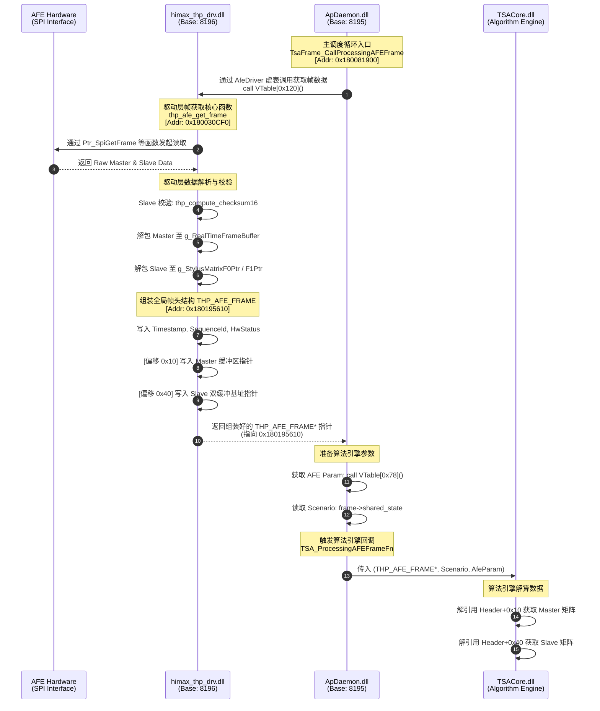

# Himax THP Driver Frame Flow Analysis

## 1. 整体调用链路与中间处理
`ApDaemon` 实际上充当了一个中间件/守护进程的角色，它不负责具体的帧计算，而是将底层 `himax_thp_drv` 解析好的数据直接透传给算法核心库（`TSACore.dll`）。

### 1.1 ApDaemon 调用 thp_afe_get_frame
* **动态符号解析**：在 `ApDaemon` 启动时，加载 `himax_thp_drv.dll` 并通过 `GetProcAddress` 获取 API 指针。
* **接口绑定**：函数指针保存在巨大的函数指针结构体 `fnList` 中，并被包装成了 C++ 的 `AfeDriver` 接口类。
* **调度循环**：在 `ApDaemon` (地址 `0x180081900`, `TsaFrame_CallProcessingAFEFrame`) 中，通过虚函数调用获取帧数据：
  ```cpp
  // 调用 AfeDriver VTable 偏移 0x120 处的虚函数 (GetFrameFn)
  uVar10_frame = (**(code **)(*(longlong *)frame->afe_driver + 0x120))();
  ```

### 1.2 Master/Slave 帧内部处理 (himax_thp_drv.dll)
`ApDaemon` 自身不参与帧数据的数值处理。所有处理在 `himax_thp_drv.dll` 的 `thp_afe_get_frame` (地址 `0x180030cf0`) 内部完成：
1. **读取硬件**：从 AFE 读取原始 Master (Touch) 和 Slave (Stylus/Pen) 数据。
2. **校验与解包 (Slave)**：验证 checksum，解包成标准的 9x9 矩阵，存入全局缓冲区 `g_StylusMatrixF0Ptr` 和 `g_StylusMatrixF1Ptr`。
3. **预处理 (Master)**：进行去噪等处理，存入全局缓冲区 `g_RealTimeFrameBuffer`。
4. **组装结构体**：将指向这些矩阵的指针、时间戳、序列号等打包到一个全局输出 Header (`0x180195610`) 中，并返回该指针。

## 2. 传入 TSA_ProcessingAFEFrameFn 的结构体内存布局
传递给算法的实际上是一个 **88 字节（0x58 Bytes）** 的硬件帧信息头结构（`THP_AFE_FRAME`）。

| 偏移量 (Offset) | 类型 (Type) | 字段名 (Field) | 含义与说明 |
| :--- | :--- | :--- | :--- |
| `0x00` | `uint32_t` | `TimestampSec` | 帧获取时的系统时间（秒）|
| `0x04` | `uint32_t` | `TimestampUsec` | 帧获取时的系统时间（微秒） |
| `0x08` | `uint16_t` | `SequenceId` | 帧序号（`g_FrameSequenceCounter`） |
| `0x0A` | `uint8_t[6]` | `_Padding0` | 内存对齐填充 |
| `0x10` | `void*` | `TouchMatrixPtr` | **[重点] Master 帧数据指针**。指向 `g_RealTimeFrameBuffer` |
| `0x18` | `void*` | `_ReservedPtr1` | 内部保留指针字段 |
| `0x20` | `void*` | `_ReservedPtr2` | 内部保留指针字段 |
| `0x28` | `void*` | `_ReservedPtr3` | 内部保留指针字段 |
| `0x30` | `uint16_t` | `HwStatus0` | 硬件状态 0（工作频点/跳频表配置） |
| `0x32` | `uint16_t` | `HwStatus1` | 硬件状态 1（硬件能力与模式标识） |
| `0x34` | `uint32_t` | `StatusFlags` | **帧状态/错误标志位** (0x00: 正常, 0x40: 超时/无效) |
| `0x38` | `uint64_t`| `_Padding1` | 内存对齐填充 |
| `0x40` | `void**` | `StylusMatrixPairPtr` | **[重点] Slave 帧数据双指针**。二级指针，指向包含 F0 和 F1 的全局指针数组 |
| `0x48` | `void*` | `_ReservedPtr4` | 内部保留指针字段 |
| `0x50` | `void*` | `_ReservedPtr5` | 内部保留指针字段 |

## 3. 帧传递流程图 (Sequence Diagram)
