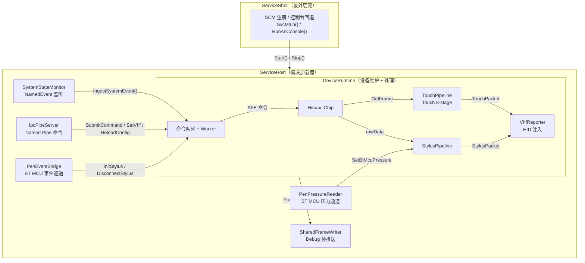
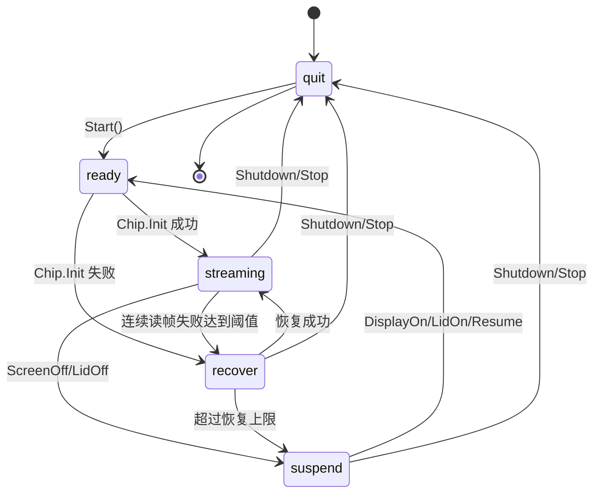
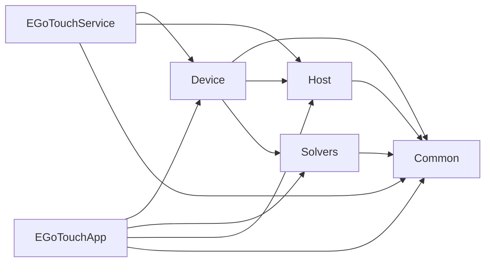

# EGoTouch 驱动服务 — 架构文档 (v4)

> **最后更新**: 2026-04-12  
> **状态**: 文档已与当前代码实现对齐（非规划稿）

---

## 一、系统层次结构

```text
EGoTouchService.exe                     ← 生产服务进程
  ServiceEntry.cpp                      — wmain: --install/--uninstall/--console
  ├── ServiceShell                      — SCM 控制码与电源事件桥接
  │     └── ServiceHost                 — 模块加载器
  │           ├── DeviceRuntime         — 状态机 + 帧采集 Worker + 命令队列
  │           │     ├── Himax::Chip     — I2C/USB 硬件独占
  │           │     ├── TouchPipeline   — Touch 算法管线 (8 stages, 零拷贝)
  │           │     ├── StylusPipeline  — Stylus 独立管线 (统一 HeatmapFrame)
  │           │     └── VhfReporter     — HID VHF 注入
  │           ├── SystemStateMonitor    — 亮灭屏/Lid/Resume/Shutdown 事件
  │           ├── PenEventBridge        — BT MCU 事件通道 (col00)
  │           ├── PenPressureReader     — BT MCU 压力通道 (col01)
  │           ├── IpcPipeServer         — Named Pipe IPC 命令通道
  │           └── SharedFrameWriter     — Shared Memory 帧推送（Debug）

EGoTouchApp.exe                         ← 调试诊断上位机 (Tools/)
  ApplicationEntry.cpp                  — ImGui DX11 主循环
  ├── ServiceProxy                      — Pipe + SharedMem 客户端代理
  │     ├── IpcPipeClient               — 命令通道客户端
  │     ├── SharedFrameReader           — 帧数据读取
  │     ├── FramePipeline (local copy)  — GUI 参数镜像
  │     └── DVR RingBuffer              — 本地回放缓存
  └── DiagnosticsWorkbench              — 调试 UI 面板

BtMcuTestTool.exe                       ← BT MCU 协议验证工具
```

## 二、核心架构特征

**核心系统能力：**

1. `ServiceShell + ServiceHost + DeviceRuntime` 分层明确，服务主链稳定。
2. 触摸和手写笔处理链独立，便于分开调试与禁用。
3. App 通过 `ServiceProxy` 代理通信，不再直接访问硬件。
4. 系统电源事件已闭环接入到 Runtime 状态机。
5. 优化管线性能，全面取消堆分配与 redundant copy，引入固定容量栈缓存（零拷贝）。
6. Touch 和 Stylus 共享同样的诊断 UI 框架并通过 moduleTag 切分子面板。

---

## 三、核心模块详解

### 3.1 服务端三层架构



### 3.2 IPC 通信协议

**命令通道**: `\\.\pipe\EGoTouchControl`

| 命令 | 方向 | 用途 |
|------|------|------|
| `Ping` | App→Svc | 连接探活 |
| `EnterDebugMode` / `ExitDebugMode` | App→Svc | 控制调试帧推送 |
| `StartRuntime` / `StopRuntime` | App→Svc | 远程启停 Runtime |
| `AfeCommand` | App→Svc | AFE 控制命令 |
| `SetVhfEnabled` / `SetVhfTranspose` | App→Svc | VHF 输出控制 |
| `SetAutoAfeSync` | App→Svc | 当前为 placeholder（返回成功） |
| `ReloadConfig` / `SaveConfig` | App→Svc | 配置读取/保存 |
| `GetLogs` | App→Svc | 拉取 Service 端日志 |
| `GetPenBridgeStatus` | App→Svc | 查询 Pen 通道运行状态与压力数据 |

**帧通道**: Shared Memory `Global\EGoTouchSharedFrame`

### 3.3 DeviceRuntime 状态机



**状态说明：**

| 状态 | Worker 行为 |
|------|------------|
| `ready` | auto mode 下尝试 `Chip::Init()` |
| `streaming` | `GetFrame()` + Touch/Stylus 处理 + VHF 上报 |
| `recover` | `check_bus()` + `Init()` 重试 |
| `suspend` | `HoldReset()` 后低功耗等待唤醒事件 |
| `quit` | 退出线程并释放运行态 |

### 3.4 线程汇总

| 线程 | 所属 | 职责 | 创建时机 |
|------|------|------|---------|
| `DeviceRuntime::WorkerMain` | DeviceRuntime | 状态机 + 采帧 + Pipeline + VHF | `DeviceRuntime::Start()` |
| `SystemStateMonitor::WorkerLoop` | Host | 监听 NamedEvent 并回调 | `ServiceHost::Start()` |
| `IpcPipeServer::ServerLoop` | Common | IPC 连接与命令分发 | `ServiceHost::Start()` |
| `PenEventBridge` 线程 | Device/penevt | BT 事件通道读取与处理 | `mode=full` 时 |
| `PenPressureReader` 线程 | Device/penpress | BT 压力通道读取 | `mode=full` 时 |
| `ServiceProxy::PollLoop` | App | 轮询 SharedMem 帧数据 | App 连接后 |
| `ServiceProxy::DiscoveryLoop` | App | 自动发现并重连 Service | App 启动后 |

### 3.5 管线处理链（Pipeline）

```text
Touch Pipeline (Service 侧注册顺序，共 8 段):
  1. MasterFrameParser
  2. BaselineSubtraction
  3. CMFProcessor
  4. GridIIRProcessor
  5. FeatureExtractor
  6. TouchTracker
  7. CoordinateFilter
  8. TouchGestureStateMachine

Stylus Pipeline:
  StylusPipeline
    -> GridPeakDetector
    -> CoordinateSolver
    -> CoorPostProcessor
    -> StylusPacket
```

---

## 四、代码工程目录

```text
EGoTouchRev-rebuild/
├── CMakeLists.txt
├── Common/
│   ├── include/
│   │   ├── Logger.h / GuiLogSink.h
│   │   ├── IpcProtocol.h / IpcPipeServer.h / IpcPipeClient.h
│   │   ├── SharedFrameBuffer.h
│   │   └── ConfigSync.h
│   └── source/
│
├── EGoTouchService/
│   ├── include/                      ← ServiceShell.h / ServiceHost.h
│   ├── source/                       ← ServiceEntry.cpp / ServiceShell.cpp / ServiceHost.cpp
│   ├── Device/
│   │   ├── runtime/                  ← DeviceRuntime
│   │   ├── himax/                    ← HimaxChip / HimaxAfe / Protocol / Registers
│   │   ├── vhf/                      ← VhfReporter
│   │   ├── btmcu/                    ← BT HID transport/channel
│   │   ├── penevt/                   ← PenEventBridge
│   │   └── penpress/                 ← PenPressureReader
│   ├── Solvers/
│   │   ├── Preprocessing/
│   │   ├── TouchSolver/
│   │   ├── Reporting/
│   │   └── StylusSolver/
│   └── Host/                         ← SystemStateMonitor
│
├── Tools/
│   ├── EGoTouchApp/
│   ├── BtMcuTestTool/
│   └── tests/
│
├── scripts/
│   ├── install_service.bat
│   └── uninstall_service.bat
│
└── docs/
    └── architecture_redesign.md
```

---

## 五、构建目标与依赖 (CMake)

| Target | 类型 | 用途 |
|--------|------|------|
| `EGoTouchService` | EXE | 生产服务（Shell + Host + Device + Solvers） |
| `EGoTouchApp` | EXE | 调试诊断 GUI（ImGui DX11 + ServiceProxy） |
| `BtMcuTestTool` | EXE | BT MCU 协议验证 |
| `HostSystemStateMonitorTest` | EXE | Host 事件监听测试 |
| `SolversRawdataBenchmarkTest` | EXE | Solvers 性能基准 |

**依赖图（按 CMake 当前配置）：**



---

## 六、核心接口速查

### DeviceRuntime

```cpp
class DeviceRuntime {
    bool Start();
    void Stop();
    
    bool IsAutoMode() const;
    void SetAutoMode(bool enabled);
    void SetStylusVhfEnabled(bool enabled);

    uint64_t SubmitCommand(command cmd, CommandSource src, const char* reason = "");
    void IngestSystemEvent(const Host::SystemStateEvent& ev);

    Solvers::TouchPipeline& GetTouchPipeline();
    Solvers::StylusPipeline& GetStylusPipeline();
    VhfReporter& GetVhfReporter();
};
```

### ServiceHost

```cpp
class ServiceHost {
    bool Start();   // Parse config -> Runtime -> Monitor -> IPC -> Pen(full)
    void Stop();    // IPC -> Pen -> Monitor -> Runtime
};
```

### ServiceProxy (App 端)

```cpp
class ServiceProxy {
    bool Connect();
    void Disconnect();
    bool GetLatestFrame(Engine::HeatmapFrame& out);

    bool SwitchAfeMode(uint8_t cmd, uint8_t param);
    bool SetVhfEnabled(bool enabled);
    bool SetVhfTranspose(bool enabled);

    void SaveConfig();
    void LoadConfig();
    PenBridgeStatus GetPenBridgeStatus() const;
};
```

