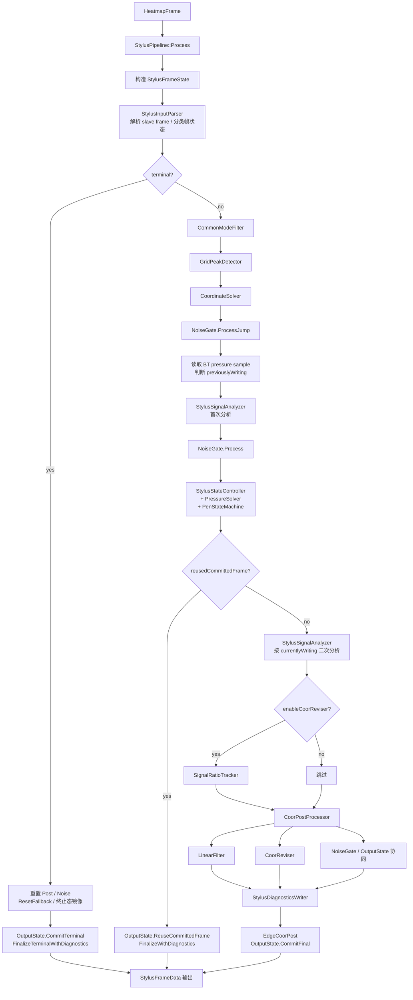
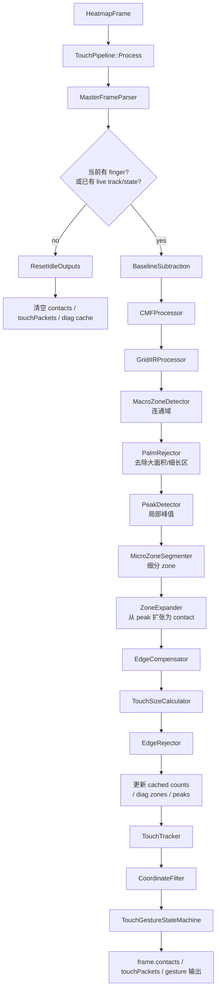
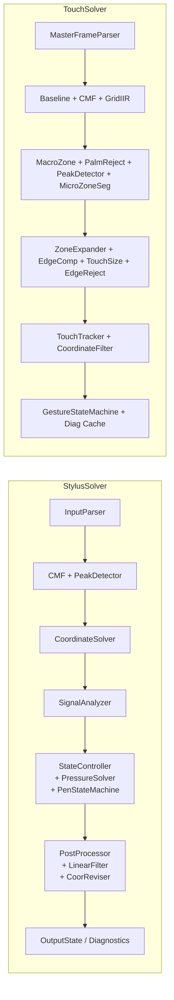

# StylusSolver 与 TouchSolver 架构对比

依据的主入口与核心状态文件：

- `EGoTouchService/Solvers/StylusSolver/StylusPipeline.h`
- `EGoTouchService/Solvers/StylusSolver/StylusPipeline.cpp`
- `EGoTouchService/Solvers/StylusSolver/StylusFrameState.hpp`
- `EGoTouchService/Solvers/TouchSolver/TouchPipeline.h`
- `EGoTouchService/Solvers/TouchSolver/TouchPipeline.cpp`

## 总体结论

两者都属于单入口、成员模块串行编排的 pipeline 架构，但核心关注点不同：

- **StylusSolver**：更偏向“状态驱动的单目标笔输入管线”，强调帧分类、生命周期控制、压力门控、历史结果复用与最终提交语义。
- **TouchSolver**：更偏向“多目标触点检测与跟踪管线”，强调信号预处理、区域分割、contact 生成、轨迹跟踪和手势输出。

---

## StylusSolver 架构图

### StylusSolver 结构特点

1. **以 `StylusFrameState` 为核心中间态**  
   将整条链路拆为 `flow`、`parse`、`tx1/tx2`、`signal`、`lifecycle`、`output` 等子状态域，模块围绕它读写。

2. **前段先做帧分类和路由决策**  
   `StylusInputParser` 会先区分 `Valid`、`ShortFrame`、`NoSignal`、`ParseFail`、`Tx1Missing`，并直接驱动 terminal / reset / packetRoute。

3. **输出有提交语义**  
   `OutputState` 负责 `BeginFrame`、`CommitFinal`、`CommitTerminal`、`ReuseCommittedFrame`、`Finalize`，支持历史有效结果复用。

4. **核心在 pen lifecycle，而不是 contact extraction**  
   中段重点是 `StylusSignalAnalyzer`、`StylusStateController`、`PressureSolver`、`PenStateMachine` 这一组状态控制模块。

---

## TouchSolver 架构图

### TouchSolver 结构特点

1. **典型分阶段线性流水线**  
   `TouchPipeline` 明确分成 Parsing、Conditioning、Feature Extraction、Zone & Contact、Tracking、Gesture 六个阶段。

2. **直接围绕 `HeatmapFrame` 和 `contacts` 工作**  
   没有像 Stylus 那样单独抽出大型帧级状态对象，而是在 `frame` 上逐步加工中间结果和输出结果。

3. **中心问题是多触点生成与跟踪**  
   主要模块链路是 MacroZone → PalmReject → Peak → MicroZone → ZoneExpand → Track。

4. **诊断缓存职责更靠近处理中段**  
   pipeline 内直接维护 peaks / touchZones / zoneEdge 等缓存，并通过 mutex / atomic 提供线程安全访问。

---

## 并排对比图

---

## 关键架构差异

### 1. 数据模型不同

- **StylusSolver**：`StylusFrameState` 是核心中间模型。
- **TouchSolver**：以 `HeatmapFrame` / `contacts` 为中心进行就地加工。

### 2. 处理目标不同

- **StylusSolver**：单笔尖、单结果、连续性优先。
- **TouchSolver**：多触点、多区域、多目标关联优先。

### 3. 控制方式不同

- **StylusSolver**：更强的状态机与分支控制，包含 terminal、reuseCommittedFrame、pressure gate、release 处理。
- **TouchSolver**：更强的线性 phase 控制，绝大多数路径沿固定顺序推进。

### 4. 输出语义不同

- **StylusSolver**：输出带有 commit / reuse / terminal 语义。
- **TouchSolver**：输出更接近“本帧 contact 检测 + 轨迹跟踪 + gesture 状态”。

### 5. 诊断职责位置不同

- **StylusSolver**：诊断更偏后处理末端汇总。
- **TouchSolver**：诊断更偏处理中段缓存和可视化支持。

---

## 一句话总结

- **StylusSolver** 是一个以状态机和输出连续性为核心的单笔输入控制管线。
- **TouchSolver** 是一个以区域分割、峰值提取、contact 生成和多目标跟踪为核心的多点触控检测管线。
