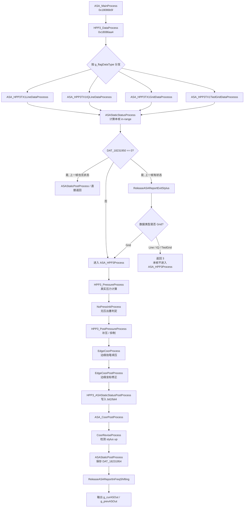

# ASA_HPP3Process 落笔/抬笔逆向分析

> [!NOTE]
> **二进制**: `TSACore.dll`  
> **分析工具**: Ghidra (`HuaweiThpService / TSACore.dll`, port `8193`)  
> **起点函数**: `ASA_HPP3Process` @ `0x180869c2`  
> **目标**: 梳理 HPP3 管线中所有与落笔/抬笔相关的函数、状态位、分支和延后释放路径

---

## 1. 结论概览

`ASA_HPP3Process` 本身不是一个状态机，而是一个 6 步顺序调度器：

```c
void ASA_HPP3Process(void)
{
    HPP3_PressureProcess();
    NoPressInkProcess();
    HPP3_PostPressureProcess();
    EdgeCoorProcess();
    EdgeCoorPostProcess();
    HPP3_ASAStaticStatusPostProcess();
}
```

真正决定当前帧是否“落笔”的，不是单一函数，而是三层组合结果：

1. 真实压感链：`HPP3_PressureProcess -> HPP3_PostPressureProcess`
2. 无压出墨链：`NoPressInkProcess -> NoPressInkHandle`
3. 最终上报链：`HPP3_ASAStaticStatusPostProcess -> ASA_CoorPostProcess -> ReleaseASAReportInFreqShifting / ReleaseASAReportExitStylus`

其中：

- `DAT_18231964` 可视为“真实压感落笔标志”
- `DAT_18231965` 可视为“无压出墨标志”
- `DAT_18231b18` 是“当前帧最终压力”
- `DAT_18231c18` 是“上一帧压力”
- `DAT_18231950` 是“本帧状态位”
- `DAT_18231954` 是“上一帧状态位”
- `DAT_18231b28` 是“最终上报状态位”

---

## 2. 总体流程图

下面的流程图包含了 `ASA_HPP3Process` 本体，以及它前后的关键 gating 与延后释放逻辑。



---

## 3. 顶层时序与入口分支

### 3.1 `ASA_MainProcess` 的位置

`ASA_MainProcess` @ `0x18086b5f` 才是每帧 HPP3 逻辑的真正组织者。与落笔/抬笔直接相关的顺序如下：

1. `ASAStaticStatusPreProcess`
2. `ASAPropertyPreProcess`
3. `ASAStaticPreProcess`
4. `ASAOutClean`
5. `HPP3_DataProcess`
6. `ASA_CoorPostProcess`
7. `AnimationProcess`
8. `ReleaseASAReportInFreqShifting`
9. `memcpy(g_prevASOut, g_curASOut, 0xec)`

### 3.2 `ASAStaticPreProcess`

`ASAStaticPreProcess` @ `0x180889f0` 每帧先执行：

```c
DAT_18231950 = 0;
```

这意味着 `ASA_HPP3Process` 中置上的 `bit2 / bit4` 完全代表本帧结果，不会残留上一帧状态。

### 3.3 `HPP3_DataProcess` 的四个前置解析分支

`HPP3_DataProcess` @ `0x18086aa4` 先根据 `g_flagDataType` 选择：

- `ASA_HPP3TX1LineDataProcesss` @ `0x1808625f`
- `ASA_HPP3TX1IQLineDataProcesss` @ `0x18086476`
- `ASA_HPP3TX1GridDataProcesss` @ `0x1808668d`
- `ASA_HPP3TX1TiedGridDataProcesss` @ `0x180868a2`

这四条路径都会在进入 `ASA_HPP3Process` 之前执行一次 `ASAStaticStatusProcess` @ `0x18088865`。

### 3.4 `ASAStaticStatusProcess` 的作用

```c
if ((DAT_18230c35 == 0) || (DAT_18230a85 == 0)) {
    ExitInRangeMode();
} else {
    DAT_18231950 |= 1;
}
if ((DAT_18231950 & 1) != 0) {
    EnterInRangeMode();
}
```

这里的 `bit0` 是本帧 in-range 标志。如果这里没置位，后面可能根本不会进入 `ASA_HPP3Process`。

### 3.5 不能漏掉的 4 条“是否进入 ASA_HPP3Process”分支

#### 分支 A: `DAT_18231950 != 0`

四条解析路径都会继续走正常后续，最终进入 `ASA_HPP3Process`。

#### 分支 B: `DAT_18231950 == 0 && DAT_18231954 == 0`

四条解析路径都会直接走：

- `ASAStaticPostProcess`
- `ASAPropertyPostProcess`
- 返回 `5`

本帧不会进入 `ASA_HPP3Process`。

#### 分支 C: `DAT_18231950 == 0 && DAT_18231954 != 0` 且当前类型为 `Line / IQLine / TiedGrid`

会执行：

- `ReleaseASAReportExitStylus()`
- 返回 `3`

本帧不会进入 `ASA_HPP3Process`。

#### 分支 D: `DAT_18231950 == 0 && DAT_18231954 != 0` 且当前类型为 `Grid`

这是最容易漏掉的特殊分支：

- 先执行 `ReleaseASAReportExitStylus()`
- 但函数返回 `0`
- `HPP3_DataProcess` 之后仍会继续调用 `ASA_HPP3Process`

也就是说，`Grid` 路径在“当前 out-range、上一帧仍有状态”时，仍可能执行后续的压力/抬笔后处理。

---

## 4. `ASA_HPP3Process` 六个函数的完整职责

### 4.1 `HPP3_PressureProcess` @ `0x1807fd1d`

这是“真实压感落笔”的起点。

#### 执行顺序

1. `DAT_18231964 = 0`
2. 原始压力为 0 时，直接令 `DAT_18231b18 = 0`
3. 原始压力非 0 时：
   - `GetPressInMapOrder()`
   - `HPP3_GetPressureMapping()`
   - 如果当前映射压力非 0 且上一帧压力非 0，则 `PressureIIR(0x40)`
4. `g_btPressCnt++`
5. `HPP3_SuppressBtPressBySignal()`
6. 若 `DAT_18231b18 != 0`，则 `DAT_18231964 = 1`

#### 相关子函数与全部分支

##### `GetPressInMapOrder`

- `flash+0xa30 == 1`
  - `g_btPressCnt < 6` 且原始压力缓存非空：按 `g_btPressMapOncell` 取映射顺序
  - 否则直接用当前原始压力
- `flash+0xa30 == 2`
  - `g_btPressCnt < 4` 且原始压力缓存非空：按 `g_btPressMapIncell` 取映射顺序
  - 否则直接用当前原始压力
- 其他值：直接用当前原始压力

##### `HPP3_GetPressureMapping`

- `param_1 == 0xfff`：直接返回 `0xfff`
- 高段：走一条四次多项式
- 中段：走另一条四次多项式
- 低段：
  - `param_1 <= 1`：返回原值
  - `param_1 > 1`：强制返回 `1`
- 若结果超过 `0xfff`：裁到 `0xfff`

##### `PressureIIR(0x40)`

使用当前映射压力与上一帧压力做 IIR 平滑：

```c
DAT_18231b18 = (DAT_18231c18 * (0x80 - 0x40) + DAT_18231b18 * 0x40) >> 7;
```

##### `HPP3_SuppressBtPressBySignal`

这是第一条强制抬笔路径：

- 若 `DAT_18231b18 == 0`：清 `g_hpp3ExitFlag`
- 若 `g_hpp3ExitFlag == 0` 且信号低于进入阈值、且 X/Y 边缘有效位都没置位：
  - `g_hpp3ExitFlag = 1`
  - `DAT_18231b18 = 0`
  - `DAT_18231964 = 0`
- 若 `g_hpp3ExitFlag == 1`
  - 若信号超过退出阈值：清 `g_hpp3ExitFlag`
  - 否则继续保持：
    - `DAT_18231b18 = 0`
    - `DAT_18231964 = 0`

#### 这一阶段的结论

- `DAT_18231964` 代表“真实压感最终有效”
- `DAT_18231b18` 此时代表“真实压力输出候选值”
- 但后面还可能被无压出墨补压，或被边缘/低信号逻辑再次改写

---

### 4.2 `NoPressInkProcess` @ `0x18076996`

这是“无真实压力但仍然维持落笔”的入口。

#### 顶层分支

- `ASA_IsHpp3NoPressInkFeatureEnabled() == 0`
  - 整条无压出墨链完全不执行
- `ASA_IsHpp3NoPressInkFeatureEnabled() != 0`
  - 继续执行下面的学习与判定逻辑

#### 第一段：是否运行 `NoPressInkHandle`

- 若 `ASA_IsHpp3NoPressTLearnedFeatureEnabled() == 0`
  - 直接执行 `NoPressInkHandle()`
- 若学习特性开启且 `g_noPressPara != 0`
  - 直接执行 `NoPressInkHandle()`
- 若学习特性开启但 `g_noPressPara == 0`
  - 不执行 `NoPressInkHandle()`
  - 直接 `DAT_18231965 = 0`

#### 第二段：学习逻辑

若学习特性开启：

- `g_noPressPara == 0`：执行 `NoPressInkLearningPrepareProcess()`
- `g_noPressPara != 0`：执行 `NoPressInkLearningProcess()`
- 若 `lastFlagHPP3NoPressInk_6997 != (DAT_18231964 | DAT_18231965)`：执行 `NoPressInkLearningLog()`

#### 学习链中涉及但不直接改写当前帧落笔状态的函数

- `NoPressInkLearningPrepareProcess`
- `NoPressInkLearningProcess`
- `CheckShortTermTable`
- `UpdateLongTermTable`
- `UpdateTiltCompScal`
- `UpdateSafeTable`
- `ClearShortTermTable`
- `IsMeetNoPressInkLearningCondition`
- `UpdateMaxSignalInTableShortTerm`
- `CalcNoPressInkThd`
- `IsTiltMeetLearnedCondition`
- `GetAvgNoPressInkLearningUnitPara`
- `GetCompensationByTilt`
- `ClearTiltPrmt`

这些函数主要更新阈值表、倾角补偿和学习状态，不直接写本帧的 `DAT_18231b18` 或 `DAT_18231964`。

---

### 4.3 `NoPressInkHandle` @ `0x18076814`

这是无压出墨是否成立的核心函数。

#### 执行顺序

1. `BuffTX1And2SignalAndPos()`
2. `CheckSignalAbnormalStatus()`
3. 若学习特性开且 `IsTiltLearnedOK() == 0`，则强制退出无压模式
4. 若 `g_flagTX2NotNull != 0`，执行 `GetNoPressInkTiltCompensation()`
5. `UpdateNoPressInkThold()`
6. `EnterToNoPressInk()`
7. `ExitToNoPressInk()`
8. 若坐标修正特性开且 `g_flagTX2Start == 0`，强制清 `DAT_18231965`

#### `IsTiltLearnedOK` 分支

- `stylus+0x24b == 0`：返回 1
- `DAT_18219eb4 == 1`：返回 1
- 当前 TX2 信号落在 `[DAT_18219eb6 - 200, DAT_18219eb8 + 200]`：返回 1
- 否则返回 0，并在 `NoPressInkHandle` 中触发：
  - `DAT_18231965 = 0`
  - 无压出墨本帧失效

#### `UpdateNoPressInkThold`

调用 `GetNopressInkTholdFromLearnedTable(curX, curY)`，然后叠加 `g_noPressInkTiltCompensation`，得到四个门限：

- `DAT_18231968`
- `DAT_1823196a`
- `DAT_1823196c`
- `DAT_1823196e`

#### `EnterToNoPressInk` 的全部分支

取决于 `flash+0xa50`：

- `== 0`
  - 若进入阈值均值 `< DAT_18231164`，返回 1
  - 否则返回 0
- `!= 0`
  - 若 `DAT_1823196a < DAT_18231162 && DAT_1823196e < DAT_18231160`，返回 1
  - 否则返回 0

进入去抖逻辑：

- 返回 0
  - 若当前还未进入无压模式：`DAT_18231967 = 2`
- 返回 1
  - 若 `DAT_18231967 != 0`：`DAT_18231967--`
  - 若 `DAT_18231967 == 0`
    - `DAT_18231965 = 1`
    - `DAT_18231966 = 2`

#### `ExitToNoPressInk` 的全部分支

同样取决于 `flash+0xa50`：

- `== 0`
  - 若 `DAT_18231164 < 退出阈值均值`，返回 1
  - 否则返回 0
- `!= 0`
  - 若 `DAT_18231162 < DAT_18231968 && DAT_18231160 < DAT_1823196c`，返回 1
  - 否则返回 0

退出去抖逻辑：

- 返回 0
  - 若当前已经在无压模式：`DAT_18231966 = 2`
- 返回 1
  - 若 `DAT_18231966 != 0`：`DAT_18231966--`
  - 若 `DAT_18231966 == 0`
    - `DAT_18231965 = 0`
    - `DAT_18231967 = 2`

#### `NoPressInkHandle` 的最终结论

- `DAT_18231965 = 1` 表示“无真实压力但允许继续出墨”
- 它不会直接把 `DAT_18231b18` 置为非 0
- 真正把无压出墨变成“仍然落笔”的动作在下一步 `HPP3_PostPressureProcess`

---

### 4.4 `HPP3_PostPressureProcess` @ `0x1807ffa4`

这是决定“本帧最终压力”的关键函数。

#### 第一段：无压出墨补压

```c
if (DAT_18231964 == 0 && DAT_18231965 != 0) {
    DAT_18231b18 = 10;
    if (DAT_18231c18 != 0) {
        DAT_18231b18 = DAT_18231c18;
    }
}
```

这里有两条分支：

- 上一帧压力为 0：本帧补最小压力 `10`
- 上一帧压力非 0：本帧直接复用上一帧压力

#### 第二段：频点切换期间是否允许假压力递减

调用：

- `HPP3_BtPenInFreqShifting()`
- `HPP3_BtPenFreqShiftingDebounceTimeOut()`

分支如下：

- 不在 freq shifting，或 debounce 已超时
  - 允许继续执行假压力递减逻辑
- 在 freq shifting 且 debounce 未超时
  - 立即清：
    - `g_disablePressEdgeSignalIsTooLow = 0`
    - `g_fakePressureDecreaseAdded = 0`
    - `g_fakePressureDecreaseAddNum = 0`

#### 第三段：`HPP3_FakePressureDecreaseProcess`

当满足以下条件时执行：

- `flash+0xa74 != 0`
- `DAT_18231c18 > 500`
- `DAT_18231b18 < 11`

该函数按 `DAT_1820dc38` 选择 1、2、3 档递减步数：

- `<= 100`：不加
- `101..300`：1 档
- `301..500`：2 档
- `> 500`：3 档

若 `g_fakePressureDecreaseAddNum != 0`，则返回：

```c
(g_fakePressureDecreaseAddNum * DAT_18231c18) / (g_fakePressureDecreaseAddNum + 1)
```

这是一条“抬笔拖尾”路径，能让压力从上一帧逐级衰减，而不是瞬间归零。

#### 第四段：边缘低信号抑制

若 `DAT_18231b18 == 0`：

- 清 fake pressure decrease 的全部状态

若 `DAT_18231b18 != 0`：

- 根据信号与阈值判断 `g_disablePressEdgeSignalIsTooLow` 是否置位
- 置位后若满足恢复阈值则清位
- 若最终仍置位：
  - `DAT_18231b18 = 0`
  - `DAT_18231964 = 0`

这是一条独立于 `HPP3_SuppressBtPressBySignal` 的第二条强制抬笔路径。

---

### 4.5 `EdgeCoorProcess` @ `0x1806f250`

这是“第一次 release 时边缘补点”的逻辑。

#### X 维分支

满足以下所有条件时命中：

- `g_firstRelease != 0`
- `DAT_18230a84 == 1`
- `DAT_18231b18 == 0`
- `DAT_18231c18 != 0`
- `abs(DAT_18231b50 - DAT_18231b44) > 0x200`
- `DAT_18231b50` 落在内部合法区间内

命中后：

- `g_needCoor2EdgeHighSpeed = 1`
- `g_firstRelease = 0`
- `bVar1 = true`

#### Y 维分支

完全对称，只是使用：

- `DAT_18230c34`
- `DAT_18231b74`
- `DAT_18231b68`

#### 后续共同分支

- 若 `DAT_18231b18 != 0`
  - `g_firstRelease = 1`
- 若 `bVar1 == true`
  - `DAT_18231b18 = DAT_18231c18`

#### 结论

`EdgeCoorProcess` 会在“抬笔首帧 + 边缘跳变过大”时，把当前压力从 0 再恢复成上一帧压力，相当于额外续一帧笔。

---

### 4.6 `EdgeCoorPostProcess` @ `0x1806f688`

此函数只在 `DAT_18231b18 != 0` 时执行，负责把靠近边缘的坐标压缩/拉回到屏幕范围。

它不会新建任何落笔状态，只做：

- X 边缘坐标压缩
- Y 边缘坐标压缩

因此它属于“落笔后坐标修饰”，不是新的落笔/抬笔判定源。

---

### 4.7 `HPP3_ASAStaticStatusPostProcess` @ `0x18088935`

这是把上面计算结果写入本帧状态位的最后一步。

```c
if (DAT_18231964 != 0) {
    DAT_18231950 |= 2;
}
if (DAT_18231b18 != 0) {
    DAT_18231950 |= 4;
}
if ((DAT_18231950 & 4) != 0) EnterNoPressInkMode();
if ((DAT_18231950 & 4) == 0) ExitNoPressInkMode();
if ((DAT_18231950 & 2) != 0) EnterInkMode();
if ((DAT_18231950 & 2) == 0) ExitInkMode();
```

这里必须区分两个 bit：

- `bit2` 来自 `DAT_18231964`
  - 表示真实压感 ink
- `bit4` 来自 `DAT_18231b18 != 0`
  - 表示最终压力非 0
  - 可能来自真实压力，也可能来自无压补压、边缘续压、拖尾压力

这也是为什么 `ASA_GetRptInk()` 最终要看：

```c
(DAT_18231b28 & 2) != 0 || (DAT_18231b28 & 4) != 0
```

---

## 5. `ASA_HPP3Process` 之后仍会影响抬笔的函数

### 5.1 `ASA_CoorPostProcess` @ `0x180869ef`

后处理顺序如下：

1. `LinearFilterProcess`
2. `GetRealTimeCoor2Buf`
3. `Get3PointAvgFilter`
4. `CoorReviseProcess`
5. `GetCoorSpeed`
6. `GetIIRCoef`
7. `CoorFilterProcess`
8. `AftCoorProcess`
9. `FitToLcdScreen`
10. `DAT_18231b28 = DAT_18231950`
11. `ASAStaticPostProcess`
12. `ASAPropertyPostProcess`

这里最关键的动作是：

```c
DAT_18231b28 = DAT_18231950;
```

即本帧上报状态位是在 `ASA_CoorPostProcess` 中最终锁存的。

### 5.2 `CoorReviseProcess` @ `0x180728bd`

这个函数虽然不主导落笔，但会明确识别“stylus up”：

```c
if (DAT_18231c18 != 0 && DAT_18231b18 == 0) {
    CoorReviseInit();
}
```

这是一个明确的抬笔检测条件。

它还有两条与无压模式相关的分支：

- `g_flagTX2Start == 0`
  - `DAT_18231965 = 0`
- `g_flagTX2Start != 0`
  - 若 `g_flagTX2NotNull != 0`，执行 `CoorReviseCalculation()`
  - 始终执行 `CoorReviseWork()`

反编译还给出了一条：

```c
if (g_flagTX2Start == 0) {
    DAT_18231b18 = 0;
}
```

但从汇编看，它依赖同一字节在两次读取间发生变化，正常单线程路径下近似不可达。这里保留记录，但不把它作为稳定主分支。

---

## 6. 两条“延后抬笔 / 保上一帧输出”路径

### 6.1 `ReleaseASAReportInFreqShifting` @ `0x18085218`

```c
if (NeedASAReportInFreqShifting() != 0) {
    memcpy(&g_curASOut, &g_prevASOut, 0xec);
}
```

即使 `ASA_HPP3Process` 已经算出抬笔，本函数仍可能把上一帧的落笔输出整帧拷贝回来。

#### `NeedASAReportInFreqShifting` 的全部分支

命中大条件之一即可继续：

- `HPP3_BtPenInFreqShifting() != 0` 且 `HPP3_BtPenFreqShiftingDebounceTimeOut() == 0`
- 或 `(DAT_18231c28 & 6) != 0` 且 `HPP3_NeedNoiseDebounce() != 0`

继续后还有三条保帧分支：

##### 分支 1

若 `DAT_18231950 == 0 && DAT_18231954 != 0`

- `DAT_18231950 = DAT_18231954`
- 返回 1

即：当前帧已经抬笔，但频点切换窗口内直接恢复上一帧状态。

##### 分支 2

若 `上一帧 active stylus bit 存在` 且 `当前帧 active stylus bit 丢失`

- `DAT_18231958 = DAT_1823195c`
- 返回 1

##### 分支 3

若 `ASA_GetRptInk() == 0` 且 `(DAT_18231c28 & 6) != 0`

- 返回 1

### 6.2 `ReleaseASAReportExitStylus` @ `0x1808527b`

这是出范围或退出 stylus 模式时的专用释放函数。

#### 第一层分支：频点切换保帧

- 若 `ReleaseASAReportInFreqShifting() != 0`
  - 直接返回 1

#### 第二层分支：上一帧是否有 ink

##### 情况 A: `DAT_18231c28` 不含 `bit2/bit4`

- 若也不含 `bit1`
  - `ASAOutClean()`
  - `ASAStaticCounterClean()`
- 若仅有 `bit1`
  - 先 `memcpy(g_curASOut, g_prevASOut, 0xec)`
  - 再根据 `DAT_18231b1c / DAT_18231b24` 决定继续保一帧或清空

##### 情况 B: `DAT_18231c28` 含 `bit2` 或 `bit4`

- 先 `memcpy(g_curASOut, g_prevASOut, 0xec)`
- 再执行 `EdgeCoorProcessExitStylusWithInk()`

###### `EdgeCoorProcessExitStylusWithInk` 的分支

- X 维边缘跳变满足条件
  - `DAT_18231a50 = DAT_18231b44`
  - `DAT_18231a74 = DAT_18231b68`
  - 返回 1
- 否则检查 Y 维
  - 满足条件则同样返回 1
- X/Y 都不满足
  - 返回 0

###### 根据返回值继续分支

- 返回 0
  - `DAT_18231b28 = 1`
  - `DAT_18231b18 = 0`
- 返回 1
  - `DAT_18231b28 = 4`

因此，`ReleaseASAReportExitStylus` 本身也可能在退出时保一帧 ink。

---

## 7. 状态机视角的落笔/抬笔流程图

```mermaid
flowchart TD
    A[开始: 本帧进入 HPP3 处理] --> B[HPP3_PressureProcess]
    B --> C{DAT_18231b18 != 0 ?}
    C -- 是 --> C1[DAT_18231964 = 1<br/>真实压感落笔成立]
    C -- 否 --> C2[DAT_18231964 = 0]

    C1 --> D[NoPressInkProcess]
    C2 --> D

    D --> E{DAT_18231965 == 1 ?}
    E -- 否 --> F[保持当前 DAT_18231b18]
    E -- 是 --> G[HPP3_PostPressureProcess 补压]

    G --> G1{DAT_18231c18 != 0 ?}
    G1 -- 是 --> G2[DAT_18231b18 = DAT_18231c18]
    G1 -- 否 --> G3[DAT_18231b18 = 10]

    F --> H{后置抑制命中?}
    G2 --> H
    G3 --> H

    H -- 是 --> H1[DAT_18231b18 = 0<br/>DAT_18231964 = 0]
    H -- 否 --> I[继续]

    H1 --> J{EdgeCoorProcess 可续压?}
    I --> J

    J -- 是 --> J1[DAT_18231b18 = DAT_18231c18]
    J -- 否 --> K[保持当前压力]
    J1 --> K

    K --> L[HPP3_ASAStaticStatusPostProcess]
    L --> M{DAT_18231964 != 0 ?}
    M -- 是 --> M1[DAT_18231950 |= 2]
    M -- 否 --> M2[不置 bit2]

    M1 --> N{DAT_18231b18 != 0 ?}
    M2 --> N

    N -- 是 --> N1[DAT_18231950 |= 4]
    N -- 否 --> N2[不置 bit4]

    N1 --> O[ASA_CoorPostProcess 锁存 DAT_18231b28]
    N2 --> O

    O --> P{频切保帧 / ExitStylus 保帧命中?}
    P -- 是 --> P1[复制 g_prevASOut<br/>延后抬笔]
    P -- 否 --> Q[按本帧结果输出]
```

---

## 8. 所有直接改写关键状态的函数

为了确认没有漏掉分支，我对关键状态做了 xref 反查。与落笔/抬笔直接相关的写入点如下。

### 8.1 `DAT_18231964` 写入点

- `HPP3_PressureProcess`
- `HPP3_SuppressBtPressBySignal`
- `HPP3_PostPressureProcess`

### 8.2 `DAT_18231965` 写入点

- `NoPressInkHandle`
- `NoPressInkProcess`
- `CoorReviseProcess`

### 8.3 `DAT_18231b18` 写入点

- `HPP3_PressureProcess`
- `PressureIIR`
- `HPP3_SuppressBtPressBySignal`
- `HPP3_PostPressureProcess`
- `EdgeCoorProcess`
- `CoorReviseProcess` 的可疑反编译分支
- `ReleaseASAReportExitStylus`

### 8.4 `DAT_18231950` 写入点

- `ASAStaticPreProcess`
- `ASAStaticStatusProcess`
- `HPP3_ASAStaticStatusPostProcess`
- `NeedASAReportInFreqShifting`

### 8.5 `DAT_18231b28` 写入点

- `ASA_CoorPostProcess`
- `ReleaseASAReportExitStylus`

---

## 9. 最终结论

HPP3 的“落笔/抬笔”不是单阈值判断，而是下面几条路径叠加后的结果：

1. 真实压力非 0，形成真实压感落笔
2. 真实压力为 0 但无压出墨成立，由 `HPP3_PostPressureProcess` 补一个非 0 压力
3. 当前帧已抬笔但边缘首帧跳变过大，由 `EdgeCoorProcess` 续回上一帧压力
4. 当前帧本应抬笔，但频点切换或退出 stylus 释放逻辑仍可能复制上一帧输出，从而延后抬笔

对应的主要抬笔路径则包括：

1. 原始压力为 0，且无压出墨未成立
2. `HPP3_SuppressBtPressBySignal` 信号过低强制清压
3. `HPP3_PostPressureProcess` 的 edge-signal-low 后置抑制强制清压
4. `NoPressInkHandle` 中 `ExitToNoPressInk` 连续命中，退出无压模式
5. `ASAStaticStatusProcess` 判定本帧 out-range，导致前置释放，不再进入 `ASA_HPP3Process`

如果只看 `ASA_HPP3Process`，会漏掉三类关键分支：

- `HPP3_DataProcess` 四条前置解析路径中的 in-range gating
- `ASA_CoorPostProcess / CoorReviseProcess` 对抬笔的后置处理
- `ReleaseASAReportInFreqShifting / ReleaseASAReportExitStylus` 的延后抬笔保帧逻辑

因此，完整答案应当把这些外围函数一并纳入，才能正确解释 HPP3 的落笔/抬笔行为。

---

## 10. 管线输入帧结构

这部分是从 `TSA_ProcessingAFEFrame -> AFE_SetFrame -> AFE_GetFrame -> TSA_ASAProcess / ASA_MainProcess` 的实际字段访问反推出来的。

### 10.1 顶层 `AFEFrame`（传入 TSACore 的每帧对象）

`TSA_ProcessingAFEFrame` 调用 `AFE_SetFrame(frame)` 后，`AFE_GetFrame()` 返回内部缓存对象。  
`ASA_MainProcess` 直接把它当作 `int*` 使用，但从读写偏移看，它本质上是一个带多个指针槽位的帧头结构。

### 10.2 已确认字段

#### 证据来源

- `ASA_MainProcess`
- `TSA_ProcessingAFEFrame`
- `AFE_SetFrame`
- `EventAnalyzer_GetEventValue`
- `TSA_ASAAFEStatus / TSA_ASAAFETX1Freq / TSA_ASAAFETX2Freq`

#### 候选结构体

```c
typedef struct _TsaAfeFrame {
    uint32_t timestampSec;          // +0x00  frame[0]
    uint32_t timestampUsec;         // +0x04  frame[1]
    uint16_t frameSequence;         // +0x08  (uint16)frame[2]
    uint16_t reserved0A;            // +0x0A  未见直接访问
    uint16_t afeCurrentFreqCmd;     // +0x0C  上游文档已确认, TSACore 本文未直接读取
    uint16_t reserved0E;            // +0x0E

    int16_t* unifiedGridOrDiff;     // +0x10  TSA_SavePreUnifiedRaw / AFE_SetFrame 会复制
    int16_t* unifiedLine;           // +0x18  AFE_SetFrame 会复制

    void*    reserved20;            // +0x20  未确认
    void*    reserved28;            // +0x28  未确认

    uint16_t afeInfo0;              // +0x30  EventAnalyzer case 10
    uint16_t afeInfo1;              // +0x32  EventAnalyzer case 11
    uint32_t statusFlags;           // +0x34  EventAnalyzer case 12/15
    uint64_t reserved38;            // +0x38  未确认

    struct _TsaStylusFrame* stylus; // +0x40  ASA_MainProcess 读取
} TsaAfeFrame;
```

### 10.3 各字段的访问证据

- `+0x00/+0x04`
  - `ASA_MainProcess` 计算：
  - `timestamp = frame[0] * 1000 + frame[1] / 1000`
- `+0x08`
  - `ASA_MainProcess` 取 `(uint16)frame[2]`
- `+0x10`
  - `TSA_ProcessingAFEFrame` 调 `TSA_SavePreUnifiedRaw(*(void**)(frame+0x10), flags)`
  - `AFE_SetFrame` 会把这里指向的数据复制到 `g_afeGridData`
- `+0x18`
  - `AFE_SetFrame` 会把这里指向的数据复制到 `g_afeLineData`
- `+0x30`
  - `EventAnalyzer_GetEventValue(case 10)` 读取
- `+0x32`
  - `EventAnalyzer_GetEventValue(case 11)` 读取
- `+0x34`
  - `EventAnalyzer_GetEventValue(case 12/15)` 读取
- `+0x40`
  - `TSA_ASAProcess`
  - `ASA_MainProcess`
  - `TSA_ASAAFEStatus`
  - `TSA_ASAAFETX1Freq`
  - `TSA_ASAAFETX2Freq`

### 10.4 `statusFlags` 的顶层语义

`EventAnalyzer_GetEventValue` 对 `frame + 0x34` 的访问表明，顶层 frame 还有一层独立于 `stylus->status` 的 AFE 状态字：

- `statusFlags & 3`
  - 被当作 frame 输出状态分类
- `statusFlags & 1`
  - 某类事件开关
- `statusFlags & 2`
  - 某类事件开关
- `statusFlags & 0x60000`
  - 某类高位状态位

结合上游驱动逆向文档，这个字段和 `FrameOut` 层的状态字高度一致，但在 TSACore 里它主要用于事件分析和状态窥视，不直接参与 `ASA_HPP3Process` 的落笔计算。

---

### 10.5 `StylusFrame`（`frame + 0x40` 指向的子结构）

这是 `ASA_MainProcess`、`ValidJudgment`、`HPP3_UpdataStylus2Buf`、`HPP3_UpdateFreq` 等函数直接消费的对象。

#### 已确认字段

```c
typedef struct _TsaStylusFrame {
    int16_t* tx1Data;               // +0x00
    int16_t* tx2Data;               // +0x08
    uint16_t tx1Freq;               // +0x10
    uint16_t tx2Freq;               // +0x12
    uint16_t pressure;              // +0x14
    uint16_t reserved16;            // +0x16  对齐位
    uint32_t button;                // +0x18
    uint32_t status;                // +0x1C

    uint16_t* hpp3FreqTable;        // +0x20  HPP3_UpdateFreq 会按 g_asaHpp3Freq 拷贝
    uint16_t reservedPtr24;         // +0x24  指针高半部分的一部分, 非独立字段

    uint16_t nextTx1Freq;           // +0x28
    uint16_t nextTx2Freq;           // +0x2A
} TsaStylusFrame;
```

> `reservedPtr24` 不是实际独立成员，只是为了说明 `+0x20` 到 `+0x27` 是一个 8 字节指针槽。真正有效的是 `hpp3FreqTable`。

### 10.6 各字段的访问证据

- `+0x00 tx1Data`
  - `ValidJudgment`
  - `HPP3_UpdateStylus2BufNormalLine`
  - `HPP3_UpdateStylus2BufIQLine`
  - `HPP3_UpdateStylus2BufNormalGrid`
  - `HPP3_UpdateStylus2BufTiedGrid`
- `+0x08 tx2Data`
  - `ValidJudgment`
  - `HPP3_UpdataStylus2Buf`
  - 上述四个 `UpdateStylus2Buf*`
- `+0x10/+0x12 tx1Freq/tx2Freq`
  - `TSA_ASAProcess`
  - `ASA_MainProcess`
  - `HPP3_UpdataStylus2Buf`
  - `HPP3_UpdateFreq`
  - `TSA_ASAAFETX1Freq / TSA_ASAAFETX2Freq`
- `+0x14 pressure`
  - `TSA_ASAProcess` 日志输出
  - `HPP2_UpdataStylus2Buf` 复制到 `g_pressBuf`
- `+0x18 button`
  - `TSA_ASAProcess` 日志输出
  - `HPP2_UpdataStylus2Buf` 复制到 `g_buttonBuf`
- `+0x1C status`
  - `TSA_ASAProcess`
  - `ASA_MainProcess`
  - `ValidJudgment`
  - `ASA_IsTouchNull`
  - `MultiPanelSwitchUpdateTPFlag`
  - `TSA_ASAAFEStatus`
- `+0x20 hpp3FreqTable`
  - `HPP3_UpdateFreq`
- `+0x28/+0x2A nextTx1Freq/nextTx2Freq`
  - `HPP3_UpdateFreq`

### 10.7 `status` 字段的位语义

根据 `ValidJudgment`、`ASA_MainProcess`、`HPP3_FreqShiftProcess`、`ASA_IsTouchNull` 的交叉验证，可以比较稳地得到下面这版解释：

| Bit | 含义 | 证据 |
|-----|------|------|
| 0 | HPP2 协议 | `ValidJudgment` 互斥校验 |
| 1 | HPP3 协议 | `ValidJudgment` + `ASA_MainProcess` 里 HPP3 分支 |
| 2 | 模式位 A | `ValidJudgment` 视为 mode；`ASA_MainProcess` 用它决定 bypass |
| 3 | 模式位 B | `ValidJudgment` 视为 mode |
| 4 | Active / Stylus Present | `ValidJudgment` 视为 mode；`MultiPanelSwitchUpdateTPFlag`、`StylusRecheck_EnterStylusMode` 依赖它 |
| 5 | FreqShift ACK/状态位 | `HPP3_FreqShiftProcess` 保留到 `DAT_18231960` |
| 6 | FreqShift REQ/状态位 | `HPP3_FreqShiftProcess` 保留到 `DAT_18231960` |
| 7 | FreqShift DONE/状态位 | `HPP3_FreqShiftProcess` 保留到 `DAT_18231960` |

> 这里对 bit2/bit3/bit4 的精确命名仍保留谨慎态度。可以确定的是：它们一起构成 `ValidJudgment` 所谓的 “mode bits”，且 bit4 同时被 TSACore 当作“笔处于 active/present 状态”的外部门控。

---

### 10.8 `tx1Data / tx2Data` 的 payload 结构

从 `HPP3_UpdataStylus2Buf` 的汇编可以看到，HPP3 实际保留了四条数据解释分支：

- `dataType = 0` -> `HPP3_UpdateStylus2BufNormalLine`
- `dataType = 1` -> `HPP3_UpdateStylus2BufIQLine`
- `dataType = 2` -> `HPP3_UpdateStylus2BufNormalGrid`
- `dataType = 3` -> `HPP3_UpdateStylus2BufTiedGrid`

但当前这版二进制在 `HPP3_UpdataStylus2Buf` 入口直接把 `g_flagDataType = 2`，所以**实跑路径固定为 NormalGrid**。

#### A. NormalGrid（当前版本实际使用）

`HPP3_UpdateStylus2BufNormalGrid` 直接按：

```c
wordCount = sensorRows * sensorCols;
tx1Data[i], tx2Data[i]
```

顺序复制，说明 `tx1Data / tx2Data` 在 Grid 模式下就是两个完整的 `u16[sensorRows * sensorCols]` 缓冲区。

#### B. NormalLine

`HPP3_UpdateStylus2BufNormalLine` 会根据 `flash+0xa28 / flash+0xa29`、以及若干启用位图，从 `tx1Data / tx2Data` 中抽取若干一维 trace。  
因此在该模式下，`tx1Data / tx2Data` 不是完整二维 grid，而是“选通 line 集合”的紧凑缓冲区。

#### C. IQLine

`HPP3_UpdateStylus2BufIQLine` 与 NormalLine 类似，但调用 `HPP3_UpdateStylus2BufIQLineUnit2`，并依赖额外 IQ 缓冲。  
因此该模式下 payload 更像“按 trace 打包的 I/Q 线数据”。

#### D. TiedGrid

`HPP3_UpdateStylus2BufTiedGrid` 把 payload 拆成两段：

- 前半段：`bVar2 * sensorCols` 个 word
- 后半段：`bVar1 * sensorRows` 个 word

然后分别投影累加到 dim1 / dim2。  
所以 TiedGrid 模式下，`tx1Data / tx2Data` 不是完整矩阵，而是“绑线后的二维条带数据”。

### 10.9 当前版本的实际结论

对当前这版 `TSACore.dll`，可以把 HPP3 的输入 stylus payload 简化理解成：

```c
// 当前 build 的实际消费形态
typedef struct _TsaStylusFrame_Runtime {
    uint16_t* tx1Grid;             // rows * cols
    uint16_t* tx2Grid;             // rows * cols, 可为空
    uint16_t  tx1Freq;
    uint16_t  tx2Freq;
    uint16_t  pressure;
    uint32_t  button;
    uint32_t  status;
    uint16_t* freqTable;           // 可为空
    uint16_t  nextTx1Freq;
    uint16_t  nextTx2Freq;
} TsaStylusFrame_Runtime;
```

也就是说：

- 顶层 `AFEFrame` 负责时间戳、AFE 状态、统一 raw 指针和 stylus 子帧入口
- `StylusFrame` 负责具体的笔输入
- 在当前 build 中，`tx1Data / tx2Data` 实际按完整 Grid 解释

---

## 11. HPP3 特征提取伪代码

> [!IMPORTANT]
> 以下伪代码以**当前这版 DLL 的实际运行路径**为准。  
> 由于 `HPP3_UpdataStylus2Buf()` 在入口把 `g_flagDataType` 固定成 `2`，因此 HPP3 实际走的是 **Grid 路径**。  
> 所以下面的 `peak / signal / projection` 以 `Grid` 版为主，不混入未实际启用的 `Line/IQLine/TiedGrid` 逻辑。

### 11.1 TX1 Peak 计算

TX1 的主峰提取由这几步组成：

- `HPP3_FindPeakOfNormalGrid`
- `HPP3_GridTypeIsPeak`
- `SearchPeakFlag`
- `Update33PeakSum`
- `UpdateGridPeakUnit`

等价伪代码如下：

```c
struct GridPeak {
    bool valid;
    int peakRow;
    int peakCol;
    uint16_t peakValue;
    uint16_t sum3x3;
    int connectedCount;
    int rowMin, rowMax;
    int colMin, colMax;
};

bool IsLocalPeak(uint16_t grid[rows][cols], int r, int c) {
    uint16_t v = grid[r][c];
    if (v <= 199) return false;  // TX1 Grid path 的种子阈值

    // 与 8 邻域比较，要求自己是局部极大
    for (each neighbor (nr, nc) around (r, c)) {
        if (grid[nr][nc] > v) return false;
    }
    return true;
}

GridPeak FloodFillPeak(uint16_t grid[rows][cols], int seedR, int seedC) {
    GridPeak p = {};
    queue q;
    uint16_t seedValue = grid[seedR][seedC];

    push(q, {seedR, seedC});
    markVisited(seedR, seedC);

    p.valid = true;
    p.rowMin = p.rowMax = seedR;
    p.colMin = p.colMax = seedC;

    while (!q.empty()) {
        auto [r, c] = pop(q);
        uint16_t v = grid[r][c];
        p.connectedCount++;

        // 更新包围盒
        p.rowMin = min(p.rowMin, r);
        p.rowMax = max(p.rowMax, r);
        p.colMin = min(p.colMin, c);
        p.colMax = max(p.colMax, c);

        // 记录真正的单点峰值位置
        if (v > p.peakValue) {
            p.peakValue = v;
            p.peakRow = r;
            p.peakCol = c;
        }

        // InPeak 的核心含义：
        // 1. 还没归属到别的峰
        // 2. 幅值足够大 (>100)
        // 3. 相对主峰不能太弱 (> 主峰一半左右)
        // 4. 相对当前扩张点也不能突变
        for (each 4-neighbor (nr, nc) of (r, c)) {
            uint16_t nv = grid[nr][nc];
            if (!visited(nr, nc) &&
                nv > 100 &&
                nv > seedValue / 2 &&
                nv > v / 3 &&
                nv < v * 2) {
                push(q, {nr, nc});
                markVisited(nr, nc);
            }
        }
    }

    // 太大的连通域不像笔尖，更像噪声/大面积耦合
    if (p.connectedCount >= 10) {
        p.valid = false;
        return p;
    }

    // 计算主峰周围 3x3 邻域和
    p.sum3x3 = 0;
    for (int rr = max(0, p.peakRow - 1); rr <= min(rows - 1, p.peakRow + 1); ++rr) {
        for (int cc = max(0, p.peakCol - 1); cc <= min(cols - 1, p.peakCol + 1); ++cc) {
            p.sum3x3 += grid[rr][cc];
        }
    }
    return p;
}

GridPeak GetMainTx1Peak(uint16_t tx1Grid[rows][cols]) {
    GridPeak best = {};
    for (each cell (r, c)) {
        if (!IsLocalPeak(tx1Grid, r, c)) continue;
        GridPeak cand = FloodFillPeak(tx1Grid, r, c);
        if (!cand.valid) continue;

        // 当前 build 最终按 3x3 邻域和选主峰
        if (!best.valid || cand.sum3x3 > best.sum3x3) {
            best = cand;
        }
    }
    return best;
}
```

### 11.2 TX1 Projection 计算

当前 Grid 路径里，TX1 的 projection 不是对整张图做，而是对**主峰所在 blob 的局部包围盒**做投影求和。

物理含义是：

- 先确认“哪一团响应是笔尖”
- 再沿 X/Y 两个方向把这团响应压成两条 1D 曲线
- 后面的 `TX1LinePeaksProcess` 和 `TX1CoordinateProcess` 就在这两条曲线上做二次峰检测和亚像素定位

等价伪代码如下：

```c
struct Projection1D {
    uint16_t dim1[cols];  // 对列求和 -> X 向曲线
    uint16_t dim2[rows];  // 对行求和 -> Y 向曲线
};

Projection1D BuildTx1Projection(uint16_t tx1Grid[rows][cols], GridPeak peak) {
    Projection1D proj = {};

    // GetGridTx1Peaks 会从主峰 blob 的包围盒出发，
    // 在不越界的前提下向四周补一格，形成局部投影范围。
    int rowBegin = peak.rowMin;
    int rowEnd   = peak.rowMax;
    int colBegin = peak.colMin;
    int colEnd   = peak.colMax;

    if (rowBegin > 0)     rowBegin--;
    if (rowEnd < rows-1)  rowEnd++;
    if (colBegin > 0)     colBegin--;
    if (colEnd < cols-1)  colEnd++;

    // dim1: 固定局部行范围，对每一列求和
    for (int c = 0; c < cols; ++c) {
        uint32_t s = 0;
        for (int r = rowBegin; r <= rowEnd; ++r) {
            s += tx1Grid[r][c];
        }
        proj.dim1[c] = (uint16_t)s;
    }

    // dim2: 固定局部列范围，对每一行求和
    for (int r = 0; r < rows; ++r) {
        uint32_t s = 0;
        for (int c = colBegin; c <= colEnd; ++c) {
            s += tx1Grid[r][c];
        }
        proj.dim2[r] = (uint16_t)s;
    }

    return proj;
}
```

### 11.3 TX1 Signal 计算

当前 Grid build 中，最终的 TX1 signal 不是投影峰值，也不是单点峰值，而是：

**主峰 3x3 邻域和**

对应关系是：

- `GetGridTx1Peaks()` 写 `DAT_182309c6`
- `ASA_HPP3TX1GridDataProcesss()` 再把 `DAT_182309c6` 送到 `DAT_18231164`
- `ASA_GetTX1Siganl()` 返回 `DAT_18231164`

等价伪代码如下：

```c
uint16_t GetTx1Signal_Grid(uint16_t tx1Grid[rows][cols]) {
    GridPeak mainPeak = GetMainTx1Peak(tx1Grid);
    if (!mainPeak.valid) return 0;

    // 当前 build 的 TX1 signal = 主峰 3x3 邻域和
    return mainPeak.sum3x3;
}
```

### 11.4 TX2 Peak 计算

TX2 和 TX1 的最大差异，是 TX2 在找峰之前先做了一步“减去 TX1 共性分量”的残差构造：

- `ReduceTX2DataTx1Peaks`
- `GetGridTx2Peaks`

等价伪代码如下：

```c
uint16_t tx2Residual[rows][cols];

void BuildTx2Residual(uint16_t tx1Grid[rows][cols],
                      uint16_t tx2Grid[rows][cols]) {
    for (int r = 0; r < rows; ++r) {
        for (int c = 0; c < cols; ++c) {
            uint16_t sub = tx1Grid[r][c] / 5;
            if (tx2Grid[r][c] > sub) {
                tx2Residual[r][c] = tx2Grid[r][c] - sub;
            } else {
                tx2Residual[r][c] = 0;
            }
        }
    }
}

bool IsLocalPeakTx2(uint16_t residual[rows][cols], int r, int c) {
    uint16_t v = residual[r][c];
    if (v <= 99) return false;  // TX2 residual 的种子阈值更低

    for (each neighbor (nr, nc) around (r, c)) {
        if (residual[nr][nc] > v) return false;
    }
    return true;
}

GridPeak GetMainTx2Peak(uint16_t tx1Grid[rows][cols],
                        uint16_t tx2Grid[rows][cols]) {
    BuildTx2Residual(tx1Grid, tx2Grid);

    GridPeak best = {};
    for (each cell (r, c)) {
        if (!IsLocalPeakTx2(tx2Residual, r, c)) continue;
        GridPeak cand = FloodFillPeak(tx2Residual, r, c);
        if (!cand.valid) continue;
        if (!best.valid || cand.sum3x3 > best.sum3x3) {
            best = cand;
        }
    }
    return best;
}
```

### 11.5 TX2 Projection 与 TX2 Signal 计算

当前 Grid 路径里，TX2 **没有像 TX1 那样显式落盘一对 1D projection 数组**。  
它更像是：

1. 先构造 `tx2Residual`
2. 在残差图上选主峰
3. 在主峰局部窗口上做 2D 加权重心，直接得到 TX2 坐标
4. 同时用主峰 `3x3` 邻域和作为 TX2 signal

所以 TX2 的“projection”如果要用伪代码表达，更接近“局部 2D 加权投影/重心”，而不是单独的 `dim1[] / dim2[]` 数组。

```c
struct LocalWeightedCoor {
    uint32_t x;
    uint32_t y;
};

LocalWeightedCoor GetTx2LocalCoor(uint16_t residual[rows][cols], GridPeak peak) {
    // UpdatePos 的核心思想：
    // 1. 在主峰周围 3x3 或 5x5 局部窗口取样
    // 2. 先算窗口均值作为局部底噪
    // 3. 每个点用 max(value - mean, 0) 当权重
    // 4. 对 x/y 分别做加权平均
    int r0 = max(0, peak.peakRow - 2);
    int r1 = min(rows - 1, peak.peakRow + 2);
    int c0 = max(0, peak.peakCol - 2);
    int c1 = min(cols - 1, peak.peakCol + 2);

    uint32_t mean = Average(residual[r0..r1][c0..c1]);
    uint64_t wsum = 0;
    uint64_t xsum = 0;
    uint64_t ysum = 0;

    for (int r = r0; r <= r1; ++r) {
        for (int c = c0; c <= c1; ++c) {
            uint32_t w = (residual[r][c] > mean) ? (residual[r][c] - mean) : 0;
            wsum += w;
            xsum += (uint64_t)c * w;
            ysum += (uint64_t)r * w;
        }
    }

    LocalWeightedCoor out = {};
    if (wsum == 0) {
        out.x = ((c0 + c1) * 0x400) / 2 + 0x200;
        out.y = ((r0 + r1) * 0x400) / 2 + 0x200;
    } else {
        out.x = (uint32_t)((xsum << 10) / wsum) + 0x200;
        out.y = (uint32_t)((ysum << 10) / wsum) + 0x200;
    }
    return out;
}

uint16_t GetTx2Signal_Grid(uint16_t tx1Grid[rows][cols],
                           uint16_t tx2Grid[rows][cols]) {
    GridPeak mainPeak = GetMainTx2Peak(tx1Grid, tx2Grid);
    if (!mainPeak.valid) return 0;

    // 当前 build 的 TX2 signal = TX2 residual 主峰的 3x3 邻域和
    return mainPeak.sum3x3;
}
```

### 11.6 当前 Grid Build 中信号变量的对应关系

```c
// Grid 路径的实际结果
DAT_18231160 = DAT_182309c6;  // TX1 signal dim1
DAT_18231162 = DAT_182309c6;  // TX1 signal dim2
DAT_18231164 = DAT_182309c6;  // TX1 综合 signal

DAT_18231166 = DAT_18230a1e;  // TX2 signal dim1
DAT_18231168 = DAT_182309c6;  // 当前 build 这里仍拷贝 TX1
DAT_1823116a = DAT_182309c6;  // 当前 build 这里仍拷贝 TX1
```

> [!WARNING]
> 上面最后两行很反直觉，但这是当前 `ASA_HPP3TX1GridDataProcesss()` 反编译出来的真实写法。  
> 因此：
> - `GetGridTx2Peaks()` 确实会计算并写出 `DAT_18230a1e`
> - 但当前 build 最终导出的 `DAT_1823116a` 在 Grid 路径里仍被写成 `DAT_182309c6`
>
> 所以如果只问“当前 DLL 最后给 NoPressInk 用的 `TX2 signal` 是谁”，答案要非常谨慎：  
> **从反编译结果看，Grid 路径最终可见的 `DAT_1823116a` 仍等于 TX1 主峰 `3x3` 和。**

---

## 12. HPP3 落笔/抬笔计算伪代码

### 12.1 落笔计算

HPP3 的落笔不是单纯等蓝牙 pressure，而是把“真实压感”和“无压出墨”合并：

```c
void HPP3_PenDownCalc_HighLevel() {
    // ── Step 1: 真实蓝牙 pressure 路径 ─────────────────
    realPressFlag = 0;
    finalPressure = 0;

    if (btPressureRaw == 0) {
        finalPressure = 0;
    } else {
        uint16_t mapped = GetPressInMapOrder();
        mapped = HPP3_GetPressureMapping(mapped);

        if (mapped != 0 && prevPressure != 0) {
            mapped = PressureIIR(mapped, prevPressure, alpha=0x40);
        }

        finalPressure = mapped;
        HPP3_SuppressBtPressBySignal(&finalPressure, &realPressFlag, tx1Signal);

        if (finalPressure != 0) {
            realPressFlag = 1;
        }
    }

    // ── Step 2: 无压出墨路径 ───────────────────────────
    noPressInkFlag = EvaluateNoPressInk(
        tx1Signal,
        tx2Signal,
        curX,
        curY,
        tiltLearningState,
        prevNoPressInkFlag);

    // ── Step 3: 如果真实 pressure 没到，但板侧已经很像接触 ──
    if (realPressFlag == 0 && noPressInkFlag != 0) {
        if (prevPressure != 0) {
            finalPressure = prevPressure;
        } else {
            finalPressure = 10;  // 最小合成压力
        }
    }

    // ── Step 4: 可选拖尾与边缘续压 ─────────────────────
    finalPressure = HPP3_PostPressureAdjust(finalPressure, prevPressure);
    finalPressure = EdgeCoorReleaseCompensation(finalPressure, prevPressure);

    // ── Step 5: 写入状态位 ─────────────────────────────
    inkBit2 = (realPressFlag != 0);      // 真实压感 ink
    inkBit4 = (finalPressure != 0);      // 最终有 pressure 就算 ink
}
```

### 12.2 快速落笔计算

这部分更接近当前机制的“核心思想”：

```c
bool FastPenDownWithoutBtPressure() {
    // 蓝牙 pressure 这帧还没来
    if (btPressureRaw != 0) return false;

    // 板侧信号已经满足无压出墨阈值
    if (!EnterToNoPressInk(tx1Signal, tx2Signal, curX, curY)) {
        return false;
    }

    // 两帧去抖通过后，允许无压出墨
    if (!NoPressInkDebouncePassed()) {
        return false;
    }

    // 立刻合成一个非零 pressure，使本帧直接进入 ink 状态
    if (prevPressure != 0) {
        finalPressure = prevPressure;
    } else {
        finalPressure = 10;
    }
    return finalPressure != 0;
}
```

### 12.3 抬笔计算

HPP3 的抬笔优先依赖板侧 signal，而不是等蓝牙 pressure 慢慢归零：

```c
void HPP3_PenUpCalc_HighLevel() {
    // ── 路径 A: 低信号直接否决蓝牙残压 ─────────────────
    if (finalPressure != 0) {
        if (SignalTooLow(tx1Signal) && !AtEdgeSpecialCase()) {
            finalPressure = 0;
            realPressFlag = 0;
        }
    }

    // ── 路径 B: 无压出墨退出 ───────────────────────────
    if (noPressInkFlag != 0) {
        if (ExitToNoPressInk(tx1Signal, tx2Signal, curX, curY)) {
            if (NoPressInkExitDebouncePassed()) {
                noPressInkFlag = 0;
            }
        }
    }

    // ── 路径 C: 后置低信号边缘抑制 ─────────────────────
    if (finalPressure != 0 && EdgeSignalTooLow()) {
        finalPressure = 0;
        realPressFlag = 0;
    }

    // ── 路径 D: 边缘首帧 release 允许续一帧 ────────────
    if (finalPressure == 0 && prevPressure != 0) {
        if (FirstReleaseAtEdge() && NeedEdgeCompensation()) {
            finalPressure = prevPressure;
        }
    }

    inkBit2 = (realPressFlag != 0);
    inkBit4 = (finalPressure != 0);
}
```

### 12.4 快速抬笔计算

```c
bool FastPenUpBeforeBtPressureDropsToZero() {
    // 就算蓝牙还残留非零 pressure，只要板侧已经证明笔离开，就先抬笔
    if (btPressureRaw != 0 && SignalTooLow(tx1Signal) && !AtEdgeSpecialCase()) {
        finalPressure = 0;
        realPressFlag = 0;
        return true;
    }

    // 如果当前只是靠无压出墨撑着，也要尽快退出
    if (noPressInkFlag != 0 && ExitToNoPressInk(tx1Signal, tx2Signal, curX, curY)) {
        if (NoPressInkExitDebouncePassed()) {
            noPressInkFlag = 0;
            if (realPressFlag == 0) {
                finalPressure = 0;
            }
            return true;
        }
    }

    return false;
}
```

### 12.5 当前 HPP3 机制的核心总结

用一句伪代码概括 HPP3 的时序思想就是：

```c
// 落笔：板侧先抢时序，蓝牙后补真压力
ink = (realBtPressure != 0) || (boardSideSignalStrongEnoughForNoPressInk);

// 抬笔：板侧先否决残压，不等蓝牙慢慢归零
ink = ink && !boardSideSignalAlreadyLooksReleased;
```

也就是：

- **快落笔**：先用板侧 `signal` 判断接触，再合成最小 pressure
- **快抬笔**：先用板侧 `signal` 证明离开，再压掉蓝牙残压
