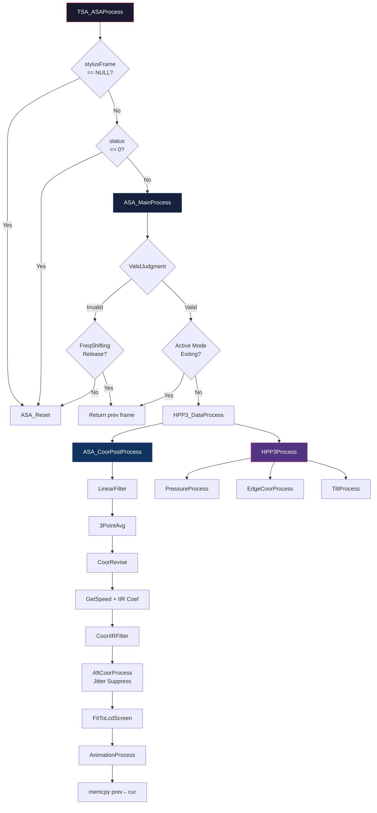

# TSA_ASAProcess 手写笔管线完整逆向分析

> [!NOTE]
> **二进制**: TSACore.dll (Himax Touch Stylus Algorithm Core)  
> **入口函数**: `TSA_ASAProcess` @ `0x18059e8d`  
> **分析工具**: Ghidra 反编译  
> **调用图总规模**: 308 个函数, 870 条调用边

---

## 目录

1. [顶层函数 TSA_ASAProcess](#1-顶层函数-tsa_asaprocess)
2. [帧数据验证 — ValidJudgment](#2-帧数据验证--validjudgment)
3. [主处理管线 — ASA_MainProcess](#3-主处理管线--asa_mainprocess)
4. [频率跳变管理 — HPP3_FreqShiftProcess](#4-频率跳变管理--hpp3_freqshiftprocess)
5. [数据类型分发 — HPP3_DataProcess / HPP2_DataProcess](#5-数据类型分发--hpp3_dataprocess--hpp2_dataprocess)
6. [传感器数据解析 — ASA_HPP3TX1LineDataProcesss](#6-传感器数据解析--asa_hpp3tx1linedataprocesss)
7. [坐标计算 — HPP3_CoordinateProcess](#7-坐标计算--hpp3_coordinateprocess)
8. [坐标后处理管线 — ASA_CoorPostProcess](#8-坐标后处理管线--asa_coorpostprocess)
9. [压力处理 — HPP3_PressureProcess](#9-压力处理--hpp3_pressureprocess)
10. [倾斜角计算 — TiltProcess](#10-倾斜角计算--tiltprocess)
11. [动画状态机 — AnimationProcess](#11-动画状态机--animationprocess)
12. [触笔/触控互斥 — StylusRecheck 子系统](#12-触笔触控互斥--stylusrecheck-子系统)
13. [关键数据结构偏移量表](#13-关键数据结构偏移量表)
14. [算法模型总结](#14-算法模型总结)

---

## 1. 顶层函数 TSA_ASAProcess

**地址**: `0x18059e8d` | **签名**: `void TSA_ASAProcess(uint param_1)`

这是 Active Stylus Algorithm (ASA) 的每帧入口点。`param_1` 是帧状态标志字。

### 伪代码与全分支注释

```c
void TSA_ASAProcess(uint frameFlags)
{
    uint rows = g_gridRows;        // 触控面板行数
    uint cols = g_gridCols;        // 触控面板列数

    // ── 逻辑块 1: 初始化信号差分缓冲区 ──────────────────
    // 从 TSAMS 子系统获取 SS(Self-Sensing) Diff 数据指针
    void* ssDifPtr = TSAMS_GetSSDifPtr();
    ASA_SetSSDiffdata(ssDifPtr, rows + cols);
    // 仅当 rows+cols 等于 DAT_1820d611 + DAT_1820d610 时才会设置指针
    // 这是一个 sanity check: 确保 SS Diff 长度 == 行数+列数

    // ── 逻辑块 2: 帧级标志位初始化 ──────────────────────
    g_isAsaCurFrameExitAbnormal = 0;  // 当前帧异常退出标记清零
    g_tsaStaticPtr[0x10c] |= 0x40;   // 设置 bit6: "ASA 正在处理" 标志

    // ── 逻辑块 3: 获取帧数据与触笔数据指针 ─────────────
    int* frame = AFE_GetFrame();       // 获取 AFE(Analog Front-End) 帧对象
    longlong stylusFrame = frame[0x10]; // offset 0x40: 触笔子帧数据指针
    ASA_MultiPanleSwitchProcess(stylusFrame);  // 多面板切换处理

    // ── 逻辑块 4: 分支 — 触笔帧数据为空 ────────────────
    if (stylusFrame == NULL) {
        ASA_Reset();    // 全管线重置 (15个子模块)
        LOG("STYLUS FRAME NULL!!");
        // ★ 路径: 直接跳到末尾的频率跳变检查
    }
    // ── 逻辑块 5: 分支 — status 字段为 0 (触笔未激活) ──
    else if (stylusFrame->status == 0) {  // offset 0x1c
        LOG("DISABLE STYLUS!");
        ASA_Reset();
        // ★ 路径: 触笔被固件禁用,重置并跳过
    }
    // ── 逻辑块 6: 正常处理路径 ─────────────────────────
    else {
        LOG("  status:%4d",   stylusFrame->status);      // +0x1c
        LOG("  tx1_freq:%4d", stylusFrame->tx1_freq);    // +0x10 (ushort)
        LOG("  tx2_freq:%4d", stylusFrame->tx2_freq);    // +0x12 (ushort)
        LOG("  btn:%4d",      stylusFrame->button);      // +0x18 (uint)
        LOG("  press:%4d",    stylusFrame->pressure);    // +0x14 (ushort)

        // ── 逻辑块 6a: 条件性保存 InRange 前值 ─────────
        // 条件: g_tsaStaticPtr[0xfc] 的 bit24==0 且 bit19==1
        // 含义: 非频率跳变模式 且 触笔感应增强特性已启用
        if ((g_tsaStaticPtr[0xfc] & 0x1000000) == 0 &&
            (g_tsaStaticPtr[0xfc] & 0x80000) != 0) {
            g_preInRange = TSA_RptASAInRange();
        }

        // ── 逻辑块 6b: 核心处理 ────────────────────────
        uint abnormal = ASA_MainProcess(frame);  // ★ 核心管线入口
        g_isAsaCurFrameExitAbnormal = abnormal;

        // ── 逻辑块 6c: 触笔/触控互斥决策 ───────────────
        // 四个条件取 OR (短路求值):
        //   C1: g_tsaStaticPtr[0x108] bit8 == 0  → Recheck 特性未启用
        //   C2: stylusFrame->status bit1 == 0     → 非 HPP3 协议
        //   C3: StylusRecheck_DisableRecheckInFreqShifting() → 频率跳变时禁用
        //   C4: StylusRecheck_EnterStylusMode() → 确认进入触笔模式
        if (C1 || C2 || C3 || C4) {
            // 正常路径: 检查是否需要禁用触控
            if (ASA_IsTouchNull(stylusFrame)) {
                g_asaDisableTouch = 3;  // 禁用触控 3 帧
            }
        } else {
            // Recheck 失败 → 认为不是真正的触笔信号
            ASA_Reset();
            g_asaDisableTouch = 0;
        }

        // ── 逻辑块 6d: 触控禁用倒计时 ──────────────────
        if (g_asaDisableTouch != 0) {
            g_asaDisableTouch--;    // 递减禁用计数器

            // ── 子分支 6d-i: 增强感应模式 ──────────────
            if ((g_tsaStaticPtr[0xfc] & 0x1000000) == 0 &&
                (g_tsaStaticPtr[0xfc] & 0x80000) != 0) {
                char curInRange = TSA_RptASAInRange();

                // ★ 子分支: 笔进入悬停 (从不在范围→在范围)
                if (curInRange == 1 && g_preInRange == 0) {
                    LOG("StylusAFT: Pen Enter Withdrawn");
                    // 对所有活跃触点设置 bit7 (标记为被笔信号干扰)
                    for (i = 0; i < *g_touchesPtr; i++) {
                        g_touchesPtr[i * 0x168 + 0x208] |= 0x80;
                    }
                }
                // ★ 子分支: 笔持续在范围内
                if (curInRange == 1 && g_preInRange == 1) {
                    PrevTouch_Init();
                    Touch_Init();
                    PrevPeak_Init();
                }
            }
            // ── 子分支 6d-ii: 非增强模式 ───────────────
            else {
                if (!ASA_IsHpp3TouchEnableFeatureEnabled()) {
                    PrevTouch_Init();
                    Touch_Init();
                    PrevPeak_Init();
                }
            }
            SideTouch_Clean();  // 清理边缘触控数据
        }

        TSALog_OutputStylus();  // 日志输出

        // ── 逻辑块 6e: 记录触发检查 ────────────────────
        if (ASA_NeedRecordTrigger()) {
            g_tsaStaticPtr[0xa4] |= 0x1000;  // 设置 bit12: 触发录制
        }

        HardwareAnalyzer_ASA_Process();  // 硬件分析器处理
    }

    // ── 逻辑块 7: 帧状态异常重置 ────────────────────────
    // param_1 低4位非零 → 帧数据校验失败
    if ((frameFlags & 0xF) != 0) {
        ASA_Reset();
    }

    // ── 逻辑块 8: 频率跳变请求检查 ──────────────────────
    if (TSA_IsASANeedTPFreqShift()) {
        LOG("ASA WANT TP FREQ SHIFT!!");
    }
    if (TSA_IsASANeedBTFreqShift()) {
        LOG("ASA WANT BT FREQ SHIFT!!");
    }

    // ── 逻辑块 9: 清除 "ASA 正在处理" 标志 ─────────────
    g_tsaStaticPtr[0x10c] &= ~0x40;  // 清除 bit6
}
```

### ASA_Reset 完整重置清单

```c
void ASA_Reset() {       // 0x18084e3b
    ButtonInit();         // 按键状态
    HPP3_FreqShiftInit(); // 频率跳变状态机
    PressureInit();       // 压力缓冲区
    RawInit();            // 原始数据缓冲区
    PeaksInit();          // 峰值检测
    GridPeaksInit();      // 栅格峰值
    CoordinateInit();     // 坐标计算
    ReportInit();         // 上报数据
    TiltInit();           // 倾斜角
    FilterInit();         // 所有滤波器
    CoorReviseInit();     // 坐标修正
    NoPressInkInit();     // 无压力书写
    ASAStaticReset();     // 静态状态
    ASACalibration_Init();// 校准
    AnimationInit();      // 动画状态机
}
```

---

## 2. 帧数据验证 — ValidJudgment

**地址**: `0x18084efc` | 在 `ASA_MainProcess` 内被调用

此函数验证触笔帧数据的协议和模式位是否合法。`status` 字段位于 `stylusFrame + 0x1c`。

### status 字段位定义

| Bit | 名称 | 含义 |
|-----|------|------|
| 0   | HPP2 Protocol | Himax Pen Protocol v2 |
| 1   | HPP3 Protocol | Himax Pen Protocol v3 |
| 2   | Reserved/Flag | 数据有效标记 |
| 3   | Reserved/Flag | 数据有效标记 |
| 4   | Active Mode   | 主动式触笔模式 |
| 5   | FreqShift ACK | 频率跳变已确认 |
| 6   | FreqShift REQ | 频率跳变被请求 |
| 7   | FreqShift Done| 频率跳变完成 |

### 全分支逻辑

```c
int ValidJudgment(StylusFrame* frame) {
    uint st = frame->status;  // +0x1c

    // ── 分支 1: 同时设置了 HPP2 和 HPP3 ──
    if ((st & 1) && (st & 2)) {
        LOG("PROTOCOL SET ERROR! MUST SELECT ONE PROTOCOL");
        return 0;  // ★ 无效: 两个协议互斥
    }

    // ── 分支 2: 两个协议都没有设置 ──
    if (!(st & 1) && !(st & 2)) {
        LOG("PROTOCOL SET ERROR! MUST SET PROTOCOL");
        return 0;  // ★ 无效: 必须选择一个协议
    }

    // 至此: 仅 HPP2(bit0) 或 HPP3(bit1) 之一被设置

    // ── 分支 3: 没有任何模式位 (bit2/3/4 全为 0) ──
    if (!(st & 4) && !(st & 8) && !(st & 0x10)) {
        LOG("MODE ERROR!");
        return 0;  // ★ 无效: 必须设置至少一种数据模式
    }

    // ── 分支 4: 三个模式位全部设置 ──
    if ((st & 4) && (st & 8) && (st & 0x10)) {
        LOG("MODE ERROR!");
        return 0;  // ★ 无效: 不能同时激活所有模式
    }

    // ── 分支 5: 正常的部分模式设置 ──
    // 检查 TX1 线数据是否为空
    if (frame->tx1_data == NULL && !(st & 4)) {  // +0x00
        LOG("STYLUS FRAME TX1 LINE DATA NULL");
        return 0;  // ★ 无效: TX1 数据缺失
    }

    // 检查 TX2 线数据 (仅 HPP3 协议)
    if ((st & 2) && frame->tx2_data == NULL && !(st & 4)) {
        LOG("STYLUS FRAME TX2 LINE DATA NULL");
        // ★ 注意: 仅打印警告,不返回 0! TX2 可选
    }

    return 1;  // ★ 有效
}
```

---

## 3. 主处理管线 — ASA_MainProcess

**地址**: `0x18086b5f` | **签名**: `int ASA_MainProcess(int* frame)`  
**返回值**: 0=正常, 1=无效帧已重置, 3=频率跳变中/需跳过, 5=信号不在范围内

### 完整分支图

```c
int ASA_MainProcess(int* frame) {
    // ── 逻辑块 1: 时间戳与全局状态 ─────────────────────
    g_timestamp = frame[0] * 1000LL + frame[1] / 1000;  // 微秒级时间戳
    g_frameCounter = (uint16)frame[2];
    longlong stylusFrame = frame[0x10];  // 触笔子帧 (偏移 0x40)
    g_frame = frame;

    LOG("HW VER IS %d, USING PRMT %d", g_curStylusHWVersion, g_curPrmtUnit);

    // 保存当前帧的 status
    g_curStatus = stylusFrame->status;  // +0x1c

    // ── 逻辑块 2: HPP3 频率跳变处理 ────────────────────
    if (g_curStatus & 2) {  // HPP3 协议
        HPP3_FreqShiftProcess(stylusFrame);  // 详见 §4
    }

    // ── 逻辑块 3: 帧有效性判断 ─────────────────────────
    char valid = ValidJudgment(stylusFrame);  // 详见 §2

    // ═══ 分支 A: 帧无效 ═══════════════════════════════
    if (!valid) {
        // ── A1: 频率跳变中是否需要释放上一帧报告 ──────
        if (!ReleaseASAReportInFreqShifting()) {
            ASA_Reset();
            return 1;   // ★ 无效帧, 完全重置
        }
        return 3;        // ★ 频率跳变中, 释放上一帧数据
    }

    // ═══ 分支 B: 从 Active 模式退出 ═══════════════════
    // 条件: 上一帧有 bit4(Active) 但本帧没有
    if ((g_prevStatus & 0x10) != 0 && (g_curStatus & 0x10) == 0) {
        ReleaseASAReportExitStylus();
        if (成功) g_prevStatus = g_curStatus;
        g_isLastFrameBypass = 1;
        LOG("ASA RELEASE!");
        return 3;        // ★ 退出 Active 模式
    }

    // ═══ 分支 C: 正常处理 ═════════════════════════════
    ASAStaticStatusPreProcess(stylusFrame->status);
    g_prevStatus = g_curStatus;

    // ── C1: 分支 — status 没有 Active 模式 (bit4==0) ──
    if ((stylusFrame->status & 4) == 0) {
        // 正常信号处理管线
        ASAPropertyPreProcess();   // 清零属性结构 (0x7AC 字节)
        ASAStaticPreProcess();     // 重置静态状态 g_inRangeState = 0
        ASAOutClean();             // 清零输出结构 g_curASOut (0xEC 字节)

        // ── C1a: HPP3 协议 (status bit1) ──────────────
        if (g_curStatus & 2) {
            HPP3_UpdataStylus2Buf(stylusFrame);  // 更新原始数据缓冲区
            int err = HPP3_DataProcess();         // 数据处理分发 (详见 §5)
            if (err != 0) {
                ReleaseASAReportInFreqShifting();
                g_isLastFrameBypass = 1;
                return 3;  // ★ 数据处理被跳过
            }
        }
        // ── C1b: HPP2 协议 (status bit0) ──────────────
        else if (g_curStatus & 1) {
            HPP2_UpdataStylus2Buf(stylusFrame);
            int err = HPP2_DataProcess();
            if (err != 0) {
                g_isLastFrameBypass = 1;
                return 3;
            }
        }

        // ★★★ 坐标后处理管线 (详见 §8) ★★★
        ASA_CoorPostProcess();

        g_recheckResult = StylusRecheck_EnterStylusMode();

        LOG("TEST X,%d, %d, Press:%d, linear:%d,%d, coor_revise:%d,%d, "
            "aft_flt:%d,%d, aft_jit:%d,%d",
            rawX, rawY, pressure,
            linearX, linearY,
            reviseX, reviseY,
            filteredX, filteredY,
            jitterX, jitterY);

        LOG("sig TX1:%4d, TX2:%4d", sigTX1, sigTX2);
        LOG("tilt x:%4d, y:%4d", tiltX, tiltY);

        AnimationProcess();                // 动画状态机 (详见 §11)
        ReleaseASAReportInFreqShifting();
        memcpy(&g_prevASOut, &g_curASOut, 0xEC);  // 保存当前帧为下一帧参考
        g_isLastFrameBypass = 0;
        ASACalibration_Process();
        return 0;  // ★ 正常完成
    }
    // ── C2: Active 模式帧但没有有效数据 ───────────────
    else {
        ReleaseASAReportInFreqShifting();
        return 3;
    }
}
```

### 日志输出的坐标变量映射

从 `ASA_MainProcess` 的日志可以追踪坐标在管线中的变量名:

| 日志标签 | 全局变量 | 管线阶段 |
|----------|---------|----------|
| `X` (raw) | `DAT_18231a44` | 原始坐标 (HPP3_CoordinateProcess 输出) |
| `Y` (raw) | `DAT_18231a68` | 原始坐标 |
| `linear` | `DAT_18231a48`, `DAT_18231a6c` | LinearFilterProcess 后 |
| `coor_revise` | `DAT_18231a4c`, `DAT_18231a70` | CoorReviseProcess 后 |
| `aft_flt` | `DAT_18231a50`, `DAT_18231a74` | CoorFilterProcess 后 |
| `aft_jit` | `DAT_18231a54`, `DAT_18231a78` | AftCoorProcess (抖动抑制) 后 |

---

## 4. 频率跳变管理 — HPP3_FreqShiftProcess

**地址**: `0x180777ef`

频率跳变 (Frequency Hopping) 是触笔与触控面板之间的频率同步机制,用于避免干扰。

### 全局频率状态变量

| 地址 | 名称 | 含义 |
|------|------|------|
| `0x1815e604` | BT模式 | 1=蓝牙已连接 |
| `0x1815e608` | prevTPfreq1 | 上一帧 TP 频率1 |
| `0x1815e609` | prevTPfreq2 | 上一帧 TP 频率2 |
| `0x1815e60a` | curTPfreq1 | 当前 TP 频率1 |
| `0x1815e60b` | curTPfreq2 | 当前 TP 频率2 |
| `0x1815e60c` | curBTfreq1 | 当前 BT 频率1 |
| `0x1815e60d` | curBTfreq2 | 当前 BT 频率2 |
| `g_freqShift` | 频率跳变状态 | bit0=跳变中, bit2=BT不匹配, bit4=TP不切换 |

### 分支逻辑

```c
void HPP3_FreqShiftProcess(StylusFrame* frame) {
    HPP3_BtStatusProcess();    // 更新蓝牙连接状态
    HPP3_UpdateFreq(frame);    // 从帧数据更新频率值

    // ── 分支 1: 频率值非法检查 ──────────────────────────
    // 合法范围: 1..0xF1 (1..241)
    if (curTPfreq1 == 0 || curTPfreq1 > 0xF1 ||
        curTPfreq2 == 0 || curTPfreq2 > 0xF1 ||
        (btMode == 1 && (curBTfreq1 == 0 || curBTfreq1 > 0xF1 ||
                         curBTfreq2 == 0 || curBTfreq2 > 0xF1))) {
        HPP3_LogFreqInfo();
        LOG("TP BT freq illegal!");
        return;  // ★ 非法频率, 不处理
    }

    // ── 分支 2: TP 频率变化 → 清除倾斜参数 ─────────────
    if (curTPfreq1 != prevTPfreq1 || curTPfreq2 != prevTPfreq2) {
        prevTPfreq1 = curTPfreq1;
        prevTPfreq2 = curTPfreq2;
        ClearTiltPrmt();  // 频率变化导致倾斜校准失效
    }

    uint64 now = GetRealtime();

    // ── 分支 3: BT 模式下 TP/BT 频率不匹配 ─────────────
    if (btMode == 1 &&
        !HPP3_IsTPandBTMatch() &&        // TP 和 BT 频率不同
        lastBTDone + 30 < now &&          // 距上次 BT 完成 >30ms
        (g_freqShift == 0 || lastShiftStart + 1000 < now)) {  // 冷却 1秒
        // 记录不匹配的频率
        g_freqShift = 3;  // bit0 | bit1: 开始 TP+BT 联合跳变
        LOG("TP BT freq NOT match!");
    }

    // ── 分支 4: BT 频率未切换 (参数启用且匹配) ─────────
    if (prmtBTFreqShiftEnabled &&
        btMode == 1 &&
        HPP3_IsTPandBTMatch() &&          // 频率已匹配
        (g_freqShift & 4) && !(g_freqShift & 0x10) &&  // BT 跳变请求中
        lastBTShiftStart + 1000 < now) {
        g_freqShift = 1;  // 降级为仅 TP 跳变
        LOG("BT freq NOT switch!");
    }

    // ── 分支 5: 需要搜索新频率 ──────────────────────────
    if (g_asaHpp3FreqShiftEnable &&
        !(g_freqShift & 1) &&             // 当前不在跳变中
        SearchForNewFreq()) {             // 信号质量差,需换频
        g_freqShift |= 1;
    }

    // ── 分支 6: 频率跳变完成 ────────────────────────────
    if ((g_freqShift & 1) && CheckIsFreqShiftDone()) {
        g_freqShift = 0;  // 清除所有跳变标志
        LOG("Start:%lld, tpStart:%lld, btStart:%lld, tpDone:%lld, btDone:%lld, done:%lld",
            ...);  // 输出完整的跳变时间线
    }

    // ── 逻辑块 7: 传递特殊状态位 ────────────────────────
    g_pendingFlags = 0;
    if (g_curStatus & 0x20) g_pendingFlags |= 0x20;   // bit5: 频率跳变 ACK
    if ((g_curStatus & 0x40) && g_freqShift == 0)
        g_pendingFlags |= 0x40;                         // bit6: REQ (仅非跳变时)
    if (g_curStatus & 0x80) g_pendingFlags |= 0x80;   // bit7: Done

    HPP3_LogFreqInfo();
}
```

---

## 5. 数据类型分发 — HPP3_DataProcess / HPP2_DataProcess

**地址**: `0x18086aa4` (HPP3) / `0x18086a4c` (HPP2)

根据 `g_flagDataType` 选择不同的传感器数据处理路径:

```c
// g_flagDataType 由 HPP3_UpdataStylus2Buf 设置
// 实际上 HPP3 协议下总是设为 2 (Grid)
int HPP3_DataProcess() {
    switch (g_flagDataType) {
        case 0:  return ASA_HPP3TX1LineDataProcesss();     // 线性扫描数据
        case 1:  return ASA_HPP3TX1IQLineDataProcesss();   // IQ 线性数据 (同相/正交)
        case 2:  return ASA_HPP3TX1GridDataProcesss();     // 栅格扫描数据 ★ 最常用
        case 3:  return ASA_HPP3TX1TiedGridDataProcesss(); // 绑定栅格数据
        default: return ASA_HPP3TX1LineDataProcesss();     // 回退为线性
    }
    ASA_HPP3Process();  // 后续处理: 压力 + 边缘坐标 + 状态
    return 0;
}
```

### HPP2 与 HPP3 的区别

| 特性 | HPP2 | HPP3 |
|------|------|------|
| TX 通道 | 仅 TX1 | TX1 + TX2 (双通道) |
| 倾斜角 | 不支持 | 通过 TX1/TX2 坐标差计算 |
| 频率跳变 | 不支持 | 完整状态机 |
| 数据类型 | Line/IQ/Grid/TiedGrid | 同左, 增加 IQ 处理 |

---

## 6. 传感器数据解析 — ASA_HPP3TX1LineDataProcesss

**地址**: `0x1808625f`

这是 HPP3 协议下 TX1 线性数据的核心处理流程。

```c
int ASA_HPP3TX1LineDataProcesss() {
    // ── 阶段 1: 预处理 ─────────────────────────────────
    HPP3_CMFProcess();              // Common-Mode Filter: 去除共模噪声
    HPP3_StylusDataQualityProcess();// 数据质量评估 (信噪比检查)

    // ── 阶段 2: 峰值检测 ───────────────────────────────
    TX1LinePeaksProcess();          // TX1 通道峰值提取
    if (g_flagTX2NotNull) {
        TX2LinePeaksProcess();      // TX2 通道峰值提取 (如果有)
    }
    HPP3_NoiseProcess();            // 噪声抑制

    // ── 阶段 3: 缓冲区旋转 ─────────────────────────────
    // 将 "当前帧" 数据复制到 "前一帧" 缓冲区
    for (i = 0; i < 0xA0; i++) {
        g_asaData[i] = g_asaData[i + 0xA0];  // 160个 uint16
    }

    // ── 阶段 4: 信号强度更新 ───────────────────────────
    UpdateLineSignal();

    // ── 阶段 5: 坐标计算 (第一次) ──────────────────────
    HPP3_CoordinateProcess();       // 详见 §7
    g_preCalibPosX = g_posX;
    g_preCalibPosY = g_posY;
    g_preCalibSig  = g_sigTX1;

    // ── 阶段 6: 可选校准刷新 ──────────────────────────
    if (g_enCalibration == 100) {
        ASA_RefreshLineTest();      // 校准模式下的特殊刷新
    }

    // ── 阶段 7: 二次处理 ───────────────────────────────
    ASA_Refresh();                  // 刷新基线数据
    TX1LinePeaksProcess();          // 重新提取峰值 (减去基线后)
    if (g_flagTX2NotNull) {
        TX2LinePeaksProcess();
    }
    HPP3_NoiseProcess();
    UpdateLineSignal();
    HPP3_NoisePostProcess();        // 噪声后处理

    // ── 阶段 8: 状态判定 ───────────────────────────────
    ASAStaticStatusProcess();       // 更新 g_inRangeState

    // ── 分支 A: 信号异常标记 ───────────────────────────
    if (g_signalAbnormal == 1) {
        memcpy(&g_curASOut, &g_prevASOut, 0xEC);  // 回退到上一帧数据
        ASAPropertyPostProcess();
        return 5;   // ★ 异常帧, 使用前一帧结果
    }

    // ── 分支 B: 信号不在范围内 ─────────────────────────
    if (g_inRangeState == 0) {
        if (g_prevInRangeState == 0) {
            ASAStaticPostProcess();
            ASAPropertyPostProcess();
            return 5;   // ★ 持续不在范围
        }
        // 从在范围→不在范围: 释放退出报告
        ReleaseASAReportExitStylus();
        LOG("ASA RELEASE! out range");
        return 3;
    }

    // ── 分支 C: 正常 — 在范围内 ────────────────────────
    HPP3_CoordinateProcess();       // 重新计算坐标 (减去基线后)
    g_aftCalibPosX = g_posX;
    g_aftCalibPosY = g_posY;

    // 倾斜角处理
    if (!g_flagTX2NotNull) {
        // 没有 TX2 → 尝试栅格模式推断
        if (GridTx1Valid()) {
            TiltKeepLastFrame();    // 保持上一帧倾斜角
        }
    } else {
        TiltProcess();              // ★ 完整倾斜角计算 (详见 §10)
    }

    return 0;   // ★ 正常完成
}
```

---

## 7. 坐标计算 — HPP3_CoordinateProcess

**地址**: `0x1806ee75`

### 核心算法: 三角插值 vs 重心法

```c
void HPP3_CoordinateProcess() {
    // ── 分支: 选择坐标算法 ──────────────────────────────
    if ((g_configFlag & 1) == 0) {      // DAT_1820d630 bit0
        // ★ 三角插值法 (Triangle Interpolation)
        g_coors[0] = GetCoordinateByTriangleOf(2);  // X-TX1
        g_coors[1] = GetCoordinateByTriangleOf(3);  // Y-TX1
    } else {
        // ★ 重心法 (Gravity/Centroid)
        g_coors[0] = GetCoordinateByGravityOf(2);
        g_coors[1] = GetCoordinateByGravityOf(3);
    }

    // TX2 坐标 (用于倾斜角) — 总是使用重心法
    if (g_configFlag & 4) {
        g_coors[6] = GetCoordinateByGravityOf(4);  // X-TX2
        g_coors[7] = GetCoordinateByGravityOf(5);  // Y-TX2
    }

    // ── 多阶多项式补偿 ─────────────────────────────────
    // 补偿传感器间距引起的周期性非线性
    g_coors[6] = CoorMultiOrderFitCompensate(g_coors[6], &prmtX);
    g_coors[7] = CoorMultiOrderFitCompensate(g_coors[7], &prmtY);

    CoorTpPatternCompensate();  // TP 图案补偿

    // 信号刷新
    if (g_asaPrmtFlash[0xa84] == 0) {
        RefreshTx1Signal();         // 标准信号刷新
    } else {
        RefreshTx1SignalByPR();     // 基于 PR(Pulse Response) 的刷新
    }

    // ── 坐标映射到传感器间距空间 ────────────────────────
    // 乘以 0x400 (1024) 将 "栅格单位" 转为 "1/1024 栅格" 精度
    g_rawX = SensorPitchSizeMapDim1(g_coors[0], 0x400);  // → DAT_18231a44
    g_rawY = SensorPitchSizeMapDim2(g_coors[1], 0x400);  // → DAT_18231a68
}
```

### GetCoordinateByTriangleOf — 三角插值算法核心

**地址**: `GetCoordinateByTriangleOf` + `TriangleAlgUsing3Piont`

```c
// 三点三角插值: 使用峰值及其两侧的信号强度来精确定位
int TriangleAlgUsing3Piont(int left, int peak, int right) {
    // left:  峰值左侧信号强度
    // peak:  峰值信号强度
    // right: 峰值右侧信号强度

    int offset;
    if (right < left) {
        // 峰值偏向右侧
        int base = right;
        if (peak <= right) base = peak - 1;  // 防止除零
        offset = -((left - base) * 0x400 / (peak - base)) / 2;
    } else {
        // 峰值偏向左侧
        int base = left;
        if (peak <= left) base = peak - 1;
        offset = ((right - base) * 0x400 / (peak - base)) / 2;
    }

    return offset + 0x200;  // 0x200 = 半个传感器间距 (中心点)
}
```

> [!TIP]
> **算法原理**: 这是经典的 **三角质心法** (Triangle Centroid)。通过三个相邻传感器通道的信号强度比来确定子像素精度位置。`0x400` (1024) 是一个传感器间距的分辨率, `0x200` (512) 是中心偏移量。结果单位为 **1/1024 传感器间距**。

### CoorMultiOrderFitCompensate — 周期性多项式补偿

**地址**: `CoorMultiOrderFitCompensate`

```c
// 补偿传感器间距引起的周期性非线性误差
// 使用 3阶多项式 (三次曲线拟合)
int CoorMultiOrderFitCompensate(int coord, double* coefs) {
    int withinPitch = coord % 0x400;     // 在一个传感器间距内的位置

    // 计算偏离中心的距离
    int dist;
    if (withinPitch < 0x201) {           // 0x201 = 513 = 中心+1
        dist = 0x200 - withinPitch;      // 左半部分
    } else {
        dist = withinPitch - 0x200;      // 右半部分
    }

    // ★ 三次多项式: y = c0 + c1*x + c2*x² + c3*x³
    int compensate = (int)(
        coefs[0] +                       // 常数项
        coefs[1] * dist +                // 一次项
        coefs[2] * dist * dist +         // 二次项 (抛物线)
        coefs[3] * dist * dist * dist    // 三次项
    );

    // 关于中心点对称: 右半部分取反
    if (withinPitch >= 0x201) {
        compensate = -compensate;
    }

    return coord + compensate;
}
```

> [!IMPORTANT]
> **算法模型**: 这是一个 **间距周期性补偿 (Pitch-Periodic Polynomial Compensation)**。由于电容触控传感器的电极图案导致信号在每个传感器间距内呈非线性分布,此函数使用预先标定的三次多项式系数来消除这种周期性失真。系数存储在参数表 `g_asaPrmtFlash` 中。

---

## 8. 坐标后处理管线 — ASA_CoorPostProcess

**地址**: `0x180869ef`

这是完整的坐标信号处理链路:

```
原始坐标 (rawX/Y)
    ↓
LinearFilterProcess()      — 直线拟合滤波器
    ↓ → linearX/Y
GetRealTimeCoor2Buf()      — 缓冲历史坐标
    ↓
Get3PointAvgFilter()       — 3点移动平均
    ↓
CoorReviseProcess()        — TX2 坐标修正
    ↓ → reviseX/Y
GetCoorSpeed()             — 计算笔尖移动速度
    ↓
GetIIRCoef()               — 根据速度动态调整 IIR 系数
    ↓
CoorFilterProcess()        — IIR 坐标滤波
    ↓ → filteredX/Y
AftCoorProcess()           — 落笔抖动抑制
    ↓ → jitterX/Y
FitToLcdScreen()           — 映射到 LCD 屏幕坐标
```

### 8.1 LinearFilterProcess — 直线拟合状态机

**地址**: `0x18071f4b`

```c
void LinearFilterProcess() {
    linearX = rawX;  // 默认直通
    linearY = rawY;

    // ── 分支: 无压力或特性未启用 → 重置 ────────────────
    if (pressure == 0 || !ASA_IsHpp3LinearFilterFeatureEnabled()) {
        g_asaStraightLineBufCnt = 0;
        g_asaShortDisBufCnt = 0;
        g_lineState = 0;
        return;
    }

    // ── 直线检测状态机 ──────────────────────────────────
    // 当缓冲超过 20 个点时, 开始更新直线拟合参数
    if (g_asaStraightLineBufCnt > 0x13) {  // > 19
        UpdateStraightLinePrmt(&dim2FitParams, 1, 400 - bufCnt);
        UpdateStraightLinePrmt(&dim1FitParams, 0, 400 - bufCnt);
    }

    switch (g_lineState) {
        case 0: g_lineState = 1; break;   // 初始化
        case 1: g_lineState = 2; break;   // 等待第2帧
        case 2: g_lineState = 3; break;   // 等待第3帧
        case 3: CurveLineProcess();       break;  // 曲线模式
        case 4: EnterStraightLineProcess(); break; // 进入直线模式
        case 5: StraightLineProcess();    break;  // 直线模式
        case 6: ExitStraightLineProcess(); break; // 退出直线模式
        default: g_lineState = 3;                  // 容错回退
    }

    // 缓冲坐标点
    BufStraightPaintPoint(rawX, rawY, frameCounter);
    BufShortDistancePoint(rawX, rawY, frameCounter);

    // 边界裁剪: 确保坐标在有效范围内
    linearX = clamp(linearX, 0, g_gridCols * 0x400);
    linearY = clamp(linearY, 0, g_gridRows * 0x400);
}
```

> [!NOTE]
> **算法模型**: 这是一个 **自适应直线/曲线检测器**。系统通过最小二乘法 (Least Squares) 拟合最近的采样点来实时判断用户正在画直线还是曲线。在直线模式下,坐标会被约束在拟合直线上以消除手部抖动。日志变量 `A` 和 `B` 分别代表斜率和截距。

### 8.2 Get3PointAvgFilter — 3点移动平均

**地址**: `0x1806f9f4`

```c
void Get3PointAvgFilter() {
    // 右移历史缓冲区 (24级深度)
    for (i = 23; i > 0; i--) {
        histX[i] = histX[i-1];
        histY[i] = histY[i-1];
    }

    if (histX[2] == 0x7FFFFFFF) {
        // 初始帧: 直接使用当前值
        avgX = curX;
        avgY = curY;
    } else {
        // ★ 3 点简单移动平均
        avgX = (curX + histX[1] + histX[2]) / 3;
        avgY = (curY + histY[1] + histY[2]) / 3;
    }

    // ★ 特殊: 坐标加速度计算 (二阶差分)
    // g_coors[8] = 3*x[0] - 3*x[1] + x[2]  → 二阶差分 = 加速度
    g_coors[8] = curX * 3 - histX[1] * 3 + histX[2];
    g_coors[9] = curY * 2 + histY[2] - histY[1] * 3 + curY;
    //            ↑ 等效: 3*y[0] - 3*y[1] + y[2]
}
```

> [!TIP]
> `g_coors[8/9]` 实际上是坐标的 **二阶差分** (加速度近似),用于后续速度自适应滤波的参考。

### 8.3 GetCoorSpeed — 速度计算

**地址**: `0x1806fc0f`

```c
void GetCoorSpeed() {
    int totalDist = 0;

    // 遍历最近 24 帧的历史坐标
    for (i = 1; i < 24; i++) {
        if (histX[i] == 0x7FFFFFFF) break;  // 无效数据终止

        // ★ 欧几里得距离 (含 sqrt, ×100 放大精度)
        float d = sqrt((histX[i-1] - histX[i])² + (histY[i-1] - histY[i])²) * 100);
        totalDist += (int)d;

        // 累计距离 → 累计速度
        speed_cumul[i] = totalDist / 10;

        // 直线距离 (起点到第 i 帧)
        float directDist = sqrt((curX - histX[i])² + (curY - histY[i])²) * 100);
        speed_direct[i] = (int)directDist / 10;

        // ★ 曲率比 = 累计路径 / 直线距离 × 100
        curvature[i] = (totalDist * 100) / (int)directDist;
    }

    // 最终速度 = 最近3帧的平均速度 (如果帧数>3)
    g_coorSpeed = speed_cumul[validCount] / validCount;
    if (validCount > 3) {
        g_shortSpeed = speed_cumul[3] / 3;
    }
}
```

### 8.4 GetIIRCoef — 速度自适应 IIR 系数

**地址**: `0x1806ffc9`

```c
void GetIIRCoef() {
    byte coefHigh, coefLow;
    ushort speedThresh;

    // ── 分支: 根据移动状态选择系数对 ────────────────────
    if ((g_inRangeState & 6) == 0) {   // 静止或首次接触
        coefHigh = g_asaPrmtFlash[0xa5f];  // 高速系数
        coefLow  = g_asaPrmtFlash[0xa5e];  // 低速系数
        speedThresh = 20;
    } else {                              // 移动中
        coefHigh = g_asaPrmtFlash[0xa5d];
        coefLow  = g_asaPrmtFlash[0xa5c];
        speedThresh = 10;
    }

    // ── 分支: 边缘区域减半系数 ─────────────────────────
    if (isAtXEdge || isAtYEdge) {
        coefHigh = g_asaPrmtFlash[0xa5f] >> 1;
        coefLow  = g_asaPrmtFlash[0xa5e] >> 1;
    }

    // ── 速度自适应插值 ──────────────────────────────────
    // speed < thresh       → 使用 coefLow
    // speed > 0xCC (204)   → 使用 coefHigh
    // thresh < speed < 204 → 线性插值
    ushort coef;
    if (g_coorSpeed < speedThresh) {
        coef = coefLow;
    } else if (g_coorSpeed >= 0xCD) {  // 205
        coef = coefHigh;
    } else {
        // ★ 线性插值: coef = coefLow + (coefHigh - coefLow) * (speed - thresh) / (204 - thresh)
        coef = coefLow + (coefHigh - coefLow) * (speed - speedThresh) / (0xCC - speedThresh);
    }

    g_coorIIRCoef = coef;
    LOG("IIR: Speed[%d,%d,%d] Coef[%d]", speed, shortSpeed, avgSpeed, coef);
}
```

> [!IMPORTANT]
> **算法模型**: 这是一个 **速度自适应一阶 IIR 低通滤波器**。低速时滤波系数小 (强滤波,抑制抖动),高速时系数大 (弱滤波,减少延迟)。速度范围为 `[speedThresh, 204]`,在此区间内系数线性变化。

### 8.5 CoorIIRFilter — IIR 滤波核心

**地址**: `CoorIIRFilter`

```c
// 经典一阶 IIR 低通滤波器
uint CoorIIRFilter(int prev, int cur, ushort alpha) {
    // ★ output = (alpha * cur + (N - alpha) * prev) / N
    // 其中 N = g_asaPrmtFlash[0xa60] (归一化分母)
    uint N = g_asaPrmtFlash[0xa60];
    return (alpha * cur + (N - alpha) * prev) / N;
}
```

> [!TIP]
> **数学公式**: `y[n] = α · x[n] + (1-α) · y[n-1]`  
> 其中 `α = g_coorIIRCoef / N`。这是一个标准的 **指数加权移动平均 (EWMA)**,`N` 是分母常量(存储在参数表中),`alpha` 是速度自适应的系数。

### 8.6 CoorFilterProcess — 双通道 IIR 滤波

**地址**: `0x18070355`

```c
void CoorFilterProcess() {
    filteredX = reviseX;
    filteredY = reviseY;

    // ── 分支: 滤波条件检查 ──────────────────────────────
    // 仅当: (启用标志 且 连续帧数>=2) 或 (帧计数器>=2)
    if (!(((g_filterEnable & 1) == 0 || frameCount2 < 2) &&
          frameCount1 < 2 && frameCount3 < 2)) {
        // ★ 对 X/Y 坐标分别应用 IIR 滤波
        CoorIIRFilterType(3);   // TX1-X: 索引 3
        CoorIIRFilterType(8);   // TX1-Y: 索引 8
        // 注意: 使用 8 位小数尾数(<<8 和 >>8)来保持精度
    } else {
        // 清零 IIR 残差
        iirResidualX = 0;
        iirResidualY = 0;
    }

    // ── 分支: 边缘高速覆写 ─────────────────────────────
    if (g_needCoor2EdgeHighSpeed) {
        filteredX = edgeHighSpeedX;  // 使用非滤波的坐标
        filteredY = edgeHighSpeedY;  // (边缘快速离开时减少延迟)
    }
}
```

### 8.7 AftCoorProcess — 落笔抖动抑制

**地址**: `0x18070456`

```c
void AftCoorProcess() {
    // ── 分支: 抖动抑制被禁用 ────────────────────────────
    if (g_aftDisable & 0x20) {
        jitterX = filteredX;
        jitterY = filteredY;
        return;
    }

    // ── 抖动阈值 — 区分边缘和中心区域 ──────────────────
    uint threshX, threshY;
    if (filteredX < 0x401 || filteredY < 0x401 ||
        filteredX >= (g_gridCols - 1) * 0x400 ||
        filteredY >= (g_gridRows - 1) * 0x400) {
        // 边缘区域: 使用较大阈值
        threshX = prmtFlash[0xa58] * g_gridCols * 0x400 / g_asaPrmt;
        threshY = prmtFlash[0xa59] * g_gridRows * 0x400 / screenHeight;
    } else {
        // 中心区域: 使用较小阈值
        threshX = prmtFlash[0xa5a] * g_gridCols * 0x400 / g_asaPrmt;
        threshY = prmtFlash[0xa5b] * g_gridRows * 0x400 / screenHeight;
    }

    // ── 落笔时锁定起始位置 ─────────────────────────────
    if (pressure != 0 && prevPressure == 0) {
        startX = filteredX;
        startY = filteredY;
        flagLockX = 1;
        flagLockY = 1;
    }

    // ── X 轴解锁逻辑 ───────────────────────────────────
    if (flagLockX) {
        if (abs(filteredX - startX) > threshX) {
            flagLockX = 0;  // ★ 移动超过阈值 → 解锁
        }
        if (flagLockX) {
            offsetX = filteredX - startX;  // 记录偏移量
        }
    }

    // ── Y 轴解锁逻辑 (同上) ────────────────────────────
    // ... (对称实现)

    // ★ 抖动补偿: 从坐标中减去锁定偏移量
    jitterX = clamp(filteredX - offsetX, 0, g_gridCols * 0x400);
    jitterY = clamp(filteredY - offsetY, 0, g_gridRows * 0x400);

    LOG("LOCK: flag[%d,%d] thold[%d,%d] offset[%d,%d]",
        flagLockX, flagLockY, threshX, threshY, offsetX, offsetY);
}
```

> [!IMPORTANT]
> **算法原理**: 这是一个 **落笔点锁定 (Landing Point Lock)** 算法。当笔尖首次接触屏幕时,记录初始位置并锁定。在笔移动距离超过阈值之前,报告的坐标被"锁定"在起始点。一旦超过阈值,坐标解锁并通过偏移量补偿来消除初始抖动。边缘区域使用更大的阈值是因为边缘信号通常噪声更大。

### 8.8 FitToLcdScreen — LCD 屏幕映射

**地址**: `0x180835a2`

```c
void FitToLcdScreen() {
    // 对 9 个坐标通道 (raw/linear/revise/filter/jitter 各 X/Y) 进行映射
    for (i = 0; i < 9; i++) {
        screenX[i] = GetClipReport(coordX[i], g_gridCols, screenWidth,
                                    marginLeft, marginRight, offsetX);
        screenY[i] = GetClipReport(coordY[i], g_gridRows, screenHeight,
                                    marginTop, marginBottom, offsetY);
    }
    UpdateRptDis();   // 更新报告距离
}
```

---

## 9. 压力处理 — HPP3_PressureProcess

**地址**: `0x1807fd1d`

```c
void HPP3_PressureProcess() {
    g_pressInRange = 0;

    // ── 分支: 无压力信号 ────────────────────────────────
    if (rawPressure == 0) {
        pressure = 0;
        return;
    }

    // ── 阶段 1: 压力值排序映射 ─────────────────────────
    ushort mappedRaw = GetPressInMapOrder();  // 将原始 ADC 值映射到标准化范围

    // ── 阶段 2: 压力曲线映射 ───────────────────────────
    pressure = HPP3_GetPressureMapping(mappedRaw);

    // ── 阶段 3: 压力 IIR 平滑 ──────────────────────────
    if (pressure != 0 && prevPressure != 0) {
        PressureIIR(0x40);  // alpha = 64/128 = 50% 滤波
    }

    // 计数器递增
    g_btPressCnt++;

    LOG("PRESS: cnt,%d, using,%d, iir,%d,%d, press,%d,%d,%d,%d",
        count, mappedRaw, pressure, prevPressure,
        rawP1, rawP2, rawP3, rawP4);

    // ── 阶段 4: 信号强度压制 ───────────────────────────
    HPP3_SuppressBtPressBySignal();  // 信号过弱时压制压力

    if (pressure != 0) {
        g_pressInRange = 1;
    }
}
```

### HPP3_GetPressureMapping — 分段多项式压力曲线

**地址**: `HPP3_GetPressureMapping`

```c
ushort HPP3_GetPressureMapping(ushort raw) {
    // 根据触笔硬件版本选择参数索引
    byte prmtIdx;
    if (g_curStylusHWVersion == 1 || g_curStylusHWVersion == 2) {
        prmtIdx = prmtFlash[0xa81];
    } else {
        prmtIdx = prmtFlash[0xa80];
    }

    // ── 分支: 满量程 ───────────────────────────────────
    if (raw == 0xFFF) return 0xFFF;

    // ★ 分段四次多项式映射
    if (raw > pressMap[prmtIdx].highThresh) {
        // 高压力区间: y = c0 + c1*x + c2*x² + c3*x³ + c4*x⁴
        mapped = c0_high + c1_high*raw + c2_high*raw² + c3_high*raw³ + c4_high*raw⁴;
    }
    else if (raw > pressMap[prmtIdx].lowThresh) {
        // 中压力区间: 使用另一组系数
        mapped = c0_mid + c1_mid*raw + c2_mid*raw² + c3_mid*raw³ + c4_mid*raw⁴;
    }
    else {
        // 低压力区间: 直接映射 (raw > 1 时→1)
        mapped = clamp(raw, 0, 1);
    }

    return clamp(mapped, 0, 0xFFF);  // 限制在 12-bit 范围
}
```

> [!IMPORTANT]
> **算法模型**: 这是一个 **分段四阶多项式映射 (Piecewise Quartic Polynomial Mapping)**。压力曲线被分为三个线性区间: 低压(死区/最小力)、中压(正常书写范围)、高压(用力按压)。每个区间使用不同的四次多项式系数来实现非线性映射,模拟自然书写的压力感觉。系数表按触笔硬件版本索引,存储在 `0x18115f80` 开始的查找表中,每组 0x58 字节。

### PressureIIR — 压力平滑滤波

```c
void PressureIIR(byte alpha) {  // alpha = 0x40 (64)
    if (alpha > 0x7F) alpha = 0x7F;  // 上限 127

    // ★ IIR: out = (alpha * cur + (128 - alpha) * prev) / 128
    int result = prevPressure * (128 - alpha) + pressure * alpha;
    pressure = result >> 7;  // 除以 128
}
```

---

## 10. 倾斜角计算 — TiltProcess

**地址**: `0x180841e6`

倾斜角通过 TX1 和 TX2 通道的坐标差来推算。

### 前置条件检查

```c
void TiltProcess() {
    if (!g_flagHPP3Protocol) return;  // HPP2 不支持倾斜

    // ── 分支: 无压力历史或首帧 → 初始化 ────────────────
    if (!(prevFilterEnable & 2) && !(prevFilterEnable & 4) || prevPressure == 0) {
        TiltInit();
    }

    // ── 分支: 数据有效性检查 (按数据类型) ───────────────
    if (dataType == 2 /* Grid */ && (!GridTx1Valid() || !GridTx2Valid())) {
        TiltKeepLastFrame();  return;  // ★ 保持上一帧
    }
    if (dataType == 0 /* Line */ && (!LineTx1Valid() || !LineTx2Valid())) {
        TiltKeepLastFrame();  return;
    }
    // ... 同理 dataType == 1 (IQ) 和 3 (TiedGrid)
```

### 核心算法

```c
    g_flagTX2Start = 1;

    // ── 阶段 1: TX1/TX2 信号比 ─────────────────────────
    ushort ratio = GetTX1TX2SignalRatio();
    BufTX1TX2SignalRatio(ratio);
    g_signalRatio = GetTX1TX2RatioAverage(3);  // 3 帧移动平均

    // ── 阶段 2: TX1-TX2 坐标差 ─────────────────────────
    short limitLen = GetTX1TX2LenLimit();  // 最大允许差值
    short dx = posTX2_X - posTX1_X;   // TX2 坐标 - TX1 坐标
    short dy = posTX2_Y - posTX1_Y;
    LOG("d[%d,%d]", dx, dy);

    // 另一种差值计算 (使用栅格峰值位置)
    short dx2 = peakTX2_X - posTX1_X;
    short dy2 = peakTX2_Y - posTX1_Y;

    // ── 阶段 3: 异常差值抑制 ───────────────────────────
    // 如果栅格峰值差异过大,使用 IIR 平滑
    if (峰值位置变化 && (dx2 或 dy2 超过 limitLen) && bufCnt > 0) {
        if (dx 或 dy 也超过 limitLen) {
            // ★ 完全异常: 使用上一帧值
            dx = prevDX;
            dy = prevDY;
        } else {
            // ★ 部分异常: 7/8 IIR 平滑
            dx = (dx + prevDX * 7) >> 3;  // α = 1/8
            dy = (dy + prevDY * 7) >> 3;
        }
    }

    // ── 阶段 4: 首帧限幅 ───────────────────────────────
    if (bufCnt == 0 && (|dx| 或 |dy| 超过 limitLen)) {
        dx = clamp(dx, -limitLen, limitLen);
        dy = clamp(dy, -limitLen, limitLen);
    }

    // ── 阶段 5: 移动平均 ───────────────────────────────
    BufTX1TX2CoorDif(dx, dy);
    dx = GetTX1TX2CoorDifAverage(5, 0);  // 5 帧移动平均-X
    dy = GetTX1TX2CoorDifAverage(5, 1);  // 5 帧移动平均-Y

    // ── 阶段 6: 差值→倾斜角 ────────────────────────────
    tiltX_raw = GetTiltByCoorDif(dx, 0);
    tiltY_raw = GetTiltByCoorDif(dy, 1);

    // ── 阶段 7: 极坐标限幅 ─────────────────────────────
    // 计算差值向量的模
    ushort magnitude = sqrt(dx² + dy²);
    if (magnitude == 0) magnitude = 1;

    // 如果超过 limitLen, 等比例缩放到 limitLen 圆内
    if (magnitude > limitLen) {
        dx = limitLen * dx / magnitude;
        dy = limitLen * dy / magnitude;
    }

    // 重新计算限幅后的倾斜角
    tiltX = GetTiltByCoorDif(dx, 0);
    tiltY = GetTiltByCoorDif(dy, 1);

    // ── 阶段 8: 时间平均 ───────────────────────────────
    BufDim1Dim2Tilt(tiltX, tiltY);
    if (prevPressure == 0 || prevTiltState == 0) {
        // 首帧: 直接使用
        outTiltX = tiltX;
        outTiltY = tiltY;
    } else {
        // ★ 5 帧移动平均
        outTiltX = GetTiltAverage(5, 0);
        outTiltY = GetTiltAverage(5, 1);
    }

    // ── 阶段 9: 1° 抖动滤波 ────────────────────────────
    outTiltX = Tilt1DegreeJitFilter(prevOutTiltX, outTiltX);
    outTiltY = Tilt1DegreeJitFilter(prevOutTiltY, outTiltY);
}
```

### GetTiltByCoorDif — 坐标差→角度转换

```c
short GetTiltByCoorDif(short coordDif, int axis) {
    // 计算最大允许差值 (基于触笔物理参数)
    ushort maxDif;
    if (!rotatedFlag) {
        if (axis == 0)  // X轴
            maxDif = prmtFlash[0xa28] * prmtStylus[0x26a] * 0x400 / prmtFlash[0xa2c];
        else            // Y轴
            maxDif = prmtFlash[0xa29] * prmtStylus[0x26a] * 0x400 / prmtFlash[0xa2a];
    } else { /* 旋转90°后 X/Y 交换 */ }

    // ★ arcsin 反三角函数: angle = arcsin(coordDif / maxDif) * 180/π
    if (|coordDif| < maxDif) {
        double rad = asin((double)coordDif / (double)maxDif);
        return (short)(rad * 180.0 / PI);  // 结果为度 × 2
    }
    else if (coordDif < 0)
        return -90;   // 0xFFA6 = -90°
    else
        return 90;    // 0x5A = 90°
}
```

> [!IMPORTANT]
> **物理模型**: 倾斜角基于 TX1 和 TX2 天线的物理位置差异。当笔倾斜时,两个天线在传感器上的投影位置会不同。通过 `arcsin(Δpos / maxLen)` 计算倾斜角,其中 `maxLen` 是两天线间距在传感器坐标系中的最大投影长度,由工厂校准参数决定。

### Tilt1DegreeJitFilter — 1° 分辨率抖动滤波

```c
short Tilt1DegreeJitFilter(short prev, short cur) {
    if (prev < cur)       return cur - 1;  // ★ 最多增加 1°
    else if (prev > cur)  return cur + 1;  // ★ 最多减少 1°
    else                  return cur;       // 不变
}
```

> [!TIP]
> 这是一个非常简单但有效的 **斜率限制滤波器 (Slew Rate Limiter)**。每帧倾斜角最多变化 ±1°,防止倾斜角在噪声影响下跳变。

---

## 11. 动画状态机 — AnimationProcess

**地址**: `0x18063745`

控制笔在屏幕边缘/角落区域的特殊行为 (如唤醒手势)。

```c
void AnimationProcess() {
    // ── 记录起始坐标 ────────────────────────────────────
    if (pressure != 0 && prevPressure == 0) {
        startX = filteredX;
        startY = filteredY;
    }

    // ── 根据屏幕方向设置热区 ────────────────────────────
    switch (g_tsaStaticPtr[0x264]) {  // 屏幕旋转角度
        case 0:  // 0° (默认)
            diffX = startX - curX;   diffY = curY - startY;
            hotArea = 右下角;
            break;
        case 1:  // 90°
            diffX = curX - startX;   diffY = curY - startY;
            hotArea = 左下角;
            break;
        case 2:  // 180°
            diffX = curX - startX;   diffY = startY - curY;
            hotArea = 左上角;
            break;
        case 3:  // 270°
            diffX = startX - curX;   diffY = startY - curY;
            hotArea = 右上角;
            break;
    }

    // ── 动画状态转换 ────────────────────────────────────
    if (isTriggerHotArea()) {
        int length = AnimalLength();  // 笔尖移动距离

        if (pressure == 0) {
            // 笔离开后的状态
            if (length < 2000)      → state = 0;     // 短划: 取消
            if (length < 4000)      → state = 4;     // 中划: 触发动作1
            else if (preState == 8) → state = 0x10;  // 长划: 触发动作2
            else if (preState == 0x10) → state = 0;  // 完成
        } else {
            // 笔接触中
            if (length < 2000)      → state = 1;     // 初始阶段
            if (length < 4000)      → state = 2;     // 进展阶段
            else                    → state = 8;     // 冲刺阶段
        }
    }
}
```

---

## 12. 触笔/触控互斥 — StylusRecheck 子系统

### StylusRecheck_EnterStylusMode (核心判定)

**地址**: `0x181051f5`

```c
char StylusRecheck_EnterStylusMode() {
    StylusFrame* frame = AFE_GetFrame()->stylusFrame;

    // ── 分支 1: 非 Active 模式 → 不是触笔 ──────────────
    if (!(frame->status & 0x10)) return 0;

    // ── 分支 2: Recheck 特性未启用 → 默认为触笔 ────────
    if (!(g_tsaStaticPtr[0x108] & 0x100) || !StylusRecheck_GetSylusRecheckEnable())
        return 1;

    // ── 分支 3: 不在范围内 → 不是触笔 ──────────────────
    if (!ASA_GetRptInRange()) return 0;

    // ── 分支 4: 信号强度检查 ────────────────────────────
    int signalThresh = StylusRecheck_GetStylusSignalInrangeThresh();
    if (sigTX1 < signalThresh || sigTX2 < signalThresh) {
        LOG("signalX or signalY too low, exit stylus status");
        return 0;  // ★ 信号太弱, 可能是触控误判
    }

    // ── 分支 5: Windows Pad 特殊检查 ────────────────────
    if (TSA_IsWindowsPadFeatureEnabled() && dataType == 2) {
        ushort maxPeak = 0;
        for (i = 0; i < rows * cols; i++) {
            if (maxPeak < frame->tx1_data[i]) maxPeak = frame->tx1_data[i];
        }
        if (maxPeak < 600) {
            LOG("peakData:%d, too low, exit stylus status", maxPeak);
            return 0;  // ★ 栅格数据峰值太低
        }
    }

    // ── 分支 6: 原始数据跳过 ────────────────────────────
    if (g_msSkipOnInvalidRawEnabled && rawMaxAmp < 600) return 1;

    // ── 分支 7: 有压力 → 确认触笔 ──────────────────────
    if (g_pressInRange) return 1;

    // ── 分支 8: 触控重叠检查 ────────────────────────────
    uint posType = Sensor_GetPosType(peakDim1, peakDim2);
    if (posType > 1 && posType < 7) {  // 在有效位置范围内
        byte touchIdx = PrevTouch_GetIdxBasedOnID(touchID);
        if (touchIdx != 0x14) {  // 找到对应的触控点
            LOG("maxPeak:%d, maxZ4:%d, touchScore:%d", ...);
            if (StylusRecheck_CheckTouchOverlapped(touchIdx)) {
                return 0;  // ★ 触控点与触笔位置重叠 → 判定为触控
            }
        }
    }
    return 1;  // ★ 确认为触笔
}
```

### ASA_IsTouchNull — 判断是否应禁用触控

```c
char ASA_IsTouchNull(StylusFrame* frame) {
    uint st = frame->status;

    // HPP2 且无有效数据标记 → 禁用触控
    if (!(st & 1) || (st & 4)) {
        // HPP3 特殊处理
        if (!ASA_IsHpp3TouchEnableFeatureEnabled() &&
            (st & 2) && !(st & 4) && !(st & 8)) {
            return 1;  // ★ HPP3 无数据模式位 → 禁用
        }
        return 0;
    }
    return 1;  // ★ HPP2 且无 bit2 → 禁用触控
}
```

---

## 13. 关键数据结构偏移量表

### StylusFrame 结构体 (从 `frame[0x10]` 获取)

| 偏移 | 大小 | 名称 | 含义 |
|------|------|------|------|
| +0x00 | ptr | tx1_data | TX1 通道扫描数据指针 |
| +0x08 | ptr | tx2_data | TX2 通道扫描数据指针 (HPP3) |
| +0x10 | u16 | tx1_freq | TX1 驱动频率 |
| +0x12 | u16 | tx2_freq | TX2 驱动频率 |
| +0x14 | u16 | pressure | 原始压力值 (ADC) |
| +0x18 | u32 | button   | 按键状态 |
| +0x1c | u32 | status   | 协议/模式/状态位字段 |

### g_tsaStaticPtr 关键偏移

| 偏移 | 含义 |
|------|------|
| +0xa4 | 触发记录标志 (bit12) |
| +0xfc | 功能启用标志 (bit19=增强感应, bit24=频率跳变模式, bit16=频率跳变请求) |
| +0x108 | Recheck 功能标志 (bit8=Recheck启用) |
| +0x10c | 运行时状态 (bit6=ASA正在处理) |
| +0x264 | 屏幕旋转角度 (0/1/2/3 = 0°/90°/180°/270°) |

### ASA 坐标管线变量链

| 地址 | 变量 | 管线阶段 |
|------|------|----------|
| `0x18231a44` | rawX | HPP3_CoordinateProcess 输出 |
| `0x18231a68` | rawY | HPP3_CoordinateProcess 输出 |
| `0x18231a48` | linearX | LinearFilterProcess 后 |
| `0x18231a6c` | linearY | LinearFilterProcess 后 |
| `0x18231a4c` | reviseX | CoorReviseProcess 后 |
| `0x18231a70` | reviseY | CoorReviseProcess 后 |
| `0x18231a50` | filteredX | CoorFilterProcess 后 |
| `0x18231a74` | filteredY | CoorFilterProcess 后 |
| `0x18231a54` | jitterX | AftCoorProcess 后 |
| `0x18231a78` | jitterY | AftCoorProcess 后 |
| `0x18231b18` | pressure | 当前帧压力 |
| `0x18231c18` | prevPressure | 上一帧压力 |
| `0x18231b14` | tiltX | 输出倾斜角 X |
| `0x18231b16` | tiltY | 输出倾斜角 Y |
| `0x18231c14` | prevTiltX | 上一帧倾斜角 X |
| `0x18231c16` | prevTiltY | 上一帧倾斜角 Y |

### 输出结构 g_curASOut (0xEC 字节)

通过 `memcpy(&g_prevASOut, &g_curASOut, 0xEC)` 在帧间传递。

---

## 14. 算法模型总结

| 模块 | 算法 | 数学模型 |
|------|------|----------|
| **坐标提取** | 三角质心法 | `pos = peakIdx ± (side/peak) * pitch/2` |
| **间距补偿** | 三次多项式 | `Δ = c₀ + c₁d + c₂d² + c₃d³` |
| **直线滤波** | 最小二乘拟合 + 状态机 | `y = Ax + B` (线性回归) |
| **移动平均** | 3点简单移动平均 | `x̄ = (x[0]+x[1]+x[2])/3` |
| **速度计算** | 欧几里得距离 + 累计路径 | `v = Σ√(Δx²+Δy²)` |
| **IIR 滤波** | 一阶 IIR / EWMA | `y[n] = α·x[n] + (1-α)·y[n-1]` |
| **速度自适应** | 线性插值 IIR 系数 | `α = αₗ + (αₕ-αₗ)·(v-vₗ)/(vₕ-vₗ)` |
| **落笔抖动** | 起始点锁定 + 阈值释放 | Slew-rate limited deadzone |
| **压力映射** | 分段四阶多项式 | `p = c₀+c₁x+c₂x²+c₃x³+c₄x⁴` |
| **压力平滑** | IIR (α=0.5) | `p[n] = 0.5·p_raw + 0.5·p[n-1]` |
| **倾斜角** | arcsin 几何模型 | `θ = arcsin(Δpos/maxLen) · 180/π` |
| **倾斜平滑** | 5点移动平均 + 1°限速 | MA(5) + Slew Rate ≤ 1°/frame |
| **频率跳变** | 多状态机 + 超时控制 | 3-bit 状态字 + 1s 冷却期 |

---


