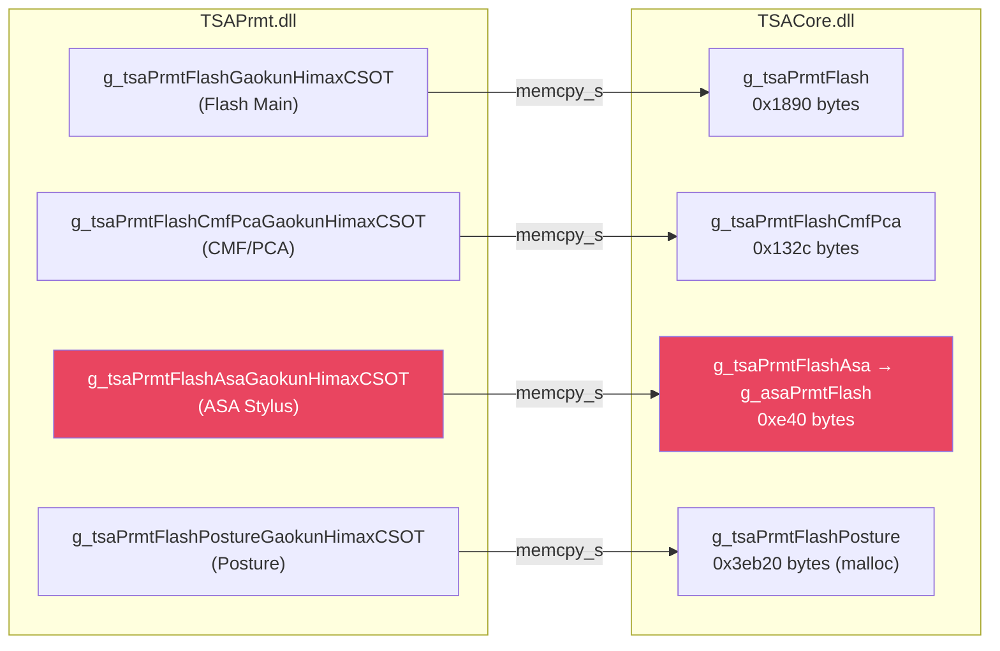
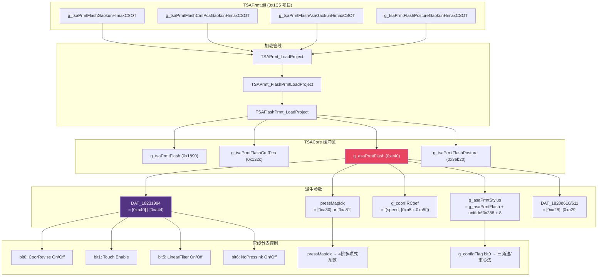

# TSACore 手写笔参数系统完整逆向分析

> [!NOTE]
> **跨模块分析**: TSAPrmt.dll (参数源) → TSACore.dll (参数消费者)  
> **关键全局变量**: `g_asaPrmtFlash`, `g_asaPrmtStylus`, `g_tsaPrmtFlash`  
> **特性标志寄存器**: `DAT_18231994` (8-bit feature bitmask)

---

## 1. 参数加载架构总览

### 1.1 四表加载管线

TSAPrmt.dll 通过回调机制将 **4 张独立参数表** 复制到 TSACore 的内存空间:



| 表名 | 大小 | 存储方式 | 用途 |
|------|------|----------|------|
| **Flash Main** | `0x1890` (6288 B) | 静态全局 `g_tsaPrmtFlash` | 触控面板基础参数 (栅格维度、阈值等) |
| **CmfPca** | `0x132c` (4908 B) | 静态全局 `g_tsaPrmtFlashCmfPca` | CMF 滤波器 / PCA 降噪参数 |
| **ASA** | `0xe40` (3648 B) | 静态全局 `g_tsaPrmtFlashAsa` → `g_asaPrmtFlash` | ★ **手写笔算法全部参数** |
| **Posture** | `0x3eb20` (257824 B) | `malloc` 动态分配 | 姿态识别大型查找表 |

### 1.2 加载调用链

```
TSAPrmt_LoadProject(projectName)
  └── TSAPrmt_FlashPrmtLoadProject(projectName)
        ├── g_prmtGetVersion() → 版本匹配检查
        ├── 构建 4 表描述符数组:
        │     [0] = { &g_tsaPrmtFlash,     0x1890 }
        │     [1] = { &g_tsaPrmtFlashCmfPca, 0x132c }
        │     [2] = { &g_tsaPrmtFlashAsa,  0x0e40 }
        │     [3] = { g_tsaPrmtFlashPosture, 0x3eb20 }  // malloc'd
        └── g_prmtCallBack(descriptors, projectName)
              └── TSAFlashPrmt_LoadProject(descriptors, projectName)
                    ├── idx = TSAFlashPrmt_GetProj(projectName)  // 遍历 0x1C5 个项目
                    ├── memcpy_s(dest[0], g_tsaPrmtFlashArray[idx],    0x1890)
                    ├── memcpy_s(dest[1], g_tsaPrmtFlashCmfPcaArray[idx], 0x132c)
                    ├── memcpy_s(dest[2], g_tsaPrmtFlashAsaArray[idx], 0x0e40)
                    └── memcpy_s(dest[3], g_tsaPrmtFlashPostureArray[idx], 0x3eb20)
```

> [!IMPORTANT]
> TSAPrmt.dll 中共有 **0x1C5 (453) 个设备配置项目**。使用 `strcmp(projectName, arrayEntry)` 线性搜索匹配。未找到则回退到 `DFLT000000` 默认配置。

---

## 2. ASA 参数表结构 — `g_asaPrmtFlash` (0xe40 字节)

这是手写笔管线最关键的参数表。以下是从反编译代码中推导出的完整偏移量映射。

### 2.1 多笔头参数单元 (HW Version Units)

ASA 表的前部是一个 **笔头硬件版本参数单元数组**：

```c
// ASA_LoadStylusHWPrmt(hwVersion) 的结构推导
struct AsaPrmtTable {
    byte numUnits;           // +0x00: 参数单元数量
    byte pad[7];             // +0x01..+0x07: 对齐填充
    
    // 每个单元 0x288 (648) 字节, 从 +0x08 开始
    struct StylusUnit {
        byte hwVersionSlots[3];  // +0x00: 最多 3 个 HW 版本号映射到此单元
        byte pad1[1];
        uint16 dimSomething1;    // +0x04 → DAT_1820d628
        uint16 dimSomething2;    // +0x06 → DAT_1820d62a
        byte configBlock[0x238]; // +0x08 → memcpy 到 DAT_1820d630 (0x238 字节)
        // 其中 +0x08 的第一个 byte 即 DAT_1820d630 → g_configFlag
        // (控制坐标算法选择: bit0=重心法/三角法, bit2=TX2坐标)
        
        // 倾斜角参数区域（相对于单元起始 +0x08）:
        // +0x248 (0x250 from unit start): 信号比分段数 bVar1
        // +0x24A (0x252): 信号比阈值起始
        // +0x262 (0x26a): 天线物理间距参数
    } units[]; // numUnits 个单元，每个 0x288 字节
};
```

加载逻辑 (`ASA_LoadStylusHWPrmt`):

```c
void ASA_LoadStylusHWPrmt(byte hwVersion) {
    if (hwVersion == 0) hwVersion = 5;  // 默认版本号
    
    // ★ 搜索匹配的参数单元
    byte unitIdx = 0;
    for (i = 0; i < g_asaPrmtFlash[0]; i++) {      // numUnits
        for (j = 0; j < 3; j++) {                    // 每单元 3 个版本槽位
            if (g_asaPrmtFlash[i * 0x288 + j + 8] == hwVersion) {
                unitIdx = i;
            }
        }
    }
    
    g_curStylusHWVersion = hwVersion;
    g_curPrmtUnit = unitIdx;
    
    // ★ 设置 g_asaPrmtStylus 指向选中的单元
    g_asaPrmtStylus = g_asaPrmtFlash + unitIdx * 0x288 + 8;
    
    // 提取芯片尺寸参数
    DAT_1820d628 = *(uint16*)(g_asaPrmtStylus + 0x04);
    DAT_1820d62a = *(uint16*)(g_asaPrmtStylus + 0x06);
    
    // ★ 将 0x238 字节的配置块批量复制到工作区
    memcpy(&DAT_1820d630, g_asaPrmtStylus + 0x08, 0x238);
    // DAT_1820d630 = configBlock[0] → g_configFlag (坐标算法选择)
}
```

### 2.2 ASA 全局参数偏移量 (表尾部, 从 0xa00+ 开始)

以下是 `g_asaPrmtFlash + offset` 在管线中每个引用点的完整映射:

| 偏移 | 大小 | 管线引用函数 | 物理含义 | 说明 |
|------|------|-------------|----------|------|
| **+0x000** | u8 | `ASA_LoadStylusHWPrmt` | `numUnits` | 参数单元数量 |
| **+0x008** | 0x288×N | 多处 | `StylusUnit[N]` | 每个笔头版本的参数块 |
| **+0xa28** | u8 | `ASA_LoadProjectPrmt`, `GetTiltByCoorDif`, `GetTX1TX2LenLimit` | **dim1Length (列数)** | 传感器 dim1 扫描节点数 → `g_gridCols / DAT_1820d610` |
| **+0xa29** | u8 | `ASA_LoadProjectPrmt`, `GetTiltByCoorDif` | **dim2Length (行数)** | 传感器 dim2 扫描节点数 → `g_gridRows / DAT_1820d611` |
| **+0xa2a** | u16 | `GetTiltByCoorDif`, `GetTX1TX2LenLimit` | **dim2PitchSize** | dim2 传感器间距 (µm) |
| **+0xa2c** | u16 | `GetTiltByCoorDif`, `GetTX1TX2LenLimit` | **dim1PitchSize** | dim1 传感器间距 (µm) |
| **+0xa40** | u32 | `ASAStaticInit` | **featureDefault** | 默认特性标志位 (与 +0xa44 OR 合并) |
| **+0xa44** | u32 | `ASAStaticInit`, `AsaSetFeatures` | **featureForce** | 强制特性标志位 (始终 OR 到最终值) |
| **+0xa48** | u32 | `ASAStaticInit` | **featureExtDefault** | 扩展特性默认 → `DAT_1823199c` |
| **+0xa4c** | u32 | `ASAStaticInit` | **featureExtForce** | 扩展特性强制 |
| **+0xa58** | u8 | `AftCoorProcess` | **edgeJitterThreshX** | 边缘落笔抖动阈值 X (分子) |
| **+0xa59** | u8 | `AftCoorProcess` | **edgeJitterThreshY** | 边缘落笔抖动阈值 Y (分子) |
| **+0xa5a** | u8 | `AftCoorProcess` | **centerJitterThreshX** | 中心落笔抖动阈值 X (分子) |
| **+0xa5b** | u8 | `AftCoorProcess` | **centerJitterThreshY** | 中心落笔抖动阈值 Y (分子) |
| **+0xa5c** | u8 | `GetIIRCoef` | **iirCoefMovingHigh** | IIR 高速系数 (移动中) |
| **+0xa5d** | u8 | `GetIIRCoef` | **iirCoefMovingLow** | IIR 低速系数 (移动中) |
| **+0xa5e** | u8 | `GetIIRCoef` | **iirCoefStillLow** | IIR 低速系数 (静止) |
| **+0xa5f** | u8 | `GetIIRCoef` | **iirCoefStillHigh** | IIR 高速系数 (静止) |
| **+0xa60** | u8 | `CoorIIRFilter` | **iirDenominator (N)** | IIR 滤波分母常量 |
| **+0xa68** | u16 | `ASA_LoadProjectPrmt` | **screenWidth** | 屏幕宽度 (像素) → `g_asaPrmt` |
| **+0xa6a** | u16 | `ASA_LoadProjectPrmt` | **screenHeight** | 屏幕高度 (像素) → `DAT_1820d602` |
| **+0xa80** | u8 | `HPP3_GetPressureMapping` | **pressMapIdx_default** | 压力曲线索引 (默认 HW) |
| **+0xa81** | u8 | `HPP3_GetPressureMapping` | **pressMapIdx_hw1_2** | 压力曲线索引 (HW v1/v2) |
| **+0xa84** | u8 | `HPP3_CoordinateProcess` | **signalRefreshMode** | 信号刷新模式: 0=标准, !=0=PR模式 |

### 2.3 StylusUnit 内部偏移 (相对于 `g_asaPrmtStylus`)

| 偏移 | 大小 | 管线引用函数 | 物理含义 |
|------|------|-------------|----------|
| **+0x00** | u8×3 | `ASA_LoadStylusHWPrmt` | HW 版本号槽位 |
| **+0x04** | u16 | `ASA_LoadStylusHWPrmt` | dim 参数 → `DAT_1820d628` |
| **+0x06** | u16 | `ASA_LoadStylusHWPrmt` | dim 参数 → `DAT_1820d62a` |
| **+0x08** | 0x238 | `ASA_LoadStylusHWPrmt` → `memcpy` | 配置块 → `DAT_1820d630` 起 |
| **+0x250** | u8 | `GetTX1TX2LenLimit` | 信号比分段数 (bVar1) |
| **+0x252** | u16 | `GetTX1TX2LenLimit` | 信号比低阈值 |
| **+0x254+** | u16×N | `GetTX1TX2LenLimit` | 信号比分段点数组 (+0x128 系列) |
| **+0x26a** | u8 | `GetTiltByCoorDif`, `GetTX1TX2LenLimit` | **天线物理间距** (物理距离参数) |
| **+0x26e** | u8 | `HPP3_FreqShiftProcess` | BT 频率跳变强制匹配启用 |

---

## 3. 特性标志位系统 — `DAT_18231994`

### 3.1 标志位定义

`ASAStaticInit` 中: `DAT_18231994 = g_asaPrmtFlash[0xa40] | g_asaPrmtFlash[0xa44]`

| Bit | 值 | Feature Enable 函数 | 控制的管线分支 |
|-----|----|---------------------|---------------|
| 0 | `0x01` | `ASA_IsHpp3CoorReiviseFeatureEnabled` | `CoorReviseProcess` — TX2 坐标修正 |
| 1 | `0x02` | `ASA_IsHpp3TouchEnableFeatureEnabled` | 触笔模式下是否允许触控 |
| 2 | `0x04` | `ASA_IsHpp3PalmCouplingDenoiseFeatureEnabled` | 手掌耦合去噪 |
| 3 | `0x08` | `ASA_IsHpp3FreqShiftAfeCtrlFeatureEnabled` | AFE 控制的频率跳变 |
| 4 | `0x10` | `ASA_IsHpp3FreqShiftTsaCtrlFeatureEnabled` | TSA 控制的频率跳变 |
| 5 | `0x20` | `ASA_IsHpp3LinearFilterFeatureEnabled` | `LinearFilterProcess` — 直线拟合滤波器 |
| 6 | `0x40` | `ASA_IsHpp3NoPressInkFeatureEnabled` | `NoPressInkProcess` — 无压力书写 |
| 7 | `0x80` | `ASA_IsHpp3NoPressTLearnedFeatureEnabled` | 自学习无压力书写 |

### 3.2 标志位初始化流程

```c
void ASAStaticInit(longlong prmtFlash) {
    if (prmtFlash == 0) return;
    memset(&g_asaStatic, 0, 0xF8);  // 248 字节状态结构清零

    // ★ 主特性标志 = 默认值 | 强制值
    DAT_18231994 = g_asaPrmtFlash[0xa40] | g_asaPrmtFlash[0xa44];
    
    // ★ 独立保存特性子集 (用于某些条件检查)
    DAT_18231990 = DAT_18231994 & 0x4813;
    // 0x4813 = bit0 + bit1 + bit4 + bit11 + bit14
    // = CoorRevise + TouchEnable + FreqShiftTsa + ??? + ???
    
    // ★ 扩展特性标志
    DAT_1823199c = g_asaPrmtFlash[0xa48] | g_asaPrmtFlash[0xa4c];
    
    // 记录初始状态
    DAT_18231998 = DAT_18231994;
}
```

### 3.3 AsaSetFeatures — 运行时特性覆写

```c
void AsaSetFeatures(uint newFlags) {
    uint flags = newFlags;
    
    // ★ 特殊处理: 如果 CoorRevise 已经启用, 则不允许通过此函数设置
    if (flags & 1) {
        if (ASA_IsHpp3CoorReiviseFeatureEnabled() == true) {
            flags &= ~1;  // 清除 bit0
        }
    }
    
    // ★ 合并: 用户标志 | 强制标志
    DAT_18231994 = flags | g_asaPrmtFlash[0xa44];
    DAT_18231990 = 0;
}
```

> [!WARNING]
> `g_asaPrmtFlash[0xa44]` 中的位 **永远无法被清除**。即使用户调用 `AsaSetFeatures(0)`,强制位仍然保留。这是一个安全锁定机制,确保出厂校准参数中设定的关键特性不会被意外禁用。

---

## 4. 参数对管线分支的控制关系

### 4.1 坐标算法选择

```
g_asaPrmtStylus[0x08] → memcpy → DAT_1820d630 (= g_configFlag)

g_configFlag bit0 → HPP3_CoordinateProcess:
  0 = GetCoordinateByTriangleOf()  (三角质心法)
  1 = GetCoordinateByGravityOf()   (重心法)

g_configFlag bit2 → HPP3_CoordinateProcess:
  设置 = 计算 TX2 坐标 (用于倾斜角)
```

### 4.2 IIR 滤波系数链

```
g_asaPrmtFlash[0xa5c..0xa5f] → GetIIRCoef() → g_coorIIRCoef
g_asaPrmtFlash[0xa60]        → CoorIIRFilter() → 滤波分母 N

速度 < 10(移动) / 20(静止):  使用 [0xa5d] / [0xa5e] (低速系数)
速度 > 204:                   使用 [0xa5c] / [0xa5f] (高速系数)
边缘区域:                     系数减半 (>> 1)
```

### 4.3 压力映射选择

```
g_curStylusHWVersion → HPP3_GetPressureMapping():
  HW v1/v2: 使用 g_asaPrmtFlash[0xa81] 作为压力曲线表索引
  其他:     使用 g_asaPrmtFlash[0xa80]

压力曲线表基址: 0x18115f80 (TSACore .rdata)
每组 0x58 (88) 字节:
  +0x00: lowThreshold  (u16)
  +0x02: highThreshold (u16)
  +0x08: c0_mid (double), c1_mid (double), c2_mid (double), c3_mid (double), c4_mid (double)
  +0x30: c0_high (double), c1_high (double), c2_high (double), c3_high (double), c4_high (double)
```

### 4.4 倾斜角限幅参数

```
GetTiltByCoorDif:
  maxDif = g_asaPrmtFlash[0xa28] * g_asaPrmtStylus[0x26a] * 0x400 / g_asaPrmtFlash[0xa2c]
  
  其中:
    [0xa28] = dim1 节点数 (对 X 轴)
    [0xa29] = dim2 节点数 (对 Y 轴)
    [0x26a] = 天线物理间距 (penStylus 参数)
    [0xa2a] = dim2 传感器间距 (µm)
    [0xa2c] = dim1 传感器间距 (µm)
    
  物理含义: maxDif = 传感器节点数 × 天线间距 × 网格分辨率 / 传感器间距
            = 两天线最大投影距离 (以 1/1024 网格为单位)

GetTX1TX2LenLimit — 信号比自适应限幅:
  g_asaPrmtStylus[0x250] = 分段数 (2..6)
  g_asaPrmtStylus[0x252] = 信号比低阈值
  后续为分段插值点: 
    X轴: +0x254, +0x256, ...  (信号比控制点)
    Y轴: +0x260, +0x262, ...  (限幅比例控制点, ‰)
```

### 4.5 特性标志对分支的完整控制

```
┌──────────────────────────────────────────────────────────────────┐
│                        特性标志 DAT_18231994                      │
├──────────┬───────────────────────────────────────────────────────┤
│ bit0 (1) │ CoorRevise → CoorReviseProcess()                    │
│          │   启用: 执行 CoorReviseCalculation + CoorReviseWork │
│          │   禁用: filteredXY = linearXY (直通)               │
├──────────┼───────────────────────────────────────────────────────┤
│ bit1 (2) │ TouchEnable → 触笔模式下触控允许                    │
│          │   启用: 触笔和触控可共存                             │
│          │   禁用: 触笔进入后强制禁用触控 3 帧                  │
├──────────┼───────────────────────────────────────────────────────┤
│ bit2 (4) │ PalmCouplingDenoise → 手掌耦合去噪                  │
│          │   启用: 额外的噪声抑制处理                           │
├──────────┼───────────────────────────────────────────────────────┤
│ bit3 (8) │ FreqShiftAfeCtrl → AFE 频率跳变控制                 │
│          │   启用: 允许 AFE 发起频率跳变                        │
├──────────┼───────────────────────────────────────────────────────┤
│ bit4(16) │ FreqShiftTsaCtrl → TSA 频率跳变控制                 │
│          │   启用: 允许 TSA 算法层发起频率跳变                  │
│          │   + 影响 DAT_18231990 & 0x4813 检查                  │
├──────────┼───────────────────────────────────────────────────────┤
│ bit5(32) │ LinearFilter → LinearFilterProcess()                │
│          │   启用: 直线拟合状态机 (6 个状态)                    │
│          │   禁用: linearXY = rawXY (直通)                     │
├──────────┼───────────────────────────────────────────────────────┤
│ bit6(64) │ NoPressInk → NoPressInkProcess()                    │
│          │   启用: 零压力时也产生墨迹 (悬浮书写)               │
│          │   禁用: pressure==0 时不上报坐标                     │
├──────────┼───────────────────────────────────────────────────────┤
│ bit7(128)│ NoPressTLearned → 自学习无压力书写                  │
│          │   启用: 动态学习无压力书写的阈值                     │
│          │   禁用: 使用固定阈值                                 │
└──────────┴───────────────────────────────────────────────────────┘
```

---

## 5. TSA Flash 主参数表 — `g_tsaPrmtFlash` (0x1890 字节)

### 5.1 来自 `ASA_LoadProjectPrmtFromTsa` 的偏移

```c
void ASA_LoadProjectPrmtFromTsa(longlong tsaPrmtFlash) {
    DAT_1820d615 = tsaPrmtFlash[0x17cd];  // 未知标志
    DAT_1820d616 = tsaPrmtFlash[0x17ce];  // 未知标志
    DAT_1820d618 = tsaPrmtFlash[0x17d0];  // u32 → 扩展配置
    DAT_1820d620 = tsaPrmtFlash[0x17d4];  // u32 → 扩展配置
}
```

### 5.2 TSA 主表中影响 ASA 管线的关键偏移

| g_tsaStaticPtr 偏移 | 检查函数 | 含义 |
|---------------------|---------|------|
| **+0xfc bit16** | `TSA_IsActiveStylusFeatureEnabled` | 主动式触笔功能总开关 |
| **+0xfc bit19** | `TSA_ASAProcess` | 增强感应特性启用 |
| **+0xfc bit24** | `TSA_ASAProcess` | 频率跳变模式标记 |
| **+0x108 bit8** | `StylusRecheck_EnterStylusMode` | Recheck 特性启用 |
| **+0x10c bit6** | `TSA_ASAProcess` | "ASA 正在处理" 运行时标志 |
| **+0x264** | `AnimationProcess` | 屏幕旋转角度 (0/1/2/3) |

---

## 6. 校准 (OEM Calibration) 参数加载

### 6.1 调用链

```
TSA_LoadASACalibration(data, size)
  ├── 检查: g_tsaStaticPtr[0xfc] bit16 != 0 (ASA 必须启用)
  └── ASA_LoadCalibration(data, size)
        ├── LOG: 打印原始数据 hex dump
        └── LoadOemTable2TableProc(data, size)
              ├── memcpy_s(&g_asaCalibOemTable, 0x42cd, data, 0x2b5)  // OEM 头
              ├── ★ 9 级嵌套验证:
              │     1. size < 0x42ce (总大小限制)
              │     2. DAT_181420ac == 0 (校准状态)
              │     3. DAT_18142004 == 0x2b5 (头偏移匹配)
              │     4. 校验和验证 (逐字节累加)
              │     5. 版本号 < 3 (校准版本兼容性)
              │     6. 项目名称匹配 (strcmp TSAPrmt_GetProjectName)
              │     7. 硬件版本匹配 (g_hwver ^ header.hwver & 0xffff)
              │     8. dim1 节点数匹配 (DAT_1820d610)
              │     9. dim2 节点数匹配 (DAT_1820d611)
              │    10. 数据块数 < 4
              │    11. 主版本号一致 (高16位)
              ├── 遍历数据块: FUN_1806796b(blockIdx, block)
              └── 验证失败 → 清零 g_asaCalibOemTable + g_asaCalibrationTable
```

### 6.2 OEM 校准表结构

| 偏移 | 全局变量 | 含义 |
|------|---------|------|
| **g_asaCalibOemTable** | `0x181420ac` 区域 | OEM 原始数据 (0x42cd 字节) |
| **g_asaCalibrationTable** | `0x1814XXXX` 区域 | 解析后的校准查找表 (0x9a7a 字节) |
| `DAT_18142004` | +0x04 from table start | 头部偏移量 (必须 = 0x2b5) |
| `DAT_1814200c` | +0x0c | 校准版本号 |
| `DAT_18142010` | +0x10 | 项目名称字符串 |
| `DAT_18142024` | +0x24 | 硬件版本 |
| `DAT_181420a4` | +0xa4 | dim1 节点数 |
| `DAT_181420a6` | +0xa6 | dim2 节点数 |
| `DAT_181422b0` | +0x2b0 | 数据校验和 |
| `DAT_181422b4` | +0x2b4 | 数据块数量 |

---

## 7. 运行时参数工作区映射

`ASA_LoadProjectPrmt` 将 ASA 表参数映射到工作全局变量:

```c
void ASA_LoadProjectPrmt(void* unused, longlong asaPrmtFlash) {
    g_curStylusHWVersion = 0;
    g_curPrmtUnit = 0;
    g_asaPrmtFlash = asaPrmtFlash;       // ★ 主参数指针
    
    if (asaPrmtFlash != NULL) {
        DAT_1820d868 = 0;                 // 数据类型重置
        
        // ★ 从 ASA 表提取传感器维度
        DAT_1820d610 = asaPrmtFlash[0xa28]; // g_gridCols (ASA 视角)
        DAT_1820d611 = asaPrmtFlash[0xa29]; // g_gridRows (ASA 视角)
        
        // ★ 从 ASA 表提取屏幕尺寸
        g_asaPrmt    = asaPrmtFlash[0xa68]; // screenWidth (u16)
        DAT_1820d602 = asaPrmtFlash[0xa6a]; // screenHeight (u16)
        
        // 清零屏幕边距参数
        DAT_1820d60a = 0;  // marginRight
        DAT_1820d608 = 0;  // marginLeft  
        DAT_1820d60e = 0;  // marginBottom
        DAT_1820d60c = 0;  // marginTop
        DAT_1820d614 = 0;
        DAT_1820d612 = 0;
        DAT_1820d613 = 0;
        DAT_1820d604 = 0;  // offsetX (屏幕偏移)
        DAT_1820d606 = 0;  // offsetY
        
        ASA_LoadStylusHWPrmt(0);  // 加载默认笔头 (hwVersion=5)
    }
}
```

---

## 8. TSAPrmt 初始化子系统

### 8.1 `TSAPrmt_ReInit` — 加载后重初始化

```
TSAPrmt_ReInit()
  ├── TSATTPrmt_Init()     // 触控跟踪参数
  ├── TSARTPrmt_Init()     // 实时参数
  ├── TSAConstPrmt_Init()  // 常量参数 (传感器间距→像素映射)
  ├── TSARamPrmt_Init()    // RAM 参数
  └── TSAPrmt_Reset()
        ├── TSADynPrmt_Init()  // 动态参数 (阈值等)
        │     ├── 恢复 g_msSkipOnInvalidRawEnabled ← DAT_18269008
        │     ├── TouchThold_Init()
        │     └── TSADynPrmt_SSInit()
        └── TSAPrmt_Validate()
              ├── assert(g_gridCols <= 0x50)  // 最大 80 列
              ├── assert(g_gridRows <= 0x50)  // 最大 80 行
              └── assert(g_gridNodeCount <= 0x1324)  // 最大 4900 节点
```

### 8.2 `TSAPrmt_Process` — 每帧参数处理

```
TSAPrmt_Process()
  ├── TSATTPrmt_Process()
  ├── TSARTPrmt_Process()
  ├── TSAConstPrmt_Process()
  ├── TSARamPrmt_Process()
  ├── TSADynPrmt_Process()
  └── TSAPrmt_Validate()  // 每帧重新验证维度限制
```

---

## 9. 参数数据流总图



---

## 10. 未在前一分析中识别的关键参数

| 偏移/变量 | 发现方式 | 对管线的影响 |
|-----------|---------|-------------|
| `g_asaPrmtFlash[0xa40]` | `ASAStaticInit` | 默认特性标志 — 决定 8 个管线分支的初始状态 |
| `g_asaPrmtFlash[0xa44]` | `ASAStaticInit`, `AsaSetFeatures` | 强制特性标志 — **不可覆写的锁定位** |
| `g_asaPrmtFlash[0xa48/0xa4c]` | `ASAStaticInit` | 扩展特性标志对 (→ `DAT_1823199c`) |
| `g_asaPrmtFlash[0xa84]` | `HPP3_CoordinateProcess` | 信号刷新模式选择 (标准 vs PR) |
| `g_asaPrmtStylus[0x26e]` | `HPP3_FreqShiftProcess` | BT 频率跳变强制匹配启用 |
| `g_asaPrmtStylus[0x250..0x26a]` | `GetTX1TX2LenLimit` | 信号比自适应倾斜角限幅参数组 |
| `g_asaPrmtStylus[0x08] → DAT_1820d630` | `HPP3_CoordinateProcess` | 坐标算法选择 (三角/重心) + TX2 启用 |
| `DAT_18231990` | `ASAStaticInit` | 特性子集掩码 `= features & 0x4813` |
| `DAT_1823199c` | `ASAStaticInit` | 扩展特性标志 (用途待进一步分析) |
| `g_msSkipOnInvalidRawEnabled` | `TSADynPrmt_Init`, `StylusRecheck_EnterStylusMode` | 无效原始数据跳过开关 |
| `g_noPressPara` | `NoPressInkProcess` | 无压力书写自学习参数是否就绪 |

> [!CAUTION]
> **`g_asaPrmtFlash[0xa44]`（强制特性位）是管线行为的最终决定者**。即使通过 `AsaSetFeatures` 传入 0，此偏移的位仍然保留在 `DAT_18231994` 中。在逆向或修改参数时，必须同时检查 `[0xa40]` 和 `[0xa44]` 才能确定某个特性的实际状态。
