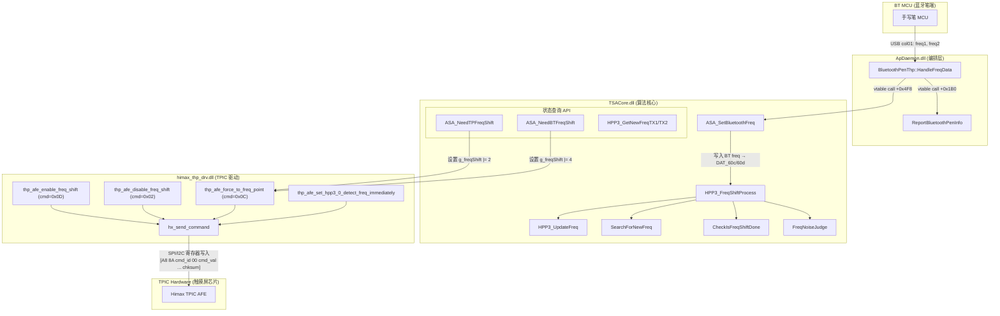
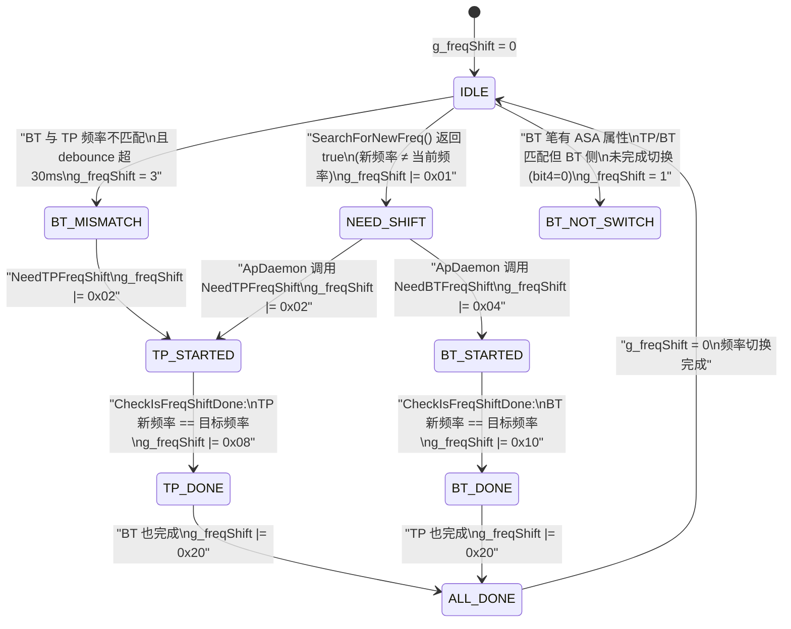
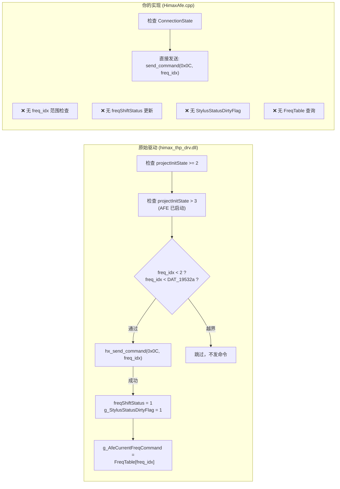
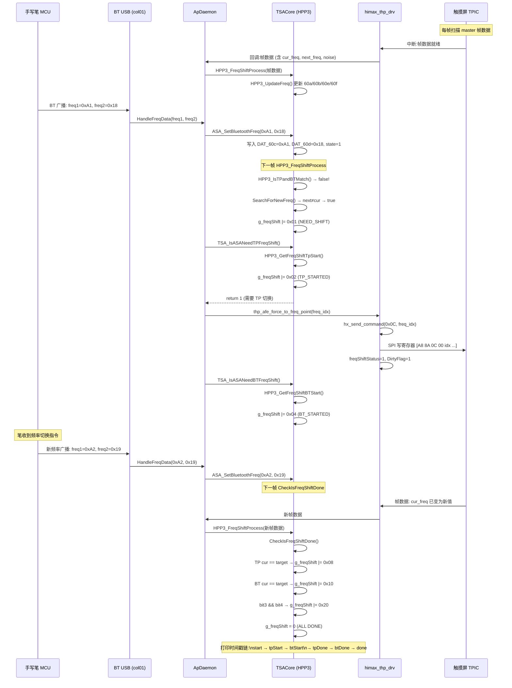

# 手写笔-触摸屏 频率协定 (Freq Shift) 完整逆向分析

## 一、四模块角色总结

| 模块 | 端口 | 角色 |
|---|---|---|
| **himax_thp_drv.dll** | 8195 | 底层驱动：通过 `hx_send_command` 写寄存器帧，直接控制 TPIC 硬件频率 |
| **CD54RPenApp.dll** | 8192 | 笔配对 UI 应用（与频率协定无关） |
| **TSACore.dll** | 8193 | **核心算法引擎**：HPP3 频率切换状态机 + 噪声判定 + TP/BT 匹配检测 |
| **ApDaemon.dll** | 8196 | 编排层：桥接 BT MCU 数据 → TSACore，调用 himax_thp_drv 执行切换 |

## 二、总体架构



## 三、HPP3 频率状态机 (`g_freqShift` 位域)



### 位域定义

| Bit | 值 | 含义 |
|-----|------|------|
| 0 | `0x01` | 需要频率切换 (NEED_SHIFT) |
| 1 | `0x02` | TP 侧已开始切换 (TP_STARTED) |
| 2 | `0x04` | BT 侧已开始切换 (BT_STARTED) |
| 3 | `0x08` | TP 侧切换完成 (TP_DONE) |
| 4 | `0x10` | BT 侧切换完成 (BT_DONE) |
| 5 | `0x20` | 全部完成 (ALL_DONE) |

## 四、每帧执行流程 (`HPP3_FreqShiftProcess`)

```mermaid
flowchart TD
    START["HPP3_FreqShiftProcess\n(每帧调用)"]
    
    START --> BT_STATUS["HPP3_BtStatusProcess()\n检测 BT MCU 心跳\n60s 超时 → state=2\n1s 超时 → BtPressureInit"]
    
    BT_STATUS --> UPDATE["HPP3_UpdateFreq(param)\n从帧数据读取:\nDAT_60a ← param+0x10 (cur TX1)\nDAT_60b ← param+0x12 (cur TX2)\nDAT_60e ← param+0x28 (next TX1)\nDAT_60f ← param+0x2a (next TX2)\n+ 频率表更新"]
    
    UPDATE --> VALID{"频率合法性检查\nTX1/TX2 ∈ [1, 0xF1]?\n(BT 有效时也检查 BT freq)"}
    
    VALID -- "非法" --> LOG_ILLEGAL["打印 'TP BT freq illegal!'\n终止本帧处理"]
    
    VALID -- "合法" --> TILT_CHECK{"cur TX1/TX2 变化?\n(vs 上一帧)"}
    
    TILT_CHECK -- "是" --> CLEAR_TILT["ClearTiltPrmt()\n清除倾斜参数"]
    TILT_CHECK -- "否" --> MISMATCH
    CLEAR_TILT --> MISMATCH
    
    MISMATCH{"BT 已连接 (state=1)\n且 TP≠BT ?\n且 debounce 满足?"}
    
    MISMATCH -- "是" --> SET_MISMATCH["g_freqShift = 3\n目标 = BT freq\n记录时间戳\n打印 'TP BT freq NOT match!'"]
    MISMATCH -- "否" --> BT_NOT_SWITCH
    SET_MISMATCH --> BT_NOT_SWITCH
    
    BT_NOT_SWITCH{"ASA 笔属性 ≠ 0?\nBT 已连接?\nTP/BT 匹配?\nbit4=0 且 bit2≠0?\n超 1s?"}
    
    BT_NOT_SWITCH -- "是" --> SET_BNS["g_freqShift = 1\n打印 'BT freq NOT switch!'"]
    BT_NOT_SWITCH -- "否" --> SEARCH
    SET_BNS --> SEARCH
    
    SEARCH{"g_asaHpp3FreqShiftEnable\n且 bit0=0?"}
    
    SEARCH -- "是" --> CALL_SEARCH["SearchForNewFreq()\n比较 next freq vs cur freq\n若不同 → 返回 true"]
    SEARCH -- "否" --> CHECK_DONE
    CALL_SEARCH -- "发现新频率" --> SET_NEED["g_freqShift |= 0x01\n记录时间戳"]
    CALL_SEARCH -- "无变化" --> CHECK_DONE
    SET_NEED --> CHECK_DONE
    
    CHECK_DONE{"bit0 = 1?\n(需要切换)"}
    
    CHECK_DONE -- "是" --> CALL_CHECK["CheckIsFreqShiftDone()\n检查 TP/BT 是否都切到目标"]
    CHECK_DONE -- "否" --> FLAG_OUT
    
    CALL_CHECK -- "完成" --> RESET["g_freqShift = 0\n打印所有时间戳\n(start, tpStart, btStart,\ntpDone, btDone, done)"]
    CALL_CHECK -- "未完成" --> FLAG_OUT
    RESET --> FLAG_OUT
    
    FLAG_OUT["更新 DAT_18231960 标志位\n(0x20=shift中, 0x40=idle可切,\n0x80=其他)\nHPP3_LogFreqInfo()"]
```



## 五、关键全局变量地图 (TSACore @ 0x1815e600 区域)

```
Offset   变量                    含义
───────────────────────────────────────────
+0x604   DAT_1815e604            BT 连接状态 (0=断开, 1=已连接, 2=超时)
+0x608   DAT_1815e608            上一帧 TP TX1 freq (用于检测变化→清倾斜)
+0x609   DAT_1815e609            上一帧 TP TX2 freq
+0x60a   DAT_1815e60a            当前帧 TP TX1 scan freq (cur)
+0x60b   DAT_1815e60b            当前帧 TP TX2 scan freq (cur)
+0x60c   DAT_1815e60c            当前帧 BT TX1 freq (来自 ASA_SetBluetoothFreq)
+0x60d   DAT_1815e60d            当前帧 BT TX2 freq
+0x60e   DAT_1815e60e            下一帧 TP TX1 freq (next, 来自 AFE)
+0x60f   DAT_1815e60f            下一帧 TP TX2 freq (next)
+0x610   DAT_1815e610[]          频率表：每条目 6 字节 [freqId(1), scanFreq(2), auxFreq(2), pad(1)]
+0x6c0   g_freqShift             频率切换状态机位域
+0x6c1   DAT_1815e6c1            切换目标 TX1 freq
+0x6c2   DAT_1815e6c2            切换目标 TX2 freq
+0x6c8   DAT_1815e6c8            切换开始时间戳
+0x6d0   DAT_1815e6d0            TP 开始切换时间戳
+0x6d8   DAT_1815e6d8            BT 开始切换时间戳
+0x6e0   DAT_1815e6e0            TP 完成切换时间戳
+0x6e8   DAT_1815e6e8            BT 完成切换时间戳
+0x6f0   DAT_1815e6f0            全部完成时间戳
```

## 六、hx_send_command 命令协议

```
帧结构 (16 字节):
┌──────┬──────┬────────┬──────┬─────────┬──────────┬──────────────┐
│ 0xA8 │ 0x8A │ cmd_id │ 0x00 │ cmd_val │ 00...00  │ checksum(2B) │
└──────┴──────┴────────┴──────┴─────────┴──────────┴──────────────┘
  [0]    [1]    [2]      [3]    [4]       [5..13]    [14..15]

写入地址: 0x10007550 + slot × 0x10  (slot 轮转 0..4)
写入流程: 先清零 → 写 header 触发 → 读回验证 → slot++
```

| cmd_id | cmd_val | 函数 | 含义 |
|--------|---------|------|------|
| `0x0D` | `0x00` | `thp_afe_enable_freq_shift` | 启用自动频率切换 |
| `0x02` | `0x00` | `thp_afe_disable_freq_shift` | 禁用频率切换 (AUTO 模式跳过) |
| `0x0C` | `freq_idx` | `thp_afe_force_to_freq_point` | 强制切到 freq_idx 频点 |
| `0x0E` | `rate_idx` | (ForceToScanRate) | 强制切到 rate_idx 扫描率 |
| `0x01` | `param` | (StartCalibration) | AFE 校准 |
| `0x0A` | `param` | (EnterIdle) | 进入空闲低功耗 |

## 七、`thp_afe_force_to_freq_point` 关键逻辑差异

这是你当前实现 (`HimaxAfe.cpp:143-149`) 与原始驱动的**最大差异点**：



### 你需要补充的逻辑：

1. **`freq_idx` 范围检查**: 原始驱动检查 `freq_idx < 2 && freq_idx < maxSupportedFreq`
2. **`freqShiftStatus = 1`**: 标记切换已请求，供 `ProcessStylusStatus` 追踪
3. **`g_StylusStatusDirtyFlag = 1`**: 通知下一帧需要重新读取 stylus status
4. **`g_AfeCurrentFreqCommand = FreqTable[freq_idx]`**: 记录当前频点的实际频率值（从频率表索引转换）

## 八、完整数据流 (频率切换一次完整周期)



## 九、噪声判定逻辑 (`FreqNoiseJudge`)

```
对 F1 和 F2 各自的最近 5 帧:
  ├─ 统计异常峰值数 (abnormalPeakNum)
  ├─ 累加异常峰值信号 (abnormalPeakSignal)
  ├─ 计算平均值 = sum / count
  └─ 判定:
       噪声大 ← (max_signal > 4500) || (avg > 2000)
       噪声小 ← (avg < 500 && max < 1000) || (count == 0)
```

## 十、你当前实现的具体问题清单

### 问题 1: `ForceToFreqPoint` 缺少状态同步
你的 `HimaxAfe.cpp:143-149` 只发命令，不更新任何状态：

```diff
 ChipResult<> AfeController::ForceToFreqPoint(uint8_t freq_idx) {
     if (m_chip.GetConnectionState() != ConnectionState::Connected)
         return std::unexpected(ChipError::InvalidOperation);
 
+    // 原始驱动: 范围检查
+    if (freq_idx >= 2 || freq_idx >= m_freqTableSize)
+        return std::unexpected(ChipError::InvalidOperation);
+
     LOG_INFO(...);
-    return HimaxProtocol::send_command(..., 0x0c, freq_idx, ...);
+    auto res = HimaxProtocol::send_command(..., 0x0c, freq_idx, ...);
+    if (res) {
+        m_stylus.freqShiftStatus = 1;          // 标记切换进行中
+        m_stylus.stylusStatusDirty = true;      // 脏标志
+        m_stylus.currentFreqCommand = m_freqTable[freq_idx]; // 记录实际频率值
+    }
+    return res;
 }
```

### 问题 2: `ProcessStylusStatus` 的噪声判定与 TSACore 不一致
- 你的阈值是 `5000/5001`，而 TSACore 的 `FreqNoiseJudge` 使用的是异常峰值统计（峰信号 > 4500 或均值 > 2000）
- TSACore 是基于 **5 帧滑窗的峰值/均值** 判定，而非单帧差值

### 问题 3: BT-TP 匹配检测缺少 TSACore 的 debounce 时间窗
- TSACore: `DAT_1815e6e8 + 30ms < currentTime` (btDone 后 30ms)
- TSACore: `g_freqShift == 0 || DAT_1815e6c8 + 1000ms < currentTime` (上次切换后 1 秒)
- 你的代码只有 `kBtMismatchDebounce = 4 frames` 的简单帧计数

### 问题 4: 缺少 TSACore 的双通道完成确认
TSACore 的 `CheckIsFreqShiftDone` 要求 **TP 和 BT 两侧都确认** 完成才最终清除 `g_freqShift`。你的代码只追踪 `freqDone != 0`（单一信号），没有分别确认 TP/BT 两侧。

### 问题 5: `disable_freq_shift` 的 AUTO 模式判定
原始驱动检查 `DAT_18019534c == 2` (feature_freq_hop == AUTO)，你代码中用 `m_stylus.switchPolicy == 2` 对应，但 **该值从未被外部更新**——TSACore 的 `ASA_EnableHpp3FreqShiftAfeCtrlFeature` / `TSACtrl` 特性标志没有桥接过来。